# Evaluation Framework — Architecture & Implementation Guide

> Companion to [eval-framework-spec.md](eval-framework-spec.md) (design goals).  
> This document covers **how the code works**: runtime flow, mock infrastructure, judges, fixtures, and the live agent loop.

---

## Overview

The eval framework has two phases that share the same judges and fixture data:

| Phase | Runner | LLM Required | Cost | Purpose |
|---|---|---|---|---|
| **Phase 1 — Offline** | `npm run eval` | No | Free | Fast, deterministic checks against hand-crafted tool-call traces |
| **Phase 2 — Live** | `npm run eval:live` | Yes (Azure OpenAI) | ~$0.005–$0.05/scenario | End-to-end agent loop with mock MCP servers + LLM-as-judge |

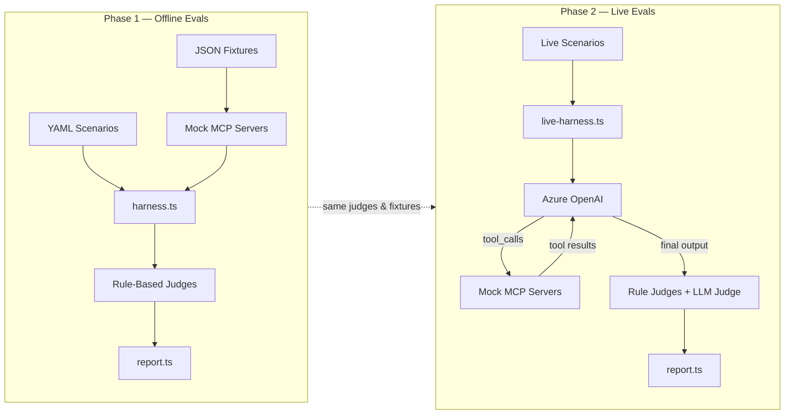

---

## Directory Structure

```
evals/
├── harness.ts                      # Core types, mock servers, scoring engine
├── report.ts                       # Markdown report & aggregation
├── fixtures/
│   ├── scenarios/                  # YAML-defined test scenarios
│   │   ├── skill-routing.yaml      # 20+ routing test cases
│   │   ├── tool-correctness.yaml   # 5 tool sequence scenarios
│   │   ├── anti-patterns.yaml      # 10 anti-pattern definitions
│   │   └── output-format.yaml      # Output schema validations
│   ├── crm-responses/              # Mock CRM JSON payloads
│   │   ├── whoami.json             # User identity (Jin Lee, CSA)
│   │   ├── opportunities-contoso.json
│   │   ├── milestones-active.json
│   │   └── tasks-active.json
│   └── m365-responses/             # Mock M365 JSON payloads
│       ├── calendar-today.json
│       └── workiq-meetings.json
├── judges/
│   ├── tool-sequence.ts            # Tool presence, params, ordering
│   ├── anti-pattern.ts             # AP-001 through AP-010
│   ├── output-format.ts            # Section/column/table validation
│   └── llm-judge.ts               # Azure OpenAI subjective scoring
├── anti-patterns/
│   └── anti-patterns.eval.ts       # AP detection unit tests
├── context-budget/
│   └── context-budget.eval.ts      # Token budget calculations
├── output-format/
│   └── output-format.eval.ts       # Format compliance tests
├── routing/
│   └── routing.eval.ts             # Skill trigger phrase routing
├── tool-correctness/
│   └── tool-calls.eval.ts          # Tool sequence simulations
└── live/
    ├── config.ts                   # Model profiles & env config
    ├── live-harness.ts             # System prompt assembly + agent loop
    └── live-agent.eval.ts          # 5 end-to-end live scenarios
```

---

## Mock Infrastructure

### Mock MCP Servers

Three mock servers live in `harness.ts`. They intercept tool calls and return fixture data without hitting real CRM, M365, or vault backends.

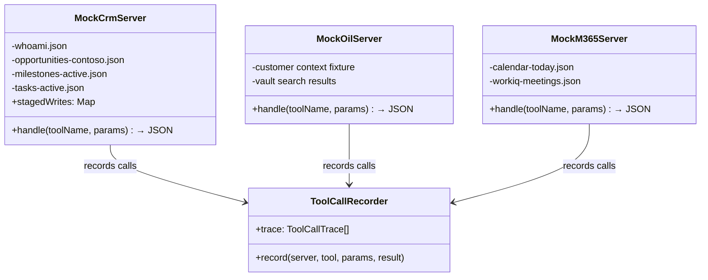

#### How Mock Routing Works

When the LLM (or a hand-crafted test) makes a tool call, the harness routes it by prefix:

| Tool Prefix | Mock Server | Fixture Source |
|---|---|---|
| `msx-crm:*` | `MockCrmServer` | `fixtures/crm-responses/` |
| `oil:*` | `MockOilServer` | Inline vault context |
| `workiq:*`, `calendar:*`, `mail:*` | `MockM365Server` | `fixtures/m365-responses/` |

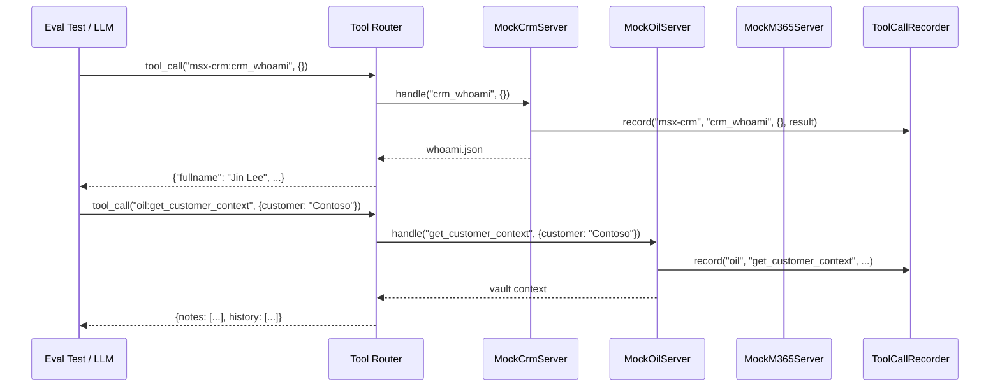

#### Write Safety in Mocks

The `MockCrmServer` never executes write operations. Instead, it:

1. Accepts the write payload
2. Assigns a `staged-{uuid}` operation ID
3. Stores it in a `stagedWrites` map
4. Returns the staging receipt (not a confirmed write)

This mirrors the production `approval-queue.ts` pattern — writes require explicit human confirmation via `execute_operation`.

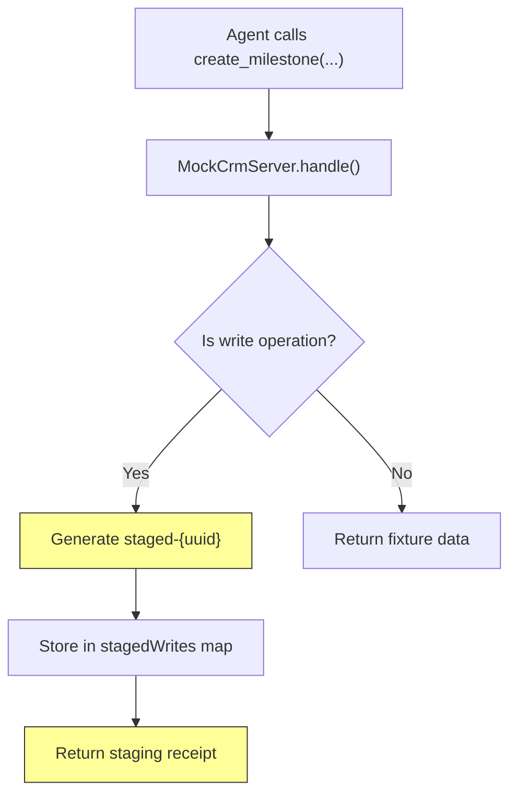

---

## Fixture Data (Mocks)

### CRM Response Fixtures

Located in `evals/fixtures/crm-responses/`:

| File | Content | Used By |
|---|---|---|
| `whoami.json` | User identity — `Jin Lee`, CSA, `jinle@microsoft.com` | Role resolution, AP-010 checks |
| `opportunities-contoso.json` | 2 opps: Azure Migration (Stage 3, $12K/mo) + Security Modernization (Stage 2) | Pipeline queries, morning brief |
| `milestones-active.json` | 3 milestones: Landing Zone (on track), App Mod POC (in progress), Sentinel (**overdue**) | Milestone health, AP-001 checks |
| `tasks-active.json` | 2 tasks: ADS deck (Apr 1), Environment access (Mar 20) | Task hygiene, SE flow |

### M365 Response Fixtures

Located in `evals/fixtures/m365-responses/`:

| File | Content | Used By |
|---|---|---|
| `calendar-today.json` | 2 meetings: Architecture Review (9 AM), Pipeline Review (2 PM) | Morning brief calendar section |
| `workiq-meetings.json` | Recent meeting notes: landing zone topology, firewall rule changes | Cross-medium synthesis |

### YAML Scenario Fixtures

Located in `evals/fixtures/scenarios/`:

```yaml
# Example from skill-routing.yaml
- id: route-morning-brief
  utterance: "start my day"
  expected_skill: morning-brief
  role: CSA

- id: route-disambiguation
  utterance: "weekly review"
  role: Specialist
  expected_skill: pipeline-hygiene-triage
  not_skill: milestone-health-review

- id: route-chain
  utterance: "prep me for governance"
  expected_skills:
    - mcem-stage-identification
    - milestone-health-review
    - customer-evidence-pack
```

```yaml
# Example from tool-correctness.yaml
- id: milestone-health-flow
  skill: milestone-health-review
  expected_tools:
    - tool: msx-crm:crm_whoami
    - tool: oil:get_customer_context
      params_contain: { customer: "Contoso" }
    - tool: msx-crm:get_milestones
      params_contain: { customerKeyword: "Contoso" }
      after: oil:get_customer_context
  forbidden_patterns:
    - AP-001  # unscoped get_milestones
```

---

## Judges (Scoring Engine)

Four judges analyze tool-call traces and output text. The first three are deterministic; the fourth uses an LLM.

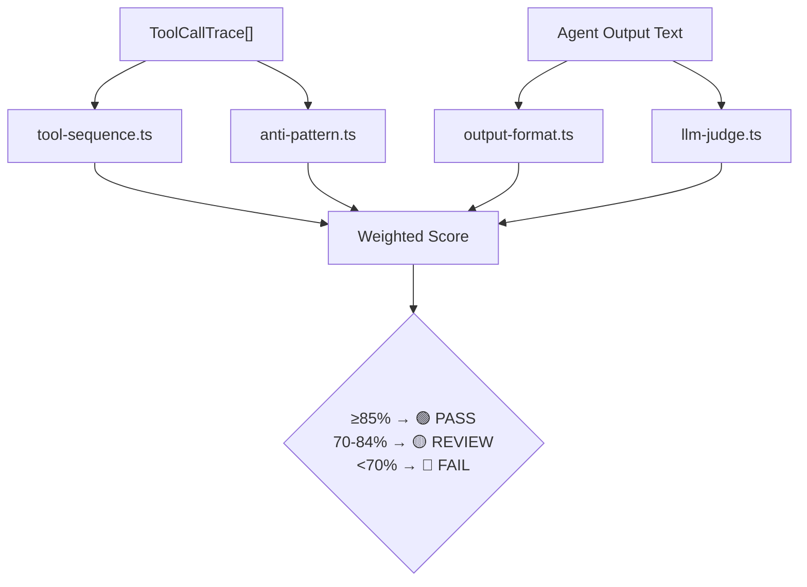

### Scoring Weights

| Dimension | Judge | Weight |
|---|---|---|
| Skill Routing | `routing.eval.ts` (keyword match) | 25% |
| Tool Correctness | `tool-sequence.ts` | 30% |
| Anti-Pattern Avoidance | `anti-pattern.ts` | 20% |
| Output Format | `output-format.ts` | 15% |
| Context Efficiency | `context-budget.eval.ts` | 10% |

### Judge Details

#### `tool-sequence.ts` — Tool Call Correctness

Checks three things against the recorded trace:

1. **Presence**: Were all expected tools called?
2. **Parameters**: Do params match (exact or subset via `params_contain`)?
3. **Ordering**: Are `after` constraints satisfied?

Supports wildcards (`msx-crm:*`) for "any CRM tool was called" assertions.

#### `anti-pattern.ts` — Anti-Pattern Detection

Scans the trace for 10 known bad patterns:

```mermaid
flowchart LR
    Trace["ToolCallTrace[]"] --> AP

    subgraph AP["Anti-Pattern Checks"]
        AP1["AP-001: Unscoped get_milestones\n(no customerKeyword/statusFilter/opportunityId)"]
        AP2["AP-002: Wrong entity set\n(msp_milestones instead of msp_engagementmilestones)"]
        AP3["AP-003: N+1 loop\n(3+ sequential calls instead of batch)"]
        AP4["AP-004: Vault skip\n(CRM called but oil:* never called)"]
        AP5["AP-005: Write without staging\n(execute_operation without staged preview)"]
        AP6["AP-006: Guessed property names\n(msp_stage vs msp_activesalesstage)"]
        AP7["AP-007: Disallowed entity set"]
        AP8["AP-008: Vault state as live truth\n(Phase 2 LLM judge only)"]
        AP9["AP-009: Unbounded WorkIQ\n(missing top: or limit)"]
        AP10["AP-010: Role assumed\n(no crm_whoami call)"]
    end

    AP --> Result["violations[] + pass/fail per AP"]
```

#### `output-format.ts` — Output Structure Validation

Validates the final agent response against expected schemas:

- **Required sections**: e.g., morning brief must contain `Pipeline`, `Milestones`, `Meetings`
- **Required columns**: e.g., milestone table needs `Name`, `Monthly Use`, `Due Date`, `Status`, `Owner`
- **Format type**: table vs. prose detection (markdown table pipe `|` detection)
- **Forbidden patterns**: e.g., prose-only when table is required

#### `llm-judge.ts` — Subjective Quality (Phase 2 Only)

Uses Azure OpenAI (RBAC auth via `DefaultAzureCredential`) to score on 5 dimensions (1–5 scale):

| Dimension | What It Measures |
|---|---|
| **Synthesis** | Cross-medium integration (CRM ↔ vault ↔ M365) |
| **Risk Surfacing** | Proactive flags with evidence + role assignment |
| **Role Appropriateness** | Respects MSX role boundaries |
| **Conciseness** | Action-oriented, not verbose |
| **Table Compliance** | Proper format with required columns |

Pass threshold: score ≥ 3 per dimension.

---

## Phase 1 — Offline Eval Flow

Offline evals run via `npm run eval` (Vitest with `vitest.config.ts`). No LLM or network calls needed.

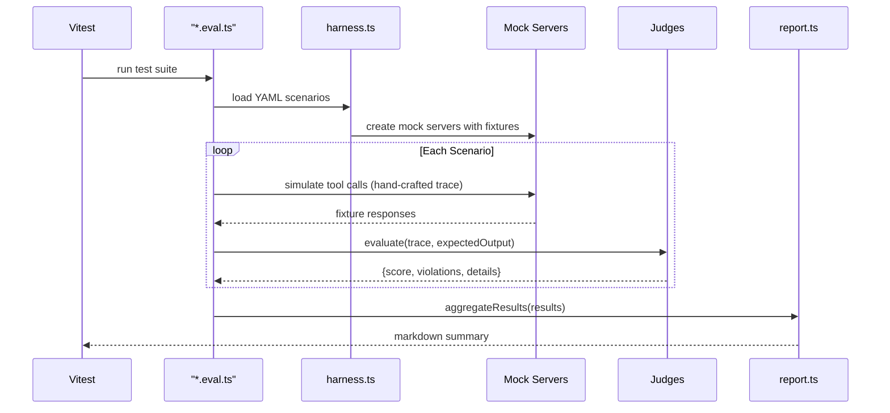

### What Each Offline Test Suite Covers

| Test Suite | File | # Tests | Validates |
|---|---|---|---|
| Skill Routing | `routing/routing.eval.ts` | 12 | Trigger phrases → correct skill activation |
| Tool Correctness | `tool-correctness/tool-calls.eval.ts` | 6 | Tool sequence, params, ordering |
| Anti-Patterns | `anti-patterns/anti-patterns.eval.ts` | 10 | Each AP with bad & good traces |
| Output Format | `output-format/output-format.eval.ts` | 5 | Table columns, sections, forbidden patterns |
| Context Budget | `context-budget/context-budget.eval.ts` | 3 | Token counts per instruction/skill/chain |

---

## Phase 2 — Live Agent Loop

Live evals run via `npm run eval:live` (Vitest with `vitest.live.config.ts`). Requires Azure OpenAI access.

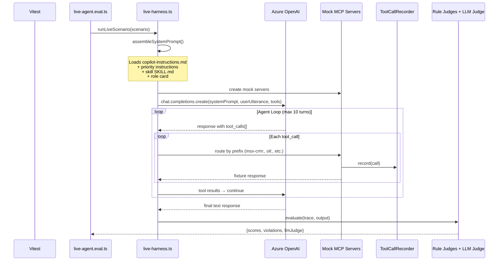

### System Prompt Assembly

`assembleSystemPrompt()` in `live-harness.ts` builds context from real instruction files:

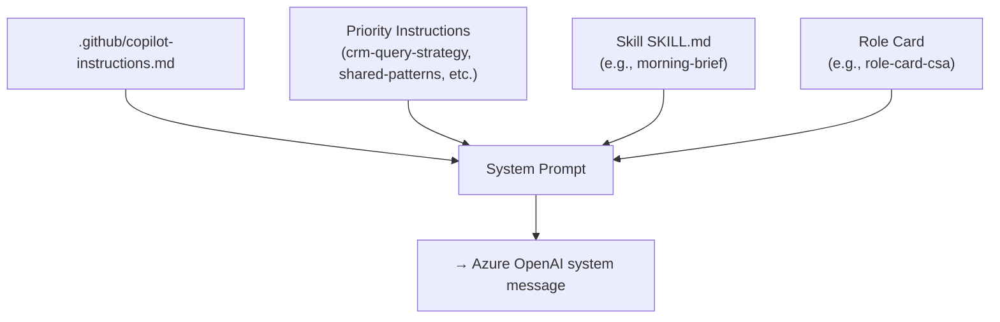

### Mock Tools Definition

`live-harness.ts` defines a `MOCK_TOOLS` array — an OpenAI function-calling schema for 15+ tools that the LLM can call:

| Tool | Description |
|---|---|
| `crm_whoami` | Get current user identity |
| `crm_query` | OData query against CRM |
| `get_milestones` | Retrieve milestones with scoping |
| `get_my_active_opportunities` | Get user's pipeline |
| `create_milestone` / `update_milestone` | Staged write ops |
| `create_task` / `close_task` | Task management |
| `execute_operation` | Execute a staged write |
| `get_customer_context` | Vault lookup |
| `search_vault` | Vault search |
| `write_note` | Vault write |
| `ask_work_iq` | WorkIQ query |
| `ListCalendarView` | Calendar events |
| `SearchMessages` | Email search |

### Live Scenarios

| # | Scenario | Key Assertions |
|---|---|---|
| 1 | **Morning Brief** | Scoped retrieval, parallel phases, structured output |
| 2 | **Milestone Health** | CSAM governance review, table format, required columns |
| 3 | **Write Safety** | All writes staged (not executed), staging receipt returned |
| 4 | **Vault-First** | `oil:*` called before `msx-crm:*` |
| 5 | **Scoped Query** | No N+1 loops, milestones scoped by keyword/filter |

### Multi-Model Comparison

Set `EVAL_MODELS=gpt-4o-mini,gpt-4o,gpt-4.1-mini` to run all scenarios across multiple models and compare scores side-by-side.

---

## Report Generation

`report.ts` aggregates individual scenario results into a markdown summary:

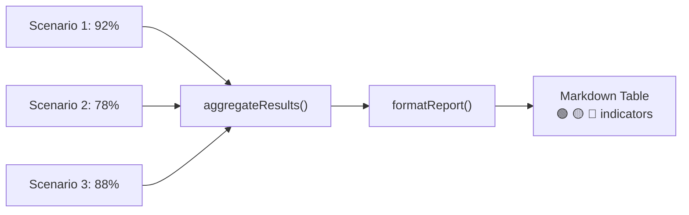

Verdicts:
- **🟢 PASS** — score ≥ 85%
- **🟡 REVIEW** — score 70–84%
- **🔴 FAIL** — score < 70%

---

## Configuration

### Vitest Configs

| Config | Command | Includes | Timeout |
|---|---|---|---|
| `vitest.config.ts` | `npm run eval` | `evals/**/*.eval.ts` (excludes `live/`) | 30s |
| `vitest.live.config.ts` | `npm run eval:live` | `evals/live/**/*.eval.ts` only | 120s |

### npm Scripts

```bash
npm run eval          # Phase 1 — offline, free, fast
npm run eval:watch    # Phase 1 — watch mode
npm run eval:live     # Phase 2 — requires Azure OpenAI
npm run eval:all      # Both phases sequentially
```

### Environment Variables (Phase 2)

| Variable | Required | Default | Purpose |
|---|---|---|---|
| `AZURE_OPENAI_ENDPOINT` | Yes | — | Azure OpenAI resource URL |
| `AZURE_OPENAI_API_VERSION` | No | `2025-03-01-preview` | API version |
| `EVAL_MODEL` | No | `gpt-4o-mini` | Model for agent |
| `EVAL_JUDGE_MODEL` | No | `gpt-4o-mini` | Model for LLM judge |
| `EVAL_MODELS` | No | — | Comma-separated for comparison |
| `EVAL_ITERATIONS` | No | `1` | Runs per scenario |
| `EVAL_TEMPERATURE` | No | `0` | LLM temperature |
| `AZURE_TENANT_ID` | No | — | Tenant for RBAC auth |

---

## Key Design Patterns

### 1. Vault-First Pattern

Judges enforce that `oil:*` calls precede `msx-crm:*` calls, ensuring the agent consults local knowledge before querying CRM. This reduces CRM load and provides richer context.

### 2. Scoped Query Pattern

Any `get_milestones` call must include at least one scoping parameter (`customerKeyword`, `statusFilter`, `opportunityId`, or `tpid`). Unscoped calls trigger AP-001.

### 3. Write Safety via Staging

All CRM writes flow through a staging layer. The mock server (and production `approval-queue.ts`) returns a `staged-{uuid}` receipt instead of executing immediately. The agent must display the staged changes and wait for explicit confirmation via `execute_operation`.

### 4. Parallel Phase Grouping

Skills like `morning-brief` group tool calls into phases:
- **Phase 1** (parallel): `crm_whoami` + `oil:get_vault_context` 
- **Phase 2** (sequential, depends on Phase 1): `get_my_active_opportunities` + `get_milestones` + `ListCalendarView`

### 5. Role-Contextualized Routing

The same utterance routes to different skills based on role:
- "weekly review" + **Specialist** → `pipeline-hygiene-triage`
- "weekly review" + **CSAM** → `milestone-health-review`

---

## Fixture Capture Tool

The capture tool connects to live MCP servers, calls read-only tools, and saves responses as JSON fixtures. This replaces hand-crafted mock data with real snapshots.

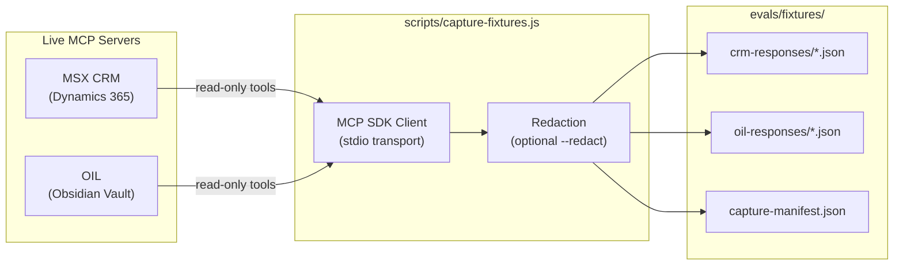

### Commands

```bash
npm run fixtures:capture                        # Capture all servers
npm run fixtures:capture -- --server crm        # CRM only
npm run fixtures:capture -- --server oil        # OIL vault only
npm run fixtures:capture -- --customer Fabrikam # Different customer
npm run fixtures:capture -- --dry-run           # Preview without writing
npm run fixtures:capture -- --redact            # Redact emails & GUIDs
```

### What Gets Captured

| Server | Tool | Output File | Description |
|--------|------|-------------|-------------|
| CRM | `crm_whoami` | `whoami.json` | User identity and role |
| CRM | `get_my_active_opportunities` | `opportunities-mine.json` | Active pipeline |
| CRM | `get_milestones` | `milestones-{customer}.json` | Customer milestones with tasks |
| CRM | `get_milestones` (mine) | `milestones-mine-active.json` | All user's active milestones |
| CRM | `get_milestone_activities` | `tasks-active.json` | Active CRM tasks |
| CRM | `get_milestone_field_options` | `milestone-field-options.json` | Picklist metadata |
| CRM | `get_task_status_options` | `task-status-options.json` | Task status codes |
| OIL | `get_vault_context` | `vault-context.json` | Vault overview |
| OIL | `get_customer_context` | `customer-context-{customer}.json` | Customer dossier |
| OIL | `search_vault` | `search-{customer}.json` | Vault search results |
| OIL | `query_notes` | `notes-{customer}.json` | Customer-tagged notes |

### Safety

- **Read-only**: Only calls read tools — never writes, updates, or deletes
- **Redaction**: `--redact` flag replaces email addresses and zeroes GUID suffixes
- **Gitignored**: `oil-responses/` and `capture-manifest.json` are gitignored (may contain PII)
- **Manifest**: Each capture writes metadata (timestamp, server list, success/failure per tool)

### Fixture Loading Priority

Mock servers load fixtures with a fallback chain:

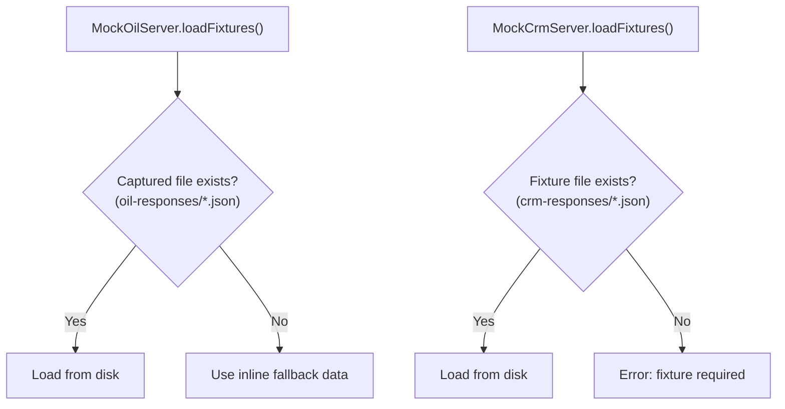

CRM fixtures always load from disk (hand-crafted or captured). OIL fixtures fall back to inline synthetic data when no captured files exist.

---

## Adding a New Eval Scenario

1. **Define the scenario** in the appropriate YAML file under `evals/fixtures/scenarios/`
2. **Add fixture data** if needed in `evals/fixtures/crm-responses/` or `m365-responses/`
3. **Write the test** in the corresponding `*.eval.ts` file
4. **For live scenarios**, add to `evals/live/live-agent.eval.ts`
5. **Run**: `npm run eval` (offline) or `npm run eval:live` (live)

---

## End-to-End Data Flow

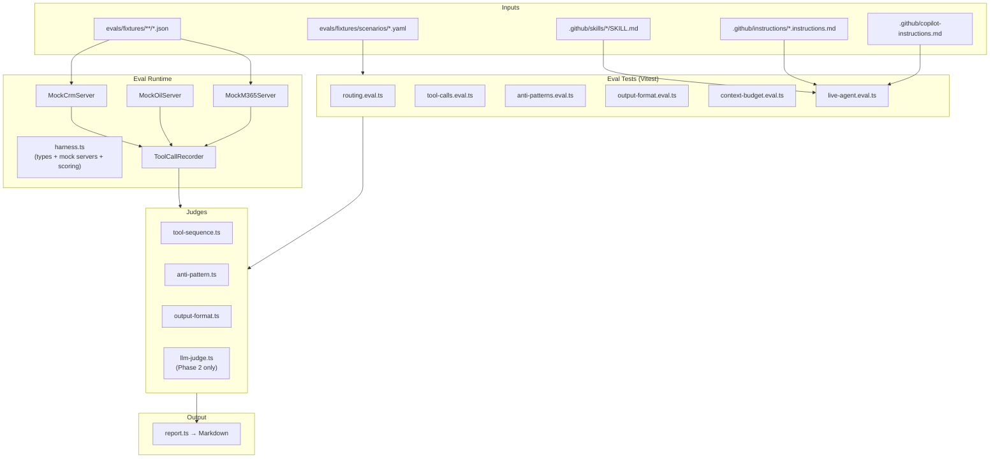
