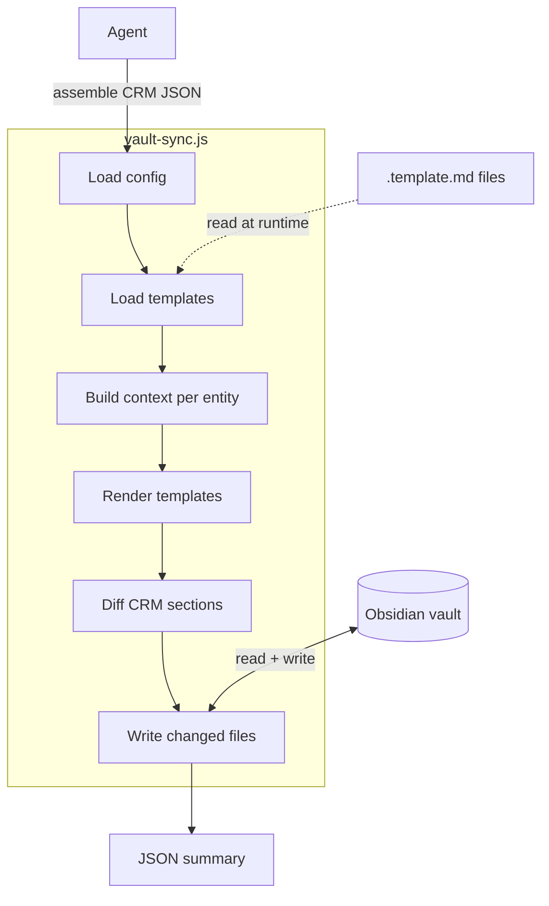

# Data Helpers

Reusable Node.js CLI scripts for normalizing, scoring, formatting, and syncing data from MCP tool responses. Eliminates inline code generation during agent workflows.

## Scripts

| Script | Purpose | Input | Output |
|---|---|---|---|
| `normalize-calendar.js` | Normalize raw `ListCalendarView` JSON | MCP calendar JSON | Compact event array |
| `score-meetings.js` | Priority-score events + detect conflicts | Normalized calendar JSON | Scored events + conflict groups |
| `normalize-mail.js` | Normalize raw `SearchMessages` JSON | MCP mail JSON | Compact mail items + summary |
| `build-workiq-query.js` | Build properly scoped WorkIQ prompts | CLI flags | Structured query text |
| `vault-sync.js` | Bulk CRM → vault sync engine | Assembled CRM JSON | Sync summary JSON |

## Common Workflow

### Calendar (morning triage)
```bash
# 1. Have @m365-actions save raw ListCalendarView JSON to file
# 2. Normalize
node scripts/helpers/normalize-calendar.js /tmp/cal-raw.json --tz America/Chicago --user-email jin.lee@microsoft.com > /tmp/cal-normalized.json

# 3. Score + detect conflicts
node scripts/helpers/score-meetings.js /tmp/cal-normalized.json --vip-list "$VAULT_DIR/_lcg/vip-list.md" > /tmp/cal-scored.json
```

### Mail (morning triage)
```bash
# 1. Have @m365-actions save raw SearchMessages JSON to file
# 2. Normalize + classify
node scripts/helpers/normalize-mail.js /tmp/mail-raw.json --vip-list "$VAULT_DIR/_lcg/vip-list.md" > /tmp/mail-normalized.json
```

### WorkIQ (scoped queries)
```bash
# Build a properly scoped query instead of ad-hoc prompts
node scripts/helpers/build-workiq-query.js \
  --goal "action items from PriorAuth sync" \
  --sources meetings,chats \
  --entities "Adam Ziesmer,Blue KC" \
  --time-window 7d \
  --topic "PriorAuth" \
  --output-shape actions
```

## Pipeline Pattern

Scripts compose via pipes:
```bash
cat /tmp/cal-raw.json \
  | node scripts/helpers/normalize-calendar.js --tz America/Chicago \
  | node scripts/helpers/score-meetings.js --vip-list "$VAULT_DIR/_lcg/vip-list.md" \
  > /tmp/cal-scored.json
```

## Vault Sync

Bulk CRM → vault sync that bypasses OIL MCP round-trips. Agent pulls CRM data once, assembles into the input format, then `vault-sync.js` renders templates and writes directly to the vault filesystem.

### Why

The `vault-sync` skill normally orchestrates individual OIL MCP tool calls: `get_note_metadata` (get mtime) → `atomic_replace` (write) per file. For a portfolio of 10 customers × 3 opps × 5 milestones, that's ~160 MCP round-trips with the agent rendering each template in-context.

`vault-sync.js` replaces this with a single filesystem pass: one JSON input → all files written.

### Architecture



**Data flow**:
1. **Agent** orchestrates parallel MSX MCP calls, assembles all CRM data into a single JSON file
2. **vault-sync.js** loads `.template.md` files from `references/`, builds a context object per entity, renders via the template engine, diffs against existing vault files, and writes only changed notes
3. **Output**: JSON summary of created/updated/skipped entities to stdout

### Template System

Templates live in `.github/skills/vault-sync/references/`:

| Template | Entity | Created by |
|----------|--------|------------|
| `opportunity-note.template.md` | Opportunity notes | sync engine |
| `milestone-note.template.md` | Milestone notes | sync engine |
| `people-note.template.md` | People / deal team notes | sync engine |
| `customer-note.template.md` | Customer root notes (scaffold only) | sync engine |

#### Template Syntax

| Syntax | Description | Example |
|--------|-------------|---------|
| `{{field}}` | Simple value substitution | `{{name}}`, `{{opportunityid}}` |
| `{{a.b}}` | Dot-notation for nested objects | `{{owner.fullname}}` |
| `{{field\|format}}` | Formatted value | `{{estimatedvalue\|currency}}` |
| `{{#each array}}...{{/each}}` | Repeat block per array item | Deal team rows, milestone rows |
| `{{#empty array}}...{{/empty}}` | Fallback when array is empty | "No deal team" placeholder |

#### Available Formats

| Format | Input | Output |
|--------|-------|--------|
| `currency` | `3500` | `$3,500` |
| `acrMonthly` | `2000` | `$2,000/mo` |
| `escapePipes` | `foo \| bar` | `foo \\| bar` |
| `default:<text>` | `null` | `<text>` |

Zero and null values render as `—` for currency/acrMonthly formats.

#### Customizing Templates

Edit any `.template.md` file to change vault note structure. The script reads templates at runtime — no code changes needed.

**Example**: Add a "Region" field to milestone notes:

```markdown
<!-- In milestone-note.template.md, add to the info table: -->
| **Region** | {{msp_milestonepreferredazureregion|default:Unknown}} |
```

Then include `msp_milestonepreferredazureregion` in the CRM input JSON for milestones.

### Content Preservation

The script never destroys user-authored content:

| Marker | What's preserved |
|--------|-----------------|
| `<!-- end-crm-sync -->` | Everything below this line in milestone notes (user notes) |
| `## Task Activity Log` | Entire section including all manually or task-sync-added rows |
| Customer root notes | Never overwritten — scaffold only on first create |
| People notes (existing) | Only the `customers:` frontmatter list is updated |

### Diff Logic

The script compares only the CRM-managed portion of each note (above `<!-- end-crm-sync -->`). It also strips `last_*_sync` timestamps from the comparison so re-running with the same CRM data doesn't trigger unnecessary rewrites.

### Usage
```bash
# Full portfolio sync
node scripts/helpers/vault-sync.js /tmp/crm-sync.json --vault "$OBSIDIAN_VAULT"

# Dry run (preview changes)
node scripts/helpers/vault-sync.js /tmp/crm-sync.json --vault "$OBSIDIAN_VAULT" --dry-run

# Sync only milestones
node scripts/helpers/vault-sync.js /tmp/crm-sync.json --vault "$OBSIDIAN_VAULT" --entities milestones

# With config file (scope to specific customers)
node scripts/helpers/vault-sync.js /tmp/crm-sync.json --vault "$OBSIDIAN_VAULT" --config ~/vault/_sync/sync-config.json
```

### Input JSON Shape

The agent assembles this from MSX MCP tool responses:

```json
{
  "syncDate": "2026-04-03T10:00:00Z",
  "user": { "email": "jin.lee@microsoft.com", "fullname": "Jin Lee" },
  "customers": [
    {
      "name": "Customer Name",
      "tpid": 12345,
      "accountId": "guid",
      "opportunities": [
        {
          "opportunityid": "guid",
          "name": "Opp Name",
          "msp_opportunitynumber": "OPP-123",
          "msp_activesalesstage": "Qualify",
          "msp_estcompletiondate": "2026-06-30",
          "estimatedvalue": 50000,
          "msp_consumptionconsumedrecurring": 1200,
          "msp_salesplay": "Data & AI",
          "description": "...",
          "statecode": 0,
          "dealTeam": [
            { "systemuserid": "guid", "fullname": "Name", "internalemailaddress": "e@m.com", "title": "SE", "isOwner": true }
          ],
          "milestones": [
            {
              "msp_engagementmilestoneid": "guid",
              "msp_name": "Milestone Name",
              "msp_milestonenumber": "MS-456",
              "msp_monthlyuse": 500,
              "msp_milestonestatus": "Active",
              "msp_commitmentrecommendation": "Committed",
              "msp_milestonedate": "2026-05-15",
              "msp_milestoneworkload": "Azure",
              "msp_deliveryspecifiedfield": "Microsoft",
              "msp_forecastcomments": "On track.",
              "msp_forecastcommentsjsonfield": [],
              "owner": { "fullname": "Owner Name", "internalemailaddress": "o@m.com" }
            }
          ]
        }
      ]
    }
  ]
}
```

### Sync Config (Optional)

Scope which customers and entities to sync. Place in vault at `_sync/sync-config.json`:

```json
{
  "customers": ["Customer A", "Customer B"],
  "excludeOpportunities": ["OPP-999"],
  "excludeMilestones": ["MS-001"],
  "syncEntities": ["opportunities", "milestones", "people"]
}
```
