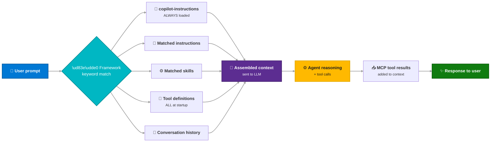
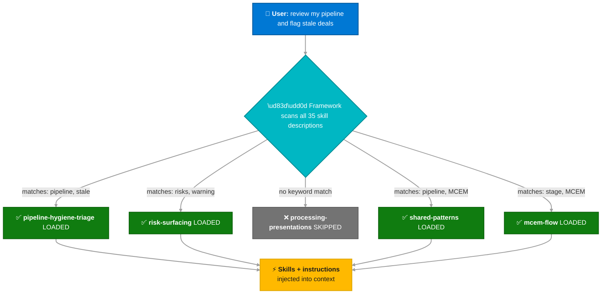
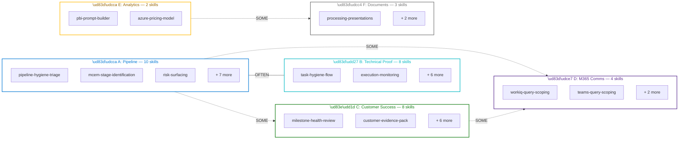
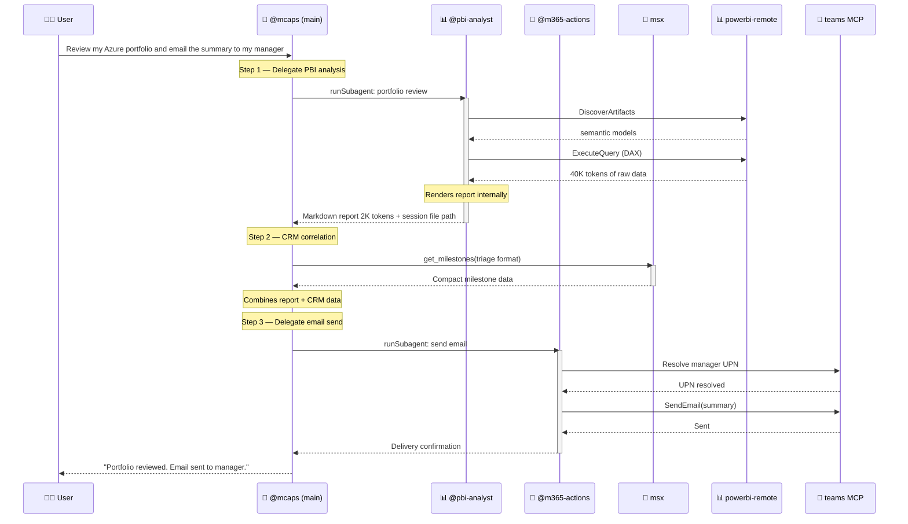
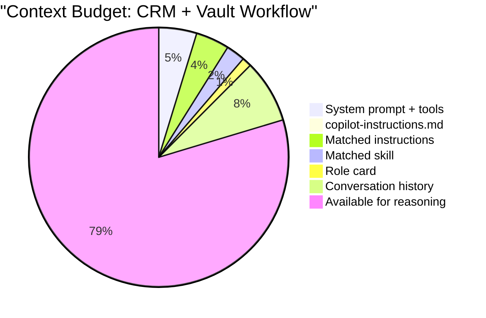
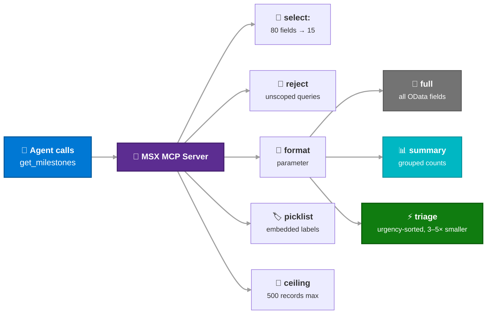

# Context Optimization

Every turn in Copilot Chat has a finite context window. MCAPS IQ optimizes that budget so more room is available for tool results and agent reasoning — not boilerplate.

!!! info "Version 2.1.0 — March 2026"
    This page reflects the current context-optimization spec. See the [action items](#action-items) for planned improvements.

---

## What We Control (and What We Don't)

| We control | We do NOT control |
|---|---|
| File sizes (instructions, skills, `copilot-instructions.md`) | Which files load (framework matches by `description` keywords) |
| Skill `description` keywords (routing accuracy) | Tool registration (all MCP tools load at startup, every turn) |
| MCP server response format/size | Context budget enforcement (no token counting API) |
| Subagent delegation (isolates heavy workflows) | Conversation history management |

**Key principle:** The optimization lever is _"make loaded files smaller and MCP responses leaner"_ — not building a custom orchestration layer.

---

## Context Assembly

The VS Code Copilot framework assembles context automatically each turn:

---

## Skill Routing via Description Matching

The `description` field in each SKILL.md frontmatter **is** the intent router. The framework matches user prompts against these descriptions to decide what to load.

!!! tip "Description quality = routing quality"
    Bad descriptions cause false positives (wasted context) or false negatives (missing capabilities). See [Skill Description Quality](#skill-description-quality) for audit criteria.

---

## Domain Clusters

35 skills grouped into 6 clusters by data source and co-activation pattern:

| Takeaway | Implication |
|---|---|
| **A ↔ B co-activate OFTEN** | Shared context (CRM schema, MCEM stages) benefits both |
| **D** is a cross-cutting evidence layer | Scoping skills stay self-contained |
| **E** is the best subagent candidate | High token cost, low co-activation |

---

## Subagent Architecture

Subagents (`.github/agents/*.agent.md`) run in isolated context windows. Tool results stay in the subagent; only the final response returns to the parent.

### Agent Inventory

| Agent | Status | Tools | When to Use | Token Impact |
|---|---|---|---|---|
| **@mcaps** | Existing | msx, oil, workiq, teams, mail, calendar | Main orchestrator for all CRM/vault workflows | — |
| **@m365-actions** | Existing | teams, mail, calendar | Send messages, emails, create events | Low (fire-and-forget) |
| **@pbi-analyst** | Recommended | powerbi-remote, editFiles | Any Power BI DAX query or report rendering | **High** — keeps 15–80K tokens out of main context |

!!! warning "Not recommended as subagents"
    - **deal-triage** — A↔B co-activation too high; CRM data already in main context
    - **vault-analyst** — Vault calls are fast (2–3 calls); high co-activation with every workflow

---

## Instruction File Trimming

The highest-impact optimization. Every token in an instruction file costs context space each time it's loaded.

### Current vs. Target Sizes

| File | Current Lines | Target Lines | Reduction | What Moves Out |
|---|---|---|---|---|
| `copilot-instructions.md` | 100 | 60 | -40% | Context Loading Architecture table, Authoring Rules → `CONTRIBUTING.md` |
| `shared-patterns` | 233 | 120 | -48% | Skill-chain table → `.github/documents/`; Connect hook detail → `connect-hooks`; CRM linkification → 5-line summary |
| `intent` | 154 | 80 | -48% | "House" room table, verbose prose → onboarding docs |
| `obsidian-vault` | 382 | 150 | -61% | Vault-init walkthrough, directory structure, troubleshooting → `mcp/oil/README.md` |
| `crm-entity-schema` | 420 | 200 | -52% | Extended entities (accounts, contacts, connections) → `.github/documents/` |
| `mcem-flow` | 204 | 120 | -41% | Per-criteria explanations → `.github/documents/` |
| `pbi-context-bridge` | 123 | 100 | -19% | DAX code examples (agent should follow PBI prompt files) |
| Role cards (×4) | 55–71 | Keep | — | Already right-sized; only one loads per session |

### Net Effect on a Typical CRM Workflow

Current instruction overhead for a typical turn: **~23,000 tokens** → After trim: **~12,500 tokens**. That's **~10,000 tokens freed** for tool results and agent reasoning.

---

## MCP Response Optimization

The second lever: make tool results smaller at the source.

### Already Implemented

### Planned Additions

| Change | Server | Impact |
|---|---|---|
| `format: "compact"` for `list_opportunities` | msx | Returns only: id, name, stage, close date, revenue, health |
| `maxResults` for `get_my_active_opportunities` | msx | Caps portfolio scans for users with 50+ opportunities |
| `maxResults` for `search_vault` (default 10) | oil | Caps large vault searches |
| `summaryOnly` flag for `get_customer_context` | oil | Returns only GUIDs + team roster, no engagement history |

---

## Skill Description Quality

Since `description` is the only routing mechanism, description quality directly controls system behavior.

### Audit Criteria

1. **Explicit trigger phrases** — the exact words users type, not abstract concepts
2. **Negative triggers** — `DO NOT USE FOR: ...` prevents false positives
3. **No sibling overlap** — distinct trigger sets between related skills
4. **Role named** — helps framework prioritize when multiple skills match

### Known Issues

| Skill | Problem | Fix |
|---|---|---|
| `partner-motion-awareness` | Too short (49 words), low keyword coverage | Add: "partner POC, partner delivery, SI engagement, co-sell deal registration" |
| `customer-outcome-scoping` | Overlaps with `adoption-excellence-review` on "KPIs" | Add: `DO NOT USE FOR: reviewing existing adoption metrics` |
| `execution-authority-clarification` | Only fires on "tie-break" | Add: "who has final say, authority dispute, escalation path, decision owner" |
| `non-linear-progression` | "regression" collides with software testing context | Replace with "deal regression, stage rollback" |

---

## Action Items

Three batches, ordered by impact:

### Batch 1 — File Trimming

| # | Action | Files |
|---|---|---|
| 1.1 | Trim `copilot-instructions.md` — remove Context Loading Architecture, Authoring Rules | 1 file |
| 1.2 | Trim `shared-patterns` — extract chain table to `.github/documents/`, deduplicate Connect hooks | 2 files |
| 1.3 | Trim `intent.instructions.md` — remove House table, compress prose | 1 file |
| 1.4 | Split `crm-entity-schema` — core stays, extended entities → `.github/documents/` | 2 files |
| 1.5 | Trim `obsidian-vault` — move setup/troubleshooting → `mcp/oil/README.md` | 2 files |
| 1.6 | Condense `mcem-flow` — compact stage table, detail → `.github/documents/` | 2 files |

### Batch 2 — Subagent + Response Optimization

| # | Action | Files |
|---|---|---|
| 2.1 | Create `@pbi-analyst` agent definition | 1 new `.agent.md` |
| 2.2 | Update `pbi-context-bridge` to reference `@pbi-analyst` | 1 file |
| 2.3 | Add `format: "compact"` to `list_opportunities` | `mcp/msx/src/tools.js` |
| 2.4 | Add `maxResults` to `get_my_active_opportunities` | `mcp/msx/src/tools.js` |
| 2.5 | Add format guidance to key skill flows | 3 skill files |

### Batch 3 — Description Quality

| # | Action | Files |
|---|---|---|
| 3.1 | Fix the 4 known description issues | 4 SKILL.md files |
| 3.2 | Audit remaining 31 skills for overlap and negatives | targeted edits |

### Explicitly Not Building

| Dropped | Reason |
|---|---|
| Custom intent router / keyword map | Framework's `description` matching already does this |
| TypeScript output contracts | No runtime enforces them |
| Compression pipeline with escalation hooks | No interception layer between tool results and context |
| Token counting instrumentation | No runtime API available |
| LLM-as-judge evaluation | Overhead exceeds value for internal tool |
| 5-phase, 15-week migration roadmap | 3 PR batches cover all work |
| Additional subagents (deal-triage, vault-analyst) | Co-activation cost exceeds savings |
