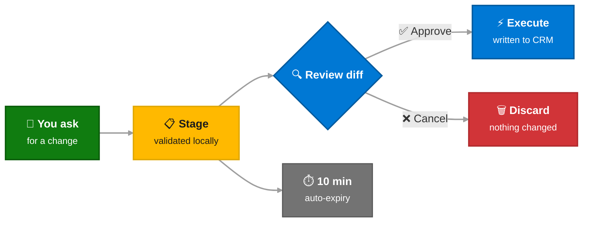

# Safety & Write Operations

!!! warning "CRM is shared production data"
    Incorrect writes can affect your entire account team and customer-facing records. Use AI-assisted write operations responsibly.

---

## Current Status

The write tools (`create_task`, `update_task`, `close_task`, `update_milestone`) are included in the MCP server but should be treated as **experimental**. They are designed with safety guardrails, but you should understand the risks before relying on them.

---

## How Write Safety Works

All write operations use a **Stage → Review → Execute** pattern:

### 1. Stage
When you ask Copilot to create, update, or close a record, the change is validated and staged locally. **Nothing is written to CRM yet.**

### 2. Review
Copilot shows you a before/after diff of the proposed change and asks for your approval. You can:

- **Approve** — proceed to execute
- **Cancel** — discard the staged change
- **Modify** — ask Copilot to adjust before approving

### 3. Execute
Only after you explicitly approve does the change get sent to CRM. You can cancel at any time.

!!! info "Auto-expiry"
    Staged operations expire automatically after **10 minutes** if not acted on. This prevents stale changes from being executed later.

---

## Staged Operation Tools

| Tool | Purpose |
|------|---------|
| `list_pending_operations` | See what's staged |
| `view_staged_changes_diff` | See before/after diff |
| `execute_operation` | Execute one staged change |
| `execute_all` | Execute all staged changes |
| `cancel_operation` | Cancel one staged change |
| `cancel_all` | Cancel all staged changes |

---

## Responsible AI Guidelines

!!! danger "Your responsibility"

    - **Always review before approving.** Read the staged diff carefully. Verify field values, dates, and record IDs.
    - **Don't batch-approve blindly.** If Copilot stages multiple operations, review each one. Use `cancel_operation` to discard any you're unsure about.
    - **Verify the right record.** CRM GUIDs can look similar. Confirm the opportunity/milestone name matches what you expect.
    - **Start with reads.** Before writing, use read tools (`crm_query`, `get_milestones`) to confirm the current state of the record.
    - **You are accountable.** AI suggests changes, but you own the approval. Treat every write approval as if you were making the change manually in MSX.
