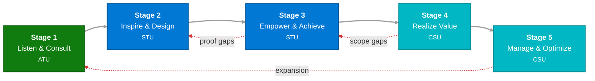

# Skill Architecture

This page documents the design rationale behind the current skill and instruction structure — why files are sized the way they are, how the MCEM process flow drives skill activation, and the governing principles that all new skills must follow.

!!! info "Spec status: Implemented"
    This restructure is complete with 3 real-task validation cycles passed. See [Validation Cycles](#validation-cycles) for trace results.

---

## Problem Statement

The original customization layer (~4,500 lines across 12 files) had three structural issues:

1. **Tier 0 overload** — `copilot-instructions.md` was ~400 lines; its own stated budget is <80. It contained operational procedures (CRM scoping, vault phases, WorkIQ references) that belong in Tier 1.

2. **Monolithic role skills** — Each role SKILL.md (430–520 lines) bundled three concerns:
    - Role identity (mission, MCEM stage accountability, boundaries)
    - Shared boilerplate (upfront scoping, runtime contract, shared definitions) — duplicated 4×
    - 10–15 procedural flows (e.g., "Commit Gate Enforcer") — each ~30 lines, not individually addressable

3. **No process-centric orientation** — Skills were organized by *role*, but MCEM is a *flow* involving all roles at different stages. No artifact modeled the end-to-end process.

---

## Design Goals

| Goal | Rationale |
|---|---|
| **Tier 0 ≤ 100 lines** | Reduce always-loaded cost; Tier 0 should route, not execute |
| **Skills are atomic** | One skill = one capability, 30–80 lines, individually triggerable |
| **Process as the spine** | A single MCEM flow document replaces role-first navigation |
| **DRY shared patterns** | Upfront scoping, runtime contract, shared definitions live in one instruction file |
| **Role context is lightweight** | Role identity = ~50-line instruction card, not a 500-line operating manual |
| **Progressive disclosure** | Agent loads process spine → activates relevant skill → pulls reference only if needed |

---

## Governing Principles

All new and refactored files conform to these binding constraints:

### P1. Description-Driven Routing

The `description` field is the **primary routing mechanism** — it determines whether a skill is selected from 100+ candidates.

- Third person ("Validates milestone readiness…", not "I validate…")
- States **what** it does AND **when** to trigger it with specific terms
- ≤ 1024 chars, keyword-rich for semantic matching
- Includes role names and MCEM stage numbers as trigger terms

!!! note "Custom frontmatter is ignored"
    VS Code routing only uses `name`, `description`, and `argument-hint`. Custom fields like `roles` / `mcem-stage` are not part of routing.

### P2. Token Budget Discipline

- Each SKILL.md body **< 500 lines** (hard cap)
- Atomic skills target **30–80 lines**
- Only include context the model does **not** already know
- Replace prose with **structured tables or bullet lists**
- Tier 0 + Tier 1 simultaneously loaded ≤ 600 lines

### P3. Progressive Disclosure

- SKILL.md is the overview; detailed domain content lives in **separate reference files**
- References are **one level deep** (no `a.md → b.md → c.md` chains)
- Referenced files > 100 lines get a table of contents at the top
- MCEM flow → atomic skills → CRM schema / vault docs (Tier 3 reference)

### P4. Degrees of Freedom

| Freedom | When to Use | Style |
|---|---|---|
| **High** | Context-dependent judgment (risk assessment, customer communication) | Text heuristics, decision criteria |
| **Medium** | Preferred pattern exists (CRM scoping, milestone review) | Numbered steps, parameterized templates |
| **Low** | Fragile/error-prone (write-gate enforcement, OData filter syntax) | Exact scripts, no deviation |

Write-intent operations are always **low freedom**.

### P5. Metadata Standards

- `name`: ≤64 chars, lowercase + hyphens only, gerund or noun form
- `argument-hint`: describes what the user should provide
- MCP tool references use fully qualified names: `msx:crm_query`, `oil:get_customer_context`

### P6. Consistent Terminology

| Use This | Not This |
|---|---|
| Opportunity | deal, engagement, opp |
| Milestone | engagement milestone, `msp_engagementmilestone` in prose |
| Committed / Uncommitted | closed, signed, pre-commit |
| Stage 1–5 with MCEM names | early stage, late stage |
| ATU → Account Team Unit | — |
| STU → Specialist + SE | — |
| CSU → CSAM + CSA | — |
| Partners | ISV, SI, vendor-specific names |

### P7. Workflows & Validation Loops

- Multi-step operations have **numbered steps**
- Critical workflows include a **copyable checklist**
- Quality-critical tasks include: execute → check → fix → repeat
- Decision points use **conditional branching** pattern

### P8. Iterative Improvement

New skills are validated through real-task usage:

1. Author based on patterns observed during manual task completion
2. Use on real MCEM scenarios → observe where agent struggles
3. Diagnose: discovery (description), clarity (body), or missing context?
4. Targeted edit → retest on failing case + existing passing cases
5. Repeat

---

## Layer Map

```
Tier 0  copilot-instructions.md           ≤100 lines  [THE TRAFFIC COP]
        ├── Intent (1 sentence)
        ├── Resolve order (Intent → Role → Stage → Skill → Risk)
        ├── Medium probe table
        ├── Role selection (4 roles → Tier 1 cards)
        ├── Pointer to MCEM flow (Tier 1)
        └── Response expectations

Tier 1  instructions/                                  [THE MAP]
        ├── mcem-flow.instructions.md        process spine (stage→skill→exit criteria)
        ├── role-card-specialist.md          role lens (~50 lines)
        ├── role-card-se.md                  role lens (~50 lines)
        ├── role-card-csa.md                 role lens (~50 lines)
        ├── role-card-csam.md                role lens (~50 lines)
        ├── shared-patterns.instructions.md  DRY shared boilerplate
        ├── crm-query-strategy.md            CRM scoping steps
        ├── crm-entity-schema.md             entity reference
        ├── msx-role-and-write-gate.md       write operations
        ├── intent.md                        top-level intent
        ├── obsidian-vault.md                vault integration
        └── connect-hooks.md                 Connect evidence

Tier 2  skills/                                        [THE TOOLS]
        └── (26 atomic skill files — see catalog below)

Tier 3  documents/                                     [THE LIBRARY]
        └── MCEM-stage-reference.md, crm-schema-extended, etc.
```

| Layer | Responsibility | Content Example |
|---|---|---|
| **Tier 0** | **The Traffic Cop** — routes intent to MCEM Flow or Role Card | `copilot-instructions.md` (≤100 lines) |
| **Tier 1** | **The Map** — Stages 1–5, accountabilities, exit criteria, role lens | `mcem-flow`, `role-card-*`, `shared-patterns` |
| **Tier 2** | **The Tools** — atomic skills, 30–80 lines each | `commit-gate-enforcement`, `pipeline-qualification`, etc. |
| **Tier 3** | **The Library** — deep reference docs | `MCEM-stage-reference.md`, `crm-entity-schema.md` |

---

## MCEM Flow — The Process Spine

The process spine (`mcem-flow.instructions.md`) models the end-to-end MSX sales motion. Each stage declares: who's accountable, what skills activate, and which exit criteria gate the next stage.

### MCEM Unit → Agent Role Mapping

| MCEM Unit | Agent Roles | Stage Accountability |
|---|---|---|
| ATU (Account Team Unit) | Account Executive (out of scope) | Stage 1 lead |
| STU (Specialist Team Unit) | **Specialist**, **SE** | Stages 2–3 accountable |
| CSU (Customer Success Unit) | **CSAM**, **CSA** | Stages 4–5 accountable |
| Partners | Referenced contextually | Varies by motion |

### Non-Linear Mechanics

The flow encodes these MCEM realities:

- **Stages may iterate or overlap** — activities can loop back based on customer readiness or proof gaps
- **Seller journeys alter sequencing** — partner-led, co-sell, and consumption-first motions change role leadership
- **Qualified pipeline typically begins at Stage 2** — Stage 1 is pre-pipeline signal consumption
- **Billed opportunities are often won at end of Stage 3** — the commit gate is the critical financial transition
- **Verifiable Outcomes are captured in MSX/D365** — CRM is the system of record for stage progression

### Stage Overview



| Stage | Objective | Accountable | Key Skills |
|---|---|---|---|
| **1 — Listen & Consult** | Qualify opportunity from signals | ATU | `pipeline-qualification`, `customer-outcome-scoping` |
| **2 — Inspire & Design** | Shape solution vision and align stakeholders | STU | `proof-plan-orchestration`, `architecture-feasibility-check`, `pipeline-hygiene-triage` |
| **3 — Empower & Achieve** | Prove feasibility, secure commitment | STU | `commit-gate-enforcement`, `handoff-readiness-validation`, `exit-criteria-validation` |
| **4 — Realize Value** | Deliver solution, achieve outcomes | CSU | `delivery-accountability-mapping`, `milestone-health-review`, `execution-monitoring` |
| **5 — Manage & Optimize** | Sustain value, drive expansion | CSU | `adoption-excellence-review`, `expansion-signal-routing`, `customer-evidence-pack` |

### Cross-Stage Capabilities (Any Stage)

| Skill | Purpose |
|---|---|
| `mcem-stage-identification` | Determine current stage from CRM data |
| `role-orchestration` | Recommend which role should lead next |
| `non-linear-progression` | Guide stage loopback when gaps exist |
| `risk-surfacing` | Proactive risk detection across mediums |
| `partner-motion-awareness` | Adjust for partner-led or co-sell motions |
| `exit-criteria-validation` | Check progress against MCEM exit criteria |

---

## Verifiable Outcomes (VO) Model

Stage identification is driven by **Verifiable Outcomes** — specific CRM entity states that evidence real progress — not the opportunity Stage field.

!!! warning "Why not the Stage field?"
    Sellers often move the Stage field before the work is done, or leave it lagging behind. Relying on it produces false positives ("You're in Stage 3" when exit criteria aren't met) and false negatives.

### Exit Criteria → CRM Entity Mapping

| Stage Gate | Exit Criteria | CRM Evidence | Entity / Field |
|---|---|---|---|
| **1 → 2** | Qualified opportunity exists | Open opportunity past qualification | `opportunity.statecode = 0` + `activestageid` transition |
| **1 → 2** | Initial Solution Play selected | Sales play populated | `opportunity.msp_salesplay ne null` |
| **2 → 3** | Solution Plays confirmed | Sales play has valid value | `opportunity.msp_salesplay` populated |
| **2 → 3** | Business value reviewed | BVA completed and linked | BVA entity `status = Complete` |
| **2 → 3** | Customer Success Plan created | CSP linked to opportunity | `msp_successplan` exists + linked |
| **3 → 4** | Customer agreement in place | Post-commitment stage | `opportunity.activestageid` + `statecode` |
| **3 → 4** | Resources aligned to delivery | Milestones Committed with dates | `msp_commitmentrecommendation = 861980003` + `msp_milestonedate` |
| **3 → 4** | Outcomes committed / baseline | At least one milestone Committed | `msp_commitmentrecommendation = 861980003` |
| **4 → 5** | Solution delivered | Milestone(s) Completed | `msp_milestonestatus = 861980003` |
| **4 → 5** | Customer health metrics agreed | CSP health fields populated | CSP entity health fields |
| **4 → 5** | Business value tracking in place | Consumption data recording | ACR/Usage data |
| **5 (exit)** | Outcomes met and sustained | Usage targets met | ACR trending + milestone completion |

!!! danger "CRM field corrections"
    - `msp_milestonestatus = 861980001` = **At Risk** (NOT Committed). Commitment lives in `msp_commitmentrecommendation`.
    - The Solution Play field is `msp_salesplay`, not `msp_solutionplay`.
    - `opportunity.activestageid` tracks D365 BPF stage transitions — use as secondary signal alongside VOs.

### How Stage Identification Uses VOs

1. Read `opportunity.activestageid` as the declared BPF stage (fast signal)
2. Read Verifiable Outcomes from CRM (milestones, success plans, BVAs, `msp_salesplay`)
3. Map achieved VOs against exit criteria for each stage gate
4. Determine the *highest stage whose exit criteria are fully evidenced*
5. Compare VO-based stage against `activestageid` — flag discrepancy if they diverge
6. Output: `actual_stage` (VO-based), `declared_stage` (BPF field), `gap_analysis` if mismatched

**Communication pattern:**

> "The CRM shows a completed Business Value Assessment and linked Success Plan, which means Stage 2 exit criteria are met — ready for Stage 3 (Empower & Achieve)."

When divergent:

> "The opportunity BPF stage shows Stage 3, but the milestone commitment recommendation is still Uncommitted and no Customer Success Plan exists — Stage 2 exit criteria are NOT met."

---

## Role Cards

Lightweight identity cards (~50 lines each) that replace the previous 430–520 line role SKILL.md files.

### Content per Card

- Mission (1–2 sentences)
- MCEM stage accountability (lead vs. contribute)
- Ownership scope in MSX
- Hygiene cadence
- Boundary rules (3–5 bullets)
- **Cross-role skill lens** (how this role weights shared skills)
- Cross-role communication patterns
- Escalation triggers

### Accountability-Based Lens Override

When the user's role is **not** the accountable unit for the current MCEM stage:

1. Load the user's own role card (their perspective)
2. **Also reference the accountable unit's role card** for stage leadership context
3. Make explicit who leads vs. who contributes
4. Gate skills owned by the accountable unit — present as "owned by [role], recommend engaging them"

!!! example "Specialist asking about Stage 4"
    Stage 4 is CSU-accountable. The agent:

    - Loads `role-card-specialist.md` → shows Specialist contributes expansion signals but doesn't lead delivery
    - References `role-card-csam.md` → shows CSAM leads delivery accountability, milestone health
    - Says: "Stage 4 is CSU-led. CSAM owns delivery accountability and milestone health. As a Specialist, your Stage 4 contribution is monitoring for expansion signals."

---

## Atomic Skills Catalog

26 atomic skills extracted from the previous monolithic role files. Each is 30–80 lines, individually triggerable.

### Frontmatter Template

```yaml
---
name: commit-gate-enforcement
description: >-
  Validates milestone readiness before commitment by checking
  delivery path, capacity, and target dates. Generates remediation
  tasks as dry-run payloads. Use when CSAM or CSA is evaluating
  commit readiness at MCEM Stage 3.
argument-hint: >-
  Provide opportunityId and milestoneId(s) approaching commitment
---
```

### Skill Body Structure

```markdown
## Purpose
1–2 sentences.

## Freedom Level
Medium | Low (for write-intent)

## Trigger
When this skill activates.

## Flow
1. Step 1 — tool call with `msx:tool_name`
2. Step 2 — evaluation logic
3. Step 3 — output generation

## Decision Logic
- Condition → action

## Output Schema
- `field_name` — what it contains
- `next_action` — recommended next skill and why
```

### Contextual Skill Chaining

Every stage-bound skill includes a `next_action` field in its output:

```mermaid
graph LR
    PQ["<b>pipeline-qualification</b>"] -->|"exit criteria met"| PPO["<b>proof-plan-orchestration</b>"]
    PPO -->|"plays confirmed"| PHT["<b>pipeline-hygiene-triage</b>"]
    PHT -->|"pipeline clean"| CGE["<b>commit-gate-enforcement</b>"]
    CGE -->|"commit gate passed"| HRV["<b>handoff-readiness-validation</b>"]
    HRV -->|"STU→CSU handoff"| DAM["<b>delivery-accountability-mapping</b>"]
    
    CGE -.->|"capacity gap"| AFC["<b>architecture-feasibility-check</b>"]

    style PQ fill:#107C10,color:#fff,stroke:#0a5c0a,stroke-width:2px
    style PPO fill:#0078D4,color:#fff,stroke:#005a9e,stroke-width:2px
    style PHT fill:#0078D4,color:#fff,stroke:#005a9e,stroke-width:2px
    style CGE fill:#FFB900,color:#1B1B1B,stroke:#e0a700,stroke-width:2px
    style HRV fill:#00B7C3,color:#fff,stroke:#008b94,stroke-width:2px
    style DAM fill:#00B7C3,color:#fff,stroke:#008b94,stroke-width:2px
    style AFC fill:#5C2D91,color:#fff,stroke:#462170,stroke-width:1.5px

    linkStyle default stroke:#9e9e9e,stroke-width:2px
    linkStyle 5 stroke:#D13438,stroke-width:1.5px
```



**Rules:**

1. `next_action` names exactly one skill (most likely next step)
2. Recommendation is grounded in the skill's output state
3. Cross-stage and navigation skills are exempt
4. The agent presents it as a suggestion — the user decides

**Cross-role chains:** When `next_action` names a skill owned by a different role, the output flags the transition:

> "STU→CSU handoff validated. The next step is `delivery-accountability-mapping`, which is owned by CSAM. Recommend notifying the CSAM to initiate Stage 4."

The agent does NOT auto-invoke a skill that belongs to a different role.

### Stage-Bound Skills

| Skill | Roles | Stage(s) | Lines |
|---|---|---|---|
| `pipeline-qualification` | Specialist | 1–2 | ~40 |
| `customer-outcome-scoping` | CSAM | 1 | ~40 |
| `proof-plan-orchestration` | SE, Specialist | 2–3 | ~50 |
| `architecture-feasibility-check` | CSA | 2–3 | ~40 |
| `pipeline-hygiene-triage` | Specialist | 2–3 | ~50 |
| `commit-gate-enforcement` | CSA, CSAM | 3 | ~60 |
| `handoff-readiness-validation` | Specialist | 3 | ~50 |
| `unified-constraint-check` | CSA, CSAM | 3–4 | ~50 |
| `delivery-accountability-mapping` | CSAM | 4 | ~50 |
| `execution-authority-clarification` | CSAM, CSA | 4 | ~40 |
| `milestone-health-review` | CSAM | 4–5 | ~50 |
| `execution-monitoring` | CSA | 4 | ~50 |
| `value-realization-pack` | CSA | 4–5 | ~50 |
| `architecture-execution-handoff` | CSA | 3–4 | ~50 |
| `adoption-excellence-review` | CSAM | 5 | ~50 |
| `expansion-signal-routing` | CSAM → Specialist | 5 | ~40 |
| `customer-evidence-pack` | CSAM | 4–5 | ~50 |

### Process Navigation Skills

| Skill | Purpose | Lines |
|---|---|---|
| `mcem-stage-identification` | Determine stage from Verifiable Outcomes | ~60 |
| `role-orchestration` | Recommend which role leads next | ~40 |
| `exit-criteria-validation` | Check MCEM exit criteria evidence | ~50 |
| `non-linear-progression` | Guide stage loopback | ~40 |
| `partner-motion-awareness` | Adjust for partner/co-sell motions | ~40 |

---

## Context Budget Projection

| Layer | Before | After | Delta |
|---|---|---|---|
| **Tier 0** (always loaded) | ~400 lines | ~100 lines | **-75%** |
| **Tier 1** (loaded on match) | ~1,660 | ~1,400 | -16% |
| **Tier 2** (loaded on demand) | ~2,410 | ~1,480 | **-39%** |
| **Typical request load** | ~2,050 | ~550 | **-73%** |

### Typical Request Comparison

=== "Before (CSAM milestone health)"

    | File | Lines |
    |---|---|
    | Tier 0 (`copilot-instructions.md`) | 400 |
    | `intent.instructions.md` | 350 |
    | `obsidian-vault.instructions.md` | 600 |
    | `msx-role-and-write-gate.md` | 200 |
    | CSAM role skill | 520 |
    | **Total** | **2,070** |

=== "After (CSAM milestone health)"

    | File | Lines |
    |---|---|
    | Tier 0 (`copilot-instructions.md`) | 72 |
    | `role-card-csam.md` | 70 |
    | `shared-patterns.md` | 62 |
    | `milestone-health-review` skill | 54 |
    | **Total** | **258** |

---

## Migration Plan

### Phase 1 — Foundation (non-breaking)

1. Create `shared-patterns.instructions.md`
2. Create `crm-query-strategy.instructions.md` (extract from Tier 0)
3. Create `mcem-flow.instructions.md` (process spine)
4. Create 4 role card files
5. Slim Tier 0 to ≤100 lines

### Phase 2 — Skill Extraction

6. Extract atomic skills from role SKILL.md files
7. Update `mcem-flow.instructions.md` to reference real skill names
8. Deprecate old role SKILL.md files

### Phase 3 — Validation

9. Test each MCEM stage scenario for correct skill activation
10. Measure context budget: Tier 0 + Tier 1 ≤ 600 lines
11. Verify no regression in role-specific workflows

### Phase 4 — Cleanup

12. Remove deprecated role SKILL.md files
13. Update skill authoring best practices
14. Update `copilot-instructions.md`

---

## Validation Cycles

Three real-task validation cycles confirmed the architecture works as designed.

### Cycle 1: Stage 3 → Stage 4 Handoff (Specialist → CSU)

**Scenario:** Specialist says: *"I need to hand off the Contoso opportunity to CSU — customer agreement was just signed."*

**Trace:** Tier 0 → `role-card-specialist` + `mcem-flow` → `mcem-stage-identification` (VOs) → Stage 3 skills → `handoff-readiness-validation` → chains to `delivery-accountability-mapping` (CSAM)

**Bugs found and fixed:**

| Issue | Severity | Fix |
|---|---|---|
| VO table mapped "Outcomes committed" to `msp_milestonestatus = 861980001` (**At Risk**) — should be `msp_commitmentrecommendation` | Critical | VO table rewritten with correct field |
| VO table referenced `msp_solutionplay` — CRM schema shows `msp_salesplay` | Medium | Corrected throughout |
| No `activestageid` in VO model | Medium | Added as Step 1 in VO algorithm |

**Gaps addressed:**

- Added accountability-based lens override for cross-role stage queries
- Added cross-role chain rule: output names the owning role, recommends engagement (no auto-invoke)
- Grounded all 5 stage exit criteria in specific CRM fields

### Cycle 2: CSAM Milestone Health Review (Stage 4)

**Scenario:** CSAM asks: *"What's the milestone health for Contoso?"*

**Trace:** Tier 0 (72) → `role-card-csam` (70) + `shared-patterns` (62) → `milestone-health-review` (54) → `delivery-accountability-mapping` (next_action)

**Context budget:** 72 + 70 + 62 + 54 = **258 lines** (budget: ≤600)

**Result:** Clean — no bugs. 87% reduction from prior architecture.

### Cycle 3: SE Proof Plan for Stage 2 (cross-role chain to CSA)

**Scenario:** SE says: *"I need to plan the proof for the Fabrikam Azure Migration opportunity."*

**Trace:** Tier 0 (72) → `role-card-se` (54) + `shared-patterns` (62) → `proof-plan-orchestration` (52) → `architecture-feasibility-check` (next_action, CSA-owned)

**Context budget:** 72 + 54 + 62 + 52 = **240 lines** (budget: ≤600)

**Bugs found:** 5 skills had cross-role `next_action` that didn't name the owning role. All fixed.

---

## Open Questions

| # | Question | Status |
|---|---|---|
| 1 | Custom `roles`/`mcem-stage` frontmatter? | **Resolved** — VS Code ignores custom fields; encode in `description` |
| 2 | Merge thin skills (<30 lines)? | Per P2, merge into nearest related skill unless distinct trigger phrase |
| 3 | Cross-role skill ownership? | **Resolved** — skills are role-agnostic; role cards provide the lens |
| 4 | Vault instruction split? | Deferred until after skill extraction proves the model |
| 5 | Stage identification mechanism? | **Resolved** — Verifiable Outcomes model (see above) |
| 6 | Backward compatibility during migration? | Keep old files alongside new during Phase 2, remove in Phase 4 |
