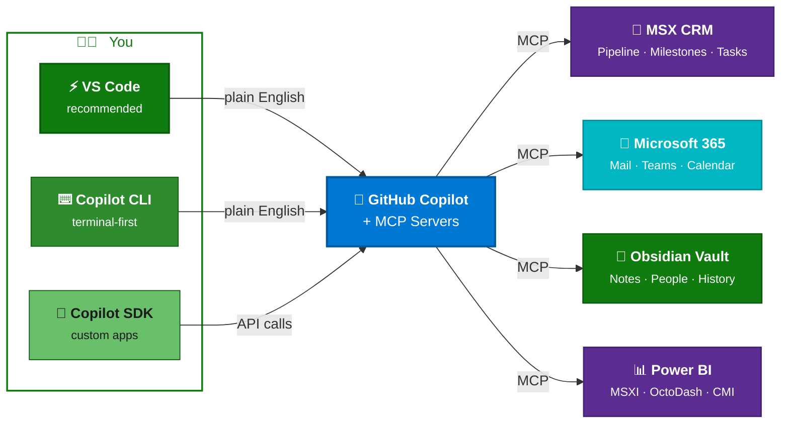

# Getting Started

!!! success "5 minutes to your first result"
    You'll go from a fresh clone to asking Copilot about your MSX pipeline in about 5 minutes. No coding, no configuration files to hand-edit.

## The Setup Path

<div class="timeline-nav">
<a href="./" class="tl-step active"><div class="tl-node"><span class="tl-num">1</span></div><div class="tl-label">Getting Started</div></a>
<a href="installation/" class="tl-step"><div class="tl-node"><span class="tl-num">2</span></div><div class="tl-label">Install</div></a>
<a href="first-chat/" class="tl-step"><div class="tl-node"><span class="tl-num">3</span></div><div class="tl-label">First Chat</div></a>
<a href="choose-role/" class="tl-step"><div class="tl-node"><span class="tl-num">4</span></div><div class="tl-label">Choose Role</div></a>
</div>

---

## Before You Begin

- [ ] **Microsoft corporate VPN** connected
- [ ] **Microsoft corp account** (`@microsoft.com`)
- [ ] **GitHub Copilot license** — verify at [aka.ms/copilot](https://aka.ms/copilot)

??? tip "How to check VPN"
    Try opening [microsoftsales.crm.dynamics.com](https://microsoftsales.crm.dynamics.com) in your browser. If it loads, you're connected.

??? tip "Need a Copilot license?"
    Go to [aka.ms/copilot](https://aka.ms/copilot) and sign in with your `@microsoft.com` account. If you don't have access, ask your manager — Microsoft provides Copilot Business for internal use.

---

## Step 1: Install Git + GitHub CLI

This repo is **internal to the Microsoft GitHub org**, so you need Git and GitHub CLI to access it. These are the **only two tools you install manually** — the bootstrap script (Step 3) handles everything else.

=== "Windows"

    Open **PowerShell** or **Command Prompt** and run:

    ```powershell
    winget install Git.Git --silent --accept-package-agreements --accept-source-agreements
    winget install GitHub.cli --silent --accept-package-agreements --accept-source-agreements
    ```

    Then refresh your PATH so the new tools are recognized:

    ```powershell
    $env:Path = [System.Environment]::GetEnvironmentVariable("Path","Machine") + ";" + [System.Environment]::GetEnvironmentVariable("Path","User")
    ```

=== "macOS"

    ```bash
    brew install git gh
    ```

    ??? tip "No Homebrew?"
        Install it first: `/bin/bash -c "$(curl -fsSL https://raw.githubusercontent.com/Homebrew/install/HEAD/install.sh)"`

---

## Step 2: Authenticate and Clone

```bash
gh auth login          # Use your PERSONAL GitHub account (not _microsoft EMU)
gh repo clone microsoft/MCAPS-IQ
cd MCAPS-IQ
```

!!! warning "Use your personal GitHub account"
    Sign in with your **personal** GitHub account (e.g. `JohnDoe`), **not** your Enterprise Managed User ending in `_microsoft`. EMU accounts cannot access GitHub Packages from external organizations.

---

## Step 3: Run the Bootstrap Script

The bootstrap script checks your system and installs any remaining tools automatically — **VS Code**, **Node.js 18+**, **Azure CLI**, **PowerShell 7** (Windows), the **Copilot extension**, GitHub Packages auth, and Azure sign-in.

=== "macOS / Linux"

    ```bash
    ./scripts/bootstrap.sh --skip-clone
    ```

=== "Windows (PowerShell)"

    ```powershell
    .\scripts\bootstrap.ps1 -SkipClone
    ```

=== "Windows (cmd.exe)"

    ```cmd
    powershell -ExecutionPolicy Bypass -File scripts\bootstrap.ps1 -SkipClone
    ```

!!! tip "Just want to check what's missing?"
    Run with `--check-only` / `-CheckOnly` to see a report without installing anything.

---

## What's Next?

After the bootstrap script finishes, VS Code opens automatically. Continue to:

[:octicons-arrow-right-16: Installation — Start MCP Servers](installation.md){ .md-button .md-button--primary }
[:octicons-arrow-right-16: Skip to Your First Chat](first-chat.md){ .md-button }

---

## Quick Visual: What You're Building



---

## Manual Setup Reference

??? abstract "Install tools yourself (skip if you used the bootstrap script)"

    If the bootstrap script didn't work or you prefer manual control, install these tools individually:

    | Tool | Check | Windows Install | macOS Install |
    |------|-------|-----------------|---------------|
    | **Git** | `git --version` (2.x+) | `winget install Git.Git` | `brew install git` |
    | **GitHub CLI** | `gh --version` (2.x+) | `winget install GitHub.cli` | `brew install gh` |
    | **Node.js** | `node --version` (v18+) | `winget install OpenJS.NodeJS.LTS` | `brew install node` |
    | **Azure CLI** | `az --version` (2.x+) | `winget install Microsoft.AzureCLI` | `brew install azure-cli` |
    | **VS Code** | Open it | `winget install Microsoft.VisualStudioCode` | `brew install --cask visual-studio-code` |
    | **PowerShell 7** | `pwsh --version` (7+) | `winget install Microsoft.PowerShell` | _not needed_ |
    | **Copilot ext** | Check Extensions panel | `code --install-extension GitHub.copilot-chat` | Same |

    After installing, refresh your PATH (Windows):
    ```powershell
    $env:Path = [System.Environment]::GetEnvironmentVariable("Path","Machine") + ";" + [System.Environment]::GetEnvironmentVariable("Path","User")
    ```

    Then sign in to Azure:
    ```bash
    az login --tenant 72f988bf-86f1-41af-91ab-2d7cd011db47
    ```

    !!! tip "Restart VS Code after installing CLI tools"
        VS Code terminals inherit PATH from launch — new installs won't be visible until you restart.

??? abstract "GitHub Account + Microsoft EMU setup"

    You need a GitHub account linked to Microsoft's Enterprise Managed Users (EMU) for unlimited Copilot access.

    1. **Create a free GitHub account** at [github.com/signup](https://github.com/signup) if you don't have one
    2. **Link it to Microsoft EMU**: Go to [aka.ms/copilot](https://aka.ms/copilot) and sign in with `@microsoft.com`. Follow the prompts to link.
    3. **Verify billing**: At [github.com/settings/copilot/features](https://github.com/settings/copilot/features), confirm **"Usage billed to"** shows **"Microsoft GitHub Copilot feature flag"**

---

## Something Not Working?

Jump to [Troubleshooting Setup](troubleshooting.md) — it covers every common issue with step-by-step fixes.
