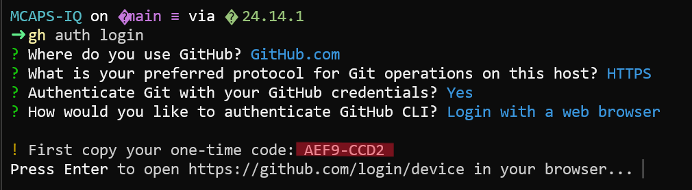
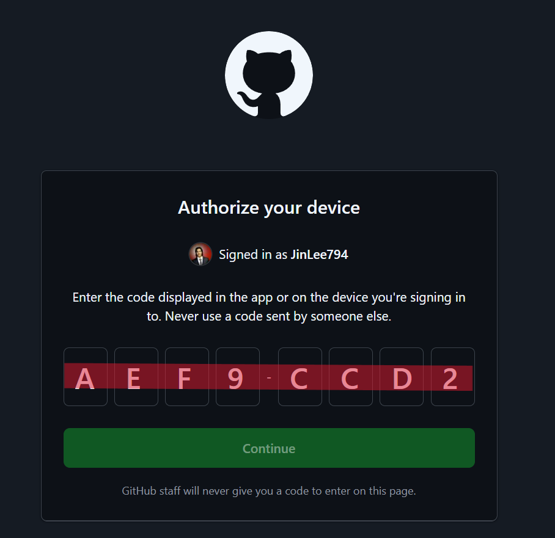
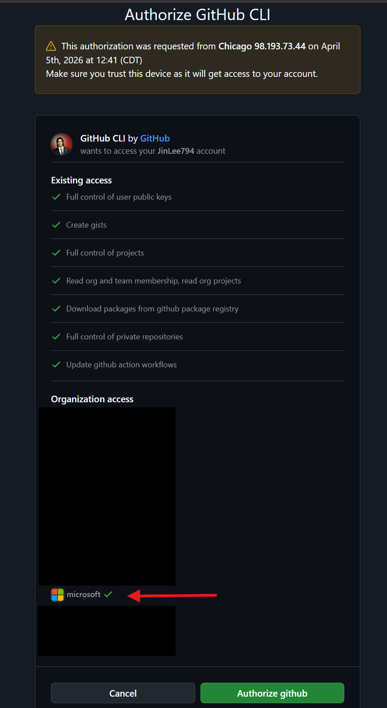
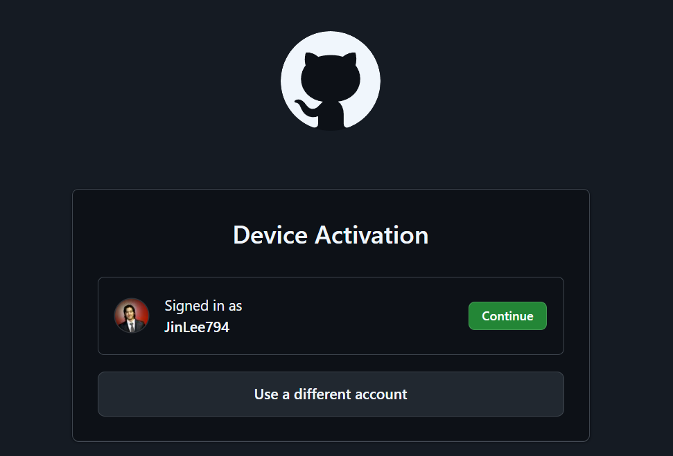
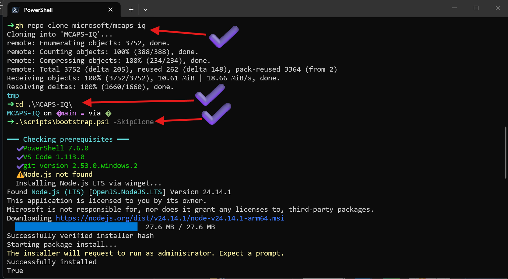
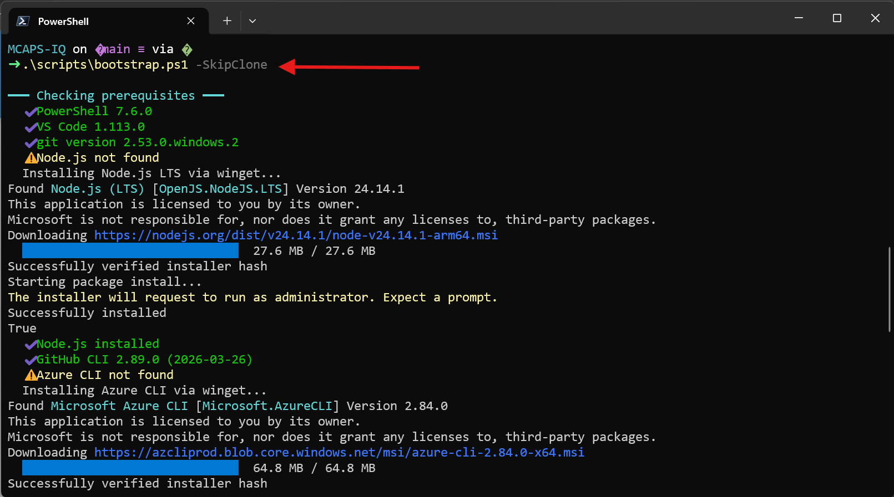
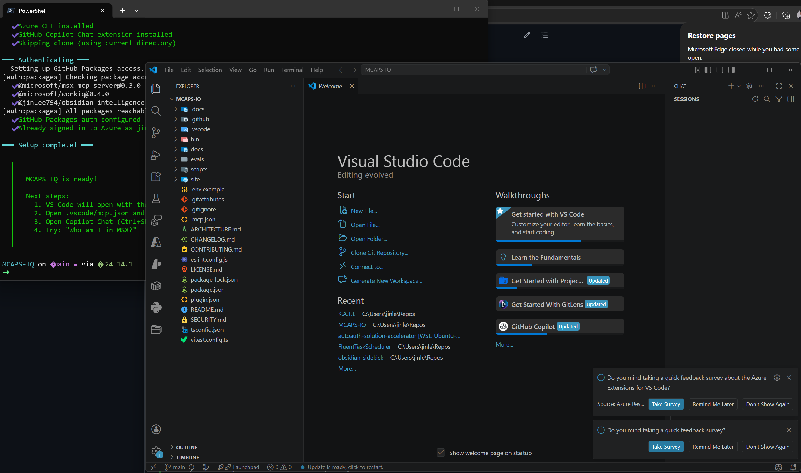
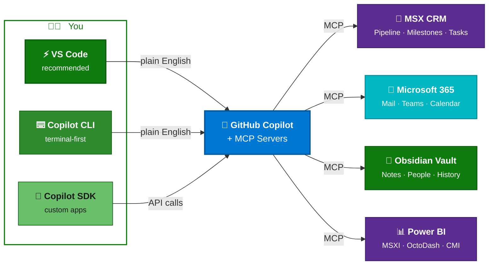

# Getting Started

!!! success "5 minutes to your first result"
    You'll go from a fresh clone to asking Copilot about your MSX pipeline in about 5 minutes. No coding, no configuration files to hand-edit.

## The Setup Path

<div class="timeline-nav">
<a href="./" class="tl-step active"><div class="tl-node"><span class="tl-num">1</span></div><div class="tl-label">Getting Started</div></a>
<a href="installation/" class="tl-step"><div class="tl-node"><span class="tl-num">2</span></div><div class="tl-label">Install</div></a>
<a href="first-chat/" class="tl-step"><div class="tl-node"><span class="tl-num">3</span></div><div class="tl-label">First Chat</div></a>
<a href="choose-role/" class="tl-step"><div class="tl-node"><span class="tl-num">4</span></div><div class="tl-label">Choose Role</div></a>
</div>

---

## Before You Begin

- [ ] **Microsoft corporate VPN** connected
- [ ] **Microsoft corp account** (`@microsoft.com`)
- [ ] **GitHub Copilot license** — verify at [aka.ms/copilot](https://aka.ms/copilot)

??? tip "How to check VPN"
    Try opening [microsoftsales.crm.dynamics.com](https://microsoftsales.crm.dynamics.com) in your browser. If it loads, you're connected.

??? tip "Need a Copilot license?"
    Go to [aka.ms/copilot](https://aka.ms/copilot) and sign in with your `@microsoft.com` account. If you don't have access, ask your manager — Microsoft provides Copilot Business for internal use.

    A successfully linked account looks like this — your **personal** GitHub account and your **Enterprise Managed User** (`_microsoft`) account are both linked, with green checkmarks confirming Copilot access:

    <figure markdown="span">
      { loading=lazy width="700" }
      <figcaption>At <a href="https://aka.ms/copilot">aka.ms/copilot</a>, confirm your personal GitHub account is <strong>linked</strong> and shows green ✓ checkmarks for Copilot access.</figcaption>
    </figure>

    Next, verify your personal GitHub account is billing Copilot through Microsoft. Go to [github.com/settings/copilot/features](https://github.com/settings/copilot/features) and confirm **"Usage billed to"** shows **"Microsoft GitHub Copilot feature flag"** — this ensures you get unlimited Copilot tokens:

    <figure markdown="span">
      { loading=lazy width="700" }
      <figcaption>In GitHub Settings → Copilot → Features, confirm <strong>Usage billed to</strong> shows <strong>Microsoft GitHub Copilot feature flag</strong>.</figcaption>
    </figure>

---

## Step 1: Install Git + GitHub CLI

This repo is **internal to the Microsoft GitHub org**, so you need Git and GitHub CLI to access it. These are the **only two tools you install manually** — the bootstrap script (Step 3) handles everything else.

=== "Windows"

    First, open **PowerShell 7**. Press the ++win++ key (or click Start), type `power`, and select **PowerShell 7 (x64)**:

    <figure markdown="span">
      { loading=lazy width="300" }
      <figcaption>Search for "power" in the Start menu and click <strong>PowerShell 7 (x64)</strong>.</figcaption>
    </figure>

    !!! warning "PowerShell 7 is required"
        The bootstrap script in Step 3 **requires PowerShell 7** to run — Windows PowerShell 5.x will not work. If you don't see **PowerShell 7 (x64)** in the Start menu, install it now:

        ```powershell
        winget install --id Microsoft.PowerShell --source winget
        ```

        After the install completes, **close your current terminal** and reopen using **PowerShell 7 (x64)** before continuing. Do not proceed with Windows PowerShell 5.x.

    ??? warning "Don't have `winget`?"
        If `winget --version` returns an error, install it:

        ```powershell
        Add-AppxPackage -RegisterByFamilyName -MainPackage Microsoft.DesktopAppInstaller_8wekyb3d8bbwe
        ```

        Then update to the latest version:

        ```powershell
        winget install -e --id Microsoft.AppInstaller --source winget --accept-source-agreements --accept-package-agreements
        ```

    Then run:

    ```powershell
    winget install Git.Git --silent --accept-package-agreements --accept-source-agreements
    winget install GitHub.cli --silent --accept-package-agreements --accept-source-agreements
    ```

    Then refresh your PATH so the new tools are recognized:

    ```powershell
    $env:Path = [System.Environment]::GetEnvironmentVariable("Path","Machine") + ";" + [System.Environment]::GetEnvironmentVariable("Path","User")
    ```

=== "macOS"

    ```bash
    brew install git gh
    ```

    ??? tip "No Homebrew?"
        Install it first: `/bin/bash -c "$(curl -fsSL https://raw.githubusercontent.com/Homebrew/install/HEAD/install.sh)"`

---

## Step 2: Authenticate and Clone

Before cloning the repo, you need to authenticate the GitHub CLI. This grants access to the Microsoft org's private packages.

```bash
gh auth login          # Use your PERSONAL GitHub account (not _microsoft EMU)
```

Select **GitHub.com**, **HTTPS**, authenticate with credentials, and **Login with a web browser**. The CLI will give you a one-time device code:

<figure markdown="span">
  { loading=lazy width="600" }
  <figcaption>The CLI prompts for GitHub.com, HTTPS, and opens a browser login flow. Copy the one-time code it displays.</figcaption>
</figure>

A browser window opens to `github.com/login/device`. Enter the one-time code from your terminal and click **Continue**:

<figure markdown="span">
  { loading=lazy width="500" }
  <figcaption>Enter the code from your terminal — never use a code sent by someone else.</figcaption>
</figure>

On the next screen, review the permissions and make sure the **microsoft** organization has a green checkmark (meaning your account has access). Click **Authorize github**:

<figure markdown="span">
  { loading=lazy width="450" }
  <figcaption>Confirm the <strong>microsoft</strong> org shows a ✓ before authorizing.</figcaption>
</figure>

After authorizing, you'll see a **Device Activation** confirmation showing your GitHub account. Click **Continue**:

<figure markdown="span">
  { loading=lazy width="500" }
  <figcaption>Confirm your GitHub identity and click Continue.</figcaption>
</figure>

Once authenticated, clone the repo and navigate into it:

```bash
gh repo clone microsoft/MCAPS-IQ
cd MCAPS-IQ
```

!!! warning "Use your personal GitHub account"
    Sign in with your **personal** GitHub account (e.g. `JohnDoe`), **not** your Enterprise Managed User ending in `_microsoft`. EMU accounts cannot access GitHub Packages from external organizations.

---

## Step 3: Run the Bootstrap Script

The bootstrap script checks your system and installs any remaining tools automatically — **VS Code**, **Node.js 18+**, **Azure CLI**, the **Copilot extension**, GitHub Packages auth, Azure sign-in, the **`mcaps` CLI command**, and **Obsidian vault initialization** (you'll be prompted for a vault location — press Enter to use the default `.vault/` directory inside the repo).

=== "macOS / Linux"

    ```bash
    ./scripts/bootstrap.sh --skip-clone
    ```

=== "Windows (PowerShell)"

    If this is your first time running scripts, allow PowerShell to execute local scripts:

    ```powershell
    Set-ExecutionPolicy -Scope CurrentUser -ExecutionPolicy RemoteSigned
    ```

    Then run the bootstrap:

    ```powershell
    .\scripts\bootstrap.ps1 -SkipClone
    ```

=== "Windows (cmd.exe)"

    ```cmd
    powershell -ExecutionPolicy Bypass -File scripts\bootstrap.ps1 -SkipClone
    ```

!!! tip "Just want to check what's missing?"
    Run with `--check-only` / `-CheckOnly` to see a report without installing anything.

!!! note "Windows `winget` commands may fail intermittently"
    If a `winget install` command errors out during the bootstrap, just re-run the script — transient failures are common and usually resolve on retry.

!!! note "Already have Node.js installed?"
    Make sure it's up to date (`node --version` should be v18+). Older versions can cause `npx` failures when starting MCP servers. Update with `winget upgrade OpenJS.NodeJS.LTS` (Windows) or `brew upgrade node` (macOS).

### What to Expect

The bootstrap script checks for each prerequisite and installs anything missing. Here's what a typical Windows run looks like:

**1. Clone, navigate, and launch the bootstrap script.** After `gh` and `git` are working, clone the repo, `cd` into it, and run the bootstrap script. The script immediately begins checking prerequisites — items already installed get a green ✓:

<figure markdown="span">
  { loading=lazy width="700" }
  <figcaption>Clone with <code>gh repo clone</code>, <code>cd</code> into the repo, then run the bootstrap script. It checks each prerequisite and auto-installs missing tools (yellow ⚠).</figcaption>
</figure>

**2. Missing dependencies are installed automatically.** The script detects any tools you're missing (Node.js, Azure CLI, etc.) and installs them via `winget` — no manual downloads needed:

<figure markdown="span">
  { loading=lazy width="700" }
  <figcaption>After installing Node.js, the script continues checking — here it finds Azure CLI missing and installs it automatically.</figcaption>
</figure>

**3. Setup complete — VS Code opens.** When all prerequisites are satisfied, the script configures GitHub Packages auth, signs you into Azure, and opens VS Code with the MCAPS-IQ workspace ready to go:

<figure markdown="span">
  { loading=lazy width="700" }
  <figcaption>The terminal shows "MCAPS IQ is ready!" with next steps. VS Code opens automatically with the workspace loaded.</figcaption>
</figure>

!!! warning "Commands not found after install?"
    If tools like `node`, `az`, or `gh` aren't recognized after the bootstrap script installs them, **close and reopen your PowerShell window** to pick up the updated PATH. If that doesn't help, **restart your PC** — some installers (especially MSI-based ones like Node.js and Azure CLI) require a full restart for PATH changes to propagate.

!!! warning "Copilot keeps asking you to log in to Azure?"
    The validation script (`npm run check`) may show Azure as logged in, but Copilot chat can still prompt you to run `az login`. If Copilot gets stuck in a loop asking you to press Enter after `az login --tenant=...`, run the login manually in a terminal first:

    ```bash
    az login --tenant 72f988bf-86f1-41af-91ab-2d7cd011db47
    ```

    Then **reload VS Code** (++cmd+shift+p++ → **"Developer: Reload Window"**) so Copilot picks up the fresh session.

---

## What's Next?

After the bootstrap script finishes, VS Code opens automatically. Continue to:

[:octicons-arrow-right-16: Installation — Start MCP Servers](installation.md){ .md-button .md-button--primary }
[:octicons-arrow-right-16: Skip to Your First Chat](first-chat.md){ .md-button }

---

## Quick Visual: What You're Building



---

## Manual Setup Reference

??? abstract "Install tools yourself (skip if you used the bootstrap script)"

    If the bootstrap script didn't work or you prefer manual control, install these tools individually:

    | Tool | Check | Windows Install | macOS Install |
    |------|-------|-----------------|---------------|
    | **Git** | `git --version` (2.x+) | `winget install Git.Git` | `brew install git` |
    | **GitHub CLI** | `gh --version` (2.x+) | `winget install GitHub.cli` | `brew install gh` |
    | **Node.js** | `node --version` (v18+) | `winget install OpenJS.NodeJS.LTS` | `brew install node` |
    | **Azure CLI** | `az --version` (2.x+) | `winget install Microsoft.AzureCLI` | `brew install azure-cli` |
    | **VS Code** | Open it | `winget install Microsoft.VisualStudioCode` | `brew install --cask visual-studio-code` |
    | **PowerShell 7** | `pwsh --version` (7+) | `winget install Microsoft.PowerShell` | _not needed_ |
    | **Copilot ext** | Check Extensions panel | `code --install-extension GitHub.copilot-chat` | Same |

    After installing, refresh your PATH (Windows):
    ```powershell
    $env:Path = [System.Environment]::GetEnvironmentVariable("Path","Machine") + ";" + [System.Environment]::GetEnvironmentVariable("Path","User")
    ```

    Then sign in to Azure:
    ```bash
    az login --tenant 72f988bf-86f1-41af-91ab-2d7cd011db47
    ```

    !!! tip "Restart VS Code after installing CLI tools"
        VS Code terminals inherit PATH from launch — new installs won't be visible until you restart.

??? abstract "GitHub Account + Microsoft EMU setup"

    You need a GitHub account linked to Microsoft's Enterprise Managed Users (EMU) for unlimited Copilot access.

    1. **Create a free GitHub account** at [github.com/signup](https://github.com/signup) if you don't have one
    2. **Link it to Microsoft EMU**: Go to [aka.ms/copilot](https://aka.ms/copilot) and sign in with `@microsoft.com`. Follow the prompts to link.
    3. **Verify billing**: At [github.com/settings/copilot/features](https://github.com/settings/copilot/features), confirm **"Usage billed to"** shows **"Microsoft GitHub Copilot feature flag"**

---

## Something Not Working?

Jump to [Troubleshooting Setup](troubleshooting.md) — it covers every common issue with step-by-step fixes.
