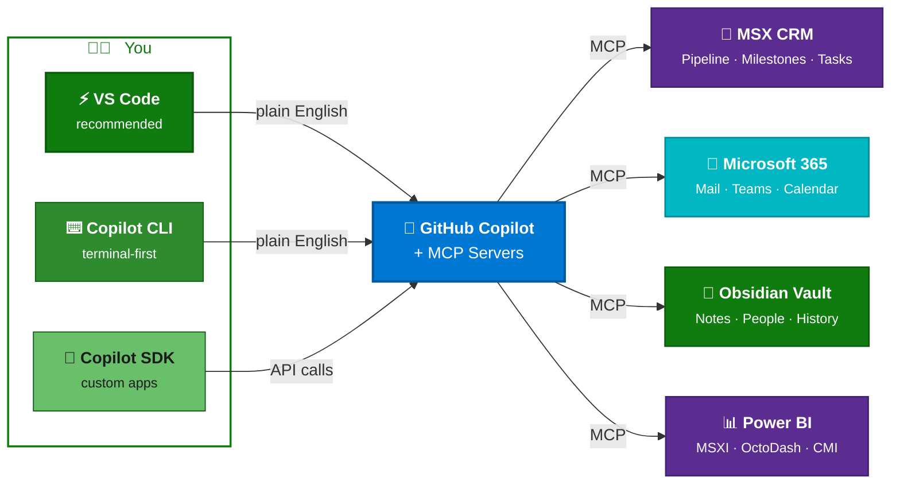
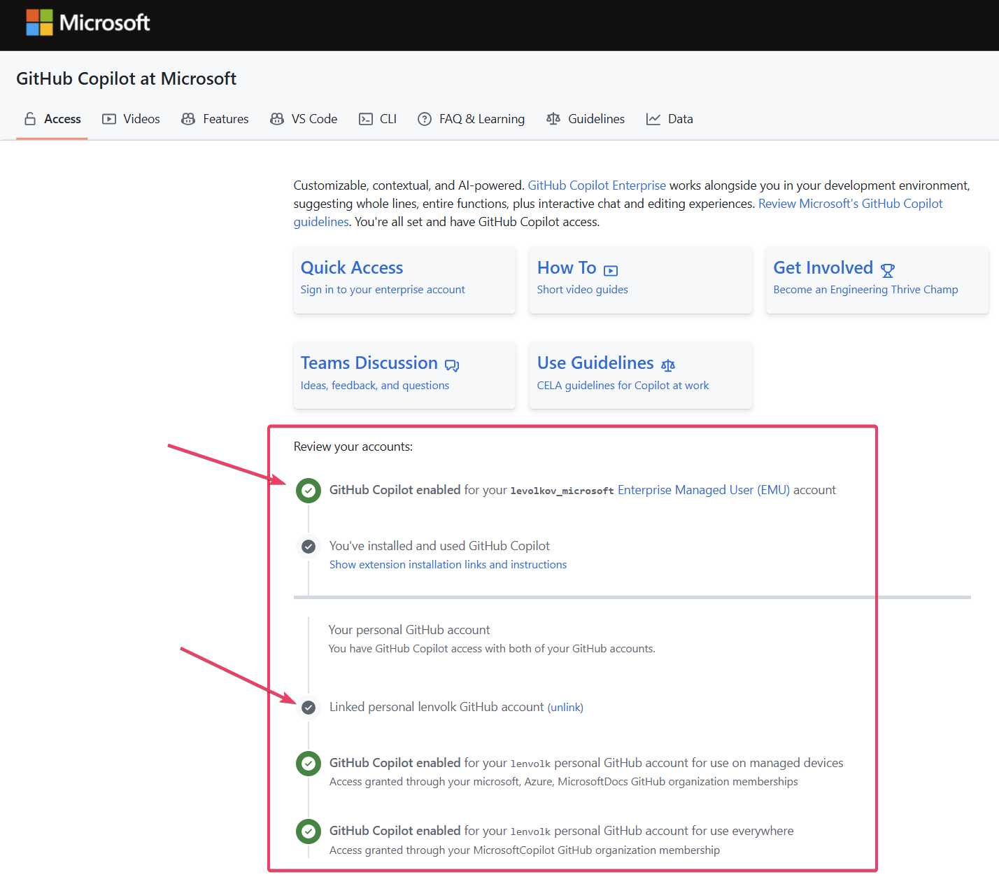
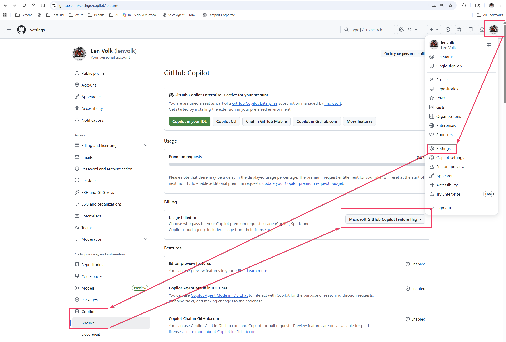
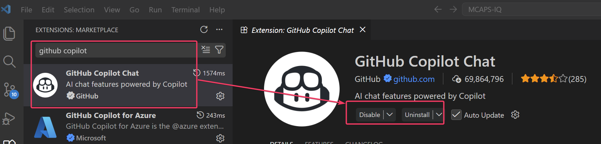
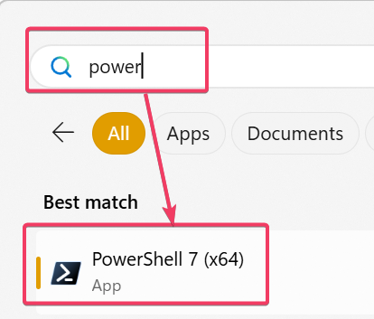
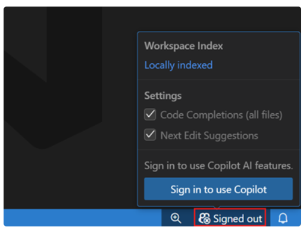
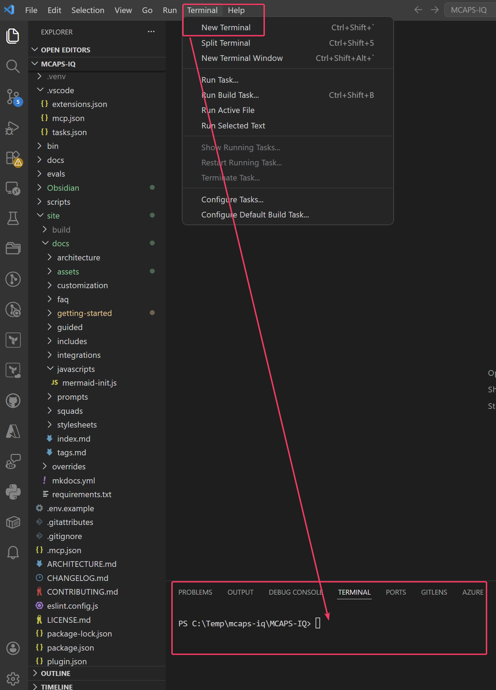

# Getting Started

!!! success "5 minutes to your first result"
    You'll go from a fresh clone to asking Copilot about your MSX pipeline in about 5 minutes. No coding, no configuration files to hand-edit.

## The Setup Path

<div class="timeline-nav">
<a href="./" class="tl-step active"><div class="tl-node"><span class="tl-num">1</span></div><div class="tl-label">Getting Started</div></a>
<a href="installation/" class="tl-step"><div class="tl-node"><span class="tl-num">2</span></div><div class="tl-label">Install</div></a>
<a href="first-chat/" class="tl-step"><div class="tl-node"><span class="tl-num">3</span></div><div class="tl-label">First Chat</div></a>
<a href="choose-role/" class="tl-step"><div class="tl-node"><span class="tl-num">4</span></div><div class="tl-label">Choose Role</div></a>
</div>

| Step | What You'll Do | Time |
|------|---------------|------|
| **Getting Started** (this page) | Verify you have VS Code, Node.js, Azure CLI, and VPN | 2 min |
| [**Installation**](installation.md) | Clone the repo, install dependencies, sign in to Azure | 3 min |
| [**Your First Chat**](first-chat.md) | Open Copilot, start the MCP servers, and ask your first question | 1 min |
| [**Choose Your Role**](choose-role.md) | Tell Copilot who you are so it tailors its behavior | 30 sec |

---

## Quick Visual: What You're Building



You're connecting Copilot to your enterprise data sources via MCP servers. **VS Code** is the recommended path — but power users can also use the **GitHub Copilot CLI** from a terminal or integrate via the **GitHub Copilot SDK** from a custom app. Once connected, you just talk to it.

---

## Prerequisites

Before you begin, make sure you're on the **Microsoft corporate VPN** and have your `@microsoft.com` account ready.

### :material-rocket-launch: One-Command Bootstrap (recommended)

The bootstrap script checks your system, installs any missing tools (VS Code, Git, Node.js, GitHub CLI, Azure CLI, Copilot extension), clones the repo, authenticates, and opens VS Code — all in one paste.

=== "Windows (PowerShell)"

    Open **PowerShell** (5.1 or 7) and paste:

    ```powershell
    irm https://raw.githubusercontent.com/microsoft/MCAPS-IQ/main/scripts/bootstrap.ps1 | iex
    ```

=== "Windows (cmd.exe)"

    Open **Command Prompt** and paste:

    ```cmd
    powershell -ExecutionPolicy Bypass -Command "irm https://raw.githubusercontent.com/microsoft/MCAPS-IQ/main/scripts/bootstrap.ps1 | iex"
    ```

=== "macOS"

    Open **Terminal** and paste:

    ```bash
    curl -fsSL https://raw.githubusercontent.com/microsoft/MCAPS-IQ/main/scripts/bootstrap.sh | bash
    ```

!!! success "What the script does"
    1. Checks for missing tools and installs them (via `winget` on Windows, `brew` on macOS)
    2. Installs **PowerShell 7** on Windows if not present (required for VS Code terminal and tooling)
    3. Clones the MCAPS IQ repo
    4. Sets up GitHub Packages auth (for private MCP server packages)
    5. Signs you in to Azure (Microsoft tenant)
    6. Opens VS Code with the workspace ready

!!! tip "Already have the repo?"
    Run the bootstrap locally with `--skip-clone` / `-SkipClone`:

    ```bash
    # macOS/Linux
    ./scripts/bootstrap.sh --skip-clone

    # Windows PowerShell
    .\scripts\bootstrap.ps1 -SkipClone
    ```

!!! tip "Just want to check what's missing?"
    Run with `--check-only` / `-CheckOnly` to see a report without installing anything.

**If the bootstrap script worked**, skip ahead to [Installation](installation.md) Step 3 (Sign In to Azure) or go directly to [Your First Chat](first-chat.md).

---

### :material-format-list-checks: Manual Prerequisites

If you prefer to install tools yourself, or the bootstrap script doesn't work for your environment, expand the sections below.

??? abstract "Quick check — run each command in your terminal"
    If it prints a version or succeeds, you're good.

    | Tool | Check command | Minimum |
    |------|--------------|---------|
    | Git | `git --version` | 2.x+ |
    | Node.js | `node --version` | v18+ |
    | GitHub CLI | `gh --version` | 2.x+ |
    | Azure CLI | `az --version` | 2.x+ |
    | VS Code | Open it + check Copilot extension | — |

### :material-wifi: Microsoft Corporate VPN

You must be connected to the Microsoft corporate network (VPN) to access MSX CRM.

**How to check:** Try opening [https://microsoftsales.crm.dynamics.com](https://microsoftsales.crm.dynamics.com) in your browser. If it loads, you're connected.

!!! failure "Not on VPN?"
    Connect to the Microsoft corporate VPN before proceeding. CRM authentication will fail without it.

---

### :material-github: GitHub Account + Microsoft EMU

You need a GitHub account linked to Microsoft's Enterprise Managed Users (EMU) to get unlimited Copilot access.

=== "Check"

    Go to [https://aka.ms/copilot](https://aka.ms/copilot) — if it shows your Copilot license is active, you're all set.

    ???+ success "Validate: What you should see"
        After signing in with your `@microsoft.com` account, you should see green checkmarks confirming:

        - **GitHub Copilot enabled** for your Enterprise Managed User (EMU) account
        - **Linked personal GitHub account** (if you have one connected)

        

        If you see these checkmarks, your Copilot access is confirmed and ready to use.

=== "Set up"

    1. **Create a free GitHub account** — if you don't have a personal GitHub account, register [here](https://github.com/signup)
    2. **Link it to Microsoft EMU**: Go to [https://aka.ms/copilot](https://aka.ms/copilot) and sign in with your `@microsoft.com` account. Follow the prompts to associate your GitHub account with Microsoft's enterprise organization.

    Once linked, you'll have unlimited GitHub Copilot tokens through Microsoft's enterprise license — no personal subscription needed.

    ??? warning "Don't forget: Verify your billing is set to Microsoft"
        After linking your account, confirm that Copilot usage is billed to Microsoft's enterprise license:

        1. Go to [github.com/settings/copilot/features](https://github.com/settings/copilot/features)
        2. In the left sidebar, click **Copilot** → **Features**
        3. Under **Billing → Usage billed to**, verify the dropdown shows **"Microsoft GitHub Copilot feature flag"**

        

        If it shows a different option (like your personal account), click the dropdown and select **Microsoft GitHub Copilot feature flag** to use the enterprise license.

!!! tip "Why do I need this?"
    MCAPS IQ runs on GitHub Copilot. The EMU link gives you the enterprise license so Copilot works without token limits or personal billing.

---

### :material-microsoft-visual-studio-code: VS Code + GitHub Copilot Extension

=== "Check"

    Open VS Code and verify the Copilot extension is installed:
    
    1. Open VS Code
    2. Press ++cmd+shift+x++ (Extensions)
    3. Search for "GitHub Copilot" — it should show as installed

    ???+ example "Example"
        Here's what the GitHub Copilot Chat extension looks like when installed:

        

=== "Install"

    1. Install VS Code, GitHub CLI, and Copilot extension:

        ??? example "Step-by-step: Install VS Code, GitHub CLI and Copilot via PowerShell"

            **Open PowerShell:**

            1. Press the ++win++ key and type **`powershell`**
            2. Click **PowerShell 7 (x64)** to open it (no need to run as administrator)

            

            !!! tip "Don't see PowerShell 7?"
                If you only see **Windows PowerShell** (version 5.x), download PowerShell 7 from [https://aka.ms/powershell-release?tag=stable](https://aka.ms/powershell-release?tag=stable) or run:

                ```powershell
                winget install Microsoft.PowerShell --silent --accept-package-agreements --accept-source-agreements
                ```

            **Run these commands** one at a time:

            ```powershell
            # First, check if winget is installed
            winget --version

            # If winget is not recognized, install it with this command:
            Add-AppxPackage -RegisterByFamilyName -MainPackage Microsoft.DesktopAppInstaller_8wekyb3d8bbwe
            ```

            ```powershell
            # Install VS Code
            winget install Microsoft.VisualStudioCode --silent --accept-package-agreements --accept-source-agreements

            # Install GitHub CLI
            winget install GitHub.cli --silent --accept-package-agreements --accept-source-agreements
            ```

            ```powershell
            # Refresh PATH so the new tools are recognized in this session
            $env:Path = [System.Environment]::GetEnvironmentVariable("Path","Machine") + ";" + [System.Environment]::GetEnvironmentVariable("Path","User")
            ```

            ```powershell
            # Install the GitHub Copilot Chat extension
            code --install-extension GitHub.copilot-chat
            ```

            If Windows asks for permission to make changes, click **Yes**. You should see a message confirming the extension was installed. If VS Code asks you to reload the window, click **Reload**.

    2. Sign in with your GitHub account that has a Copilot license.

        ???+ example "Example: GitHub Copilot Sign In"
            When VS Code opens, you'll see a prompt to sign in to GitHub Copilot:

            

!!! info "Copilot license"
    You need a GitHub Copilot subscription (Free, Pro, Pro+, Business, or Enterprise). If you don't have one, ask your manager — Microsoft provides Copilot Business for internal use.

---

### :material-git: Git

Git is required to clone the repository. It ships with most macOS dev setups (Xcode Command Line Tools) and is bundled with GitHub Desktop on Windows — but it is **not** always  pre-installed.

!!! warning "GitHub CLI (`gh`) is not Git"
    Having `gh` installed does **not** mean `git` is available. They are separate tools.

??? info "VSCode New Terminal"
    To open a new terminal in VS Code:

    1. Click **Terminal** in the top menu bar
    2. Click **New Terminal**

    

=== "Check"

    ```bash
    git --version
    # Should print git version 2.x.x or higher
    ```

=== "Install"

    ```bash
    # macOS (installs Xcode Command Line Tools which includes git)
    xcode-select --install

    # Or via Homebrew
    brew install git
    ```

    ```powershell
    # Windows (run in VS Code terminal)
    winget install Git.Git --silent --accept-package-agreements --accept-source-agreements

    # Refresh PATH so git is recognized in this session
    $env:Path = [System.Environment]::GetEnvironmentVariable("Path","Machine") + ";" + [System.Environment]::GetEnvironmentVariable("Path","User")

    # Verify installation
    git --version
    ```

---

### :material-nodejs: Node.js 18+

=== "Check"

    ```bash
    node --version
    # Should print v18.x.x or higher
    ```

=== "Install"

    ```bash
    # macOS (Homebrew)
    brew install node
    ```

    ```powershell
    # Windows (run in VS Code terminal)
    winget install OpenJS.NodeJS.LTS --silent --accept-package-agreements --accept-source-agreements

    # Refresh PATH so node is recognized in this session
    $env:Path = [System.Environment]::GetEnvironmentVariable("Path","Machine") + ";" + [System.Environment]::GetEnvironmentVariable("Path","User")

    # Verify installation
    node --version
    # Should print v18.x.x or higher
    ```

---

### :material-github: GitHub CLI (`gh`)

The GitHub CLI is required for authenticating to private GitHub Packages (like `@microsoft/msx-mcp-server`). The setup script will attempt to install it automatically, but you can also install it manually.

!!! warning "Use your **personal** GitHub account"
    When prompted to sign in, use your **personal GitHub account** (e.g. `JohnDoe`).
    **Do NOT use your Enterprise Managed User (EMU) account** — the one ending in `_microsoft`.
    EMU accounts cannot access GitHub Packages from external organizations.

=== "Check"

    ```bash
    gh --version
    # Should print gh version 2.x.x or higher
    ```

=== "Install"

    ```bash
    # macOS
    brew install gh
    ```

    ```powershell
    # Windows (run in VS Code terminal)
    winget install GitHub.cli --silent --accept-package-agreements --accept-source-agreements

    # Add to PATH for this session:
    $env:Path += ";C:\Program Files\GitHub CLI"

    # Verify:
    gh --version
    ```

!!! tip "Still stuck after install?"
    Open Copilot Chat (++cmd+shift+i++) and ask: *"Help me debug my MCP package auth setup"*

---

### :material-microsoft-azure: Azure CLI

=== "Check"

    ```bash
    az --version
    # Should print azure-cli 2.x.x or higher
    ```

=== "Install"

    ```bash
    # macOS
    brew install azure-cli
    ```

    ```powershell
    # Windows (run in VS Code terminal — see "Step-by-step" above for how to open it)
    winget install Microsoft.AzureCLI --silent --accept-package-agreements --accept-source-agreements

    # Refresh the PATH in your current terminal so "az" works immediately:
    $env:Path = [System.Environment]::GetEnvironmentVariable("Path", "Machine") + ";" + [System.Environment]::GetEnvironmentVariable("Path", "User")

    # Verify it works:
    az --version
    ```

---

### :material-account: Microsoft Corp Account

You'll sign in with your `@microsoft.com` alias (e.g., `yourname@microsoft.com`). This is the same account you use for MSX.

After installing Azure CLI, sign in to the Microsoft corporate tenant by running this in your terminal:

```powershell
az login --tenant 72f988bf-86f1-41af-91ab-2d7cd011db47
```

A browser window will open — sign in with your `@microsoft.com` account. After authentication, the terminal will show "Select a subscription and tenant." **Just press Enter** — it doesn't matter which subscription is selected. The app only uses the login session to talk to CRM, not to manage Azure resources.

---

!!! tip "Restart VS Code after installing new CLI tools"
    If you just installed Git, Node.js, GitHub CLI, or Azure CLI, **close and reopen VS Code entirely** (not just the terminal tab). VS Code terminals inherit the PATH from when VS Code launched — new installs won't be visible until you restart the application.

---

## All Good?

If every item above checks out, you're ready to install:

[:octicons-arrow-right-16: Continue to Installation](installation.md){ .md-button .md-button--primary }

??? failure "Something missing?"
    | Problem | Fix |
    |---------|-----|
    | Git not found | macOS: `xcode-select --install`; Windows: `winget install Git.Git` |
    | Node.js too old | Run `brew upgrade node` or download from nodejs.org |
    | No Copilot extension | Install from VS Code Marketplace |
    | No GitHub CLI | `brew install gh` on Mac, `winget install GitHub.cli` on Windows |
    | No Azure CLI | `brew install azure-cli` on Mac |
    | Can't access VPN | Contact your IT support |
    | No Copilot license | Ask your manager for GitHub Copilot Business access |
    | Package auth failing | Run `npm run auth:packages` or ask Copilot: *"Help me debug my MCP package auth setup"* |
    | Command not found after install | Close and reopen VS Code entirely to pick up PATH changes |

---

## Two Ways to Set Up

### :material-rocket-launch: Bootstrap Path (recommended)

Since this is a **private repo**, you need Git and GitHub CLI installed first to clone it. After that, the bootstrap script installs everything else automatically.

1. **Install Git + GitHub CLI manually** — see [Prerequisites](prerequisites.md) for install commands
2. **Clone the repo:**
    ```bash
    gh auth login
    gh repo clone microsoft/MCAPS-IQ
    cd MCAPS-IQ
    ```
3. **Run the bootstrap script** — installs VS Code, Node.js, Azure CLI, PowerShell 7 (Windows), Copilot extension, and configures auth:

    === "macOS / Linux"

        ```bash
        ./scripts/bootstrap.sh --skip-clone
        ```

    === "Windows (PowerShell)"

        ```powershell
        .\scripts\bootstrap.ps1 -SkipClone
        ```

    === "Windows (cmd.exe)"

        ```cmd
        powershell -ExecutionPolicy Bypass -File scripts\bootstrap.ps1 -SkipClone
        ```

!!! tip "Just want to check what's missing?"
    Run with `--check-only` / `-CheckOnly` to see a report without installing anything.

### :material-format-list-checks: Manual Path

If you prefer to install tools yourself, or the bootstrap script doesn't work for your environment, follow the full [Prerequisites](prerequisites.md) checklist, then continue to [Installation](installation.md).

---

## Something Not Working?

Jump to [Troubleshooting Setup](troubleshooting.md) — it covers every common issue with step-by-step fixes.
