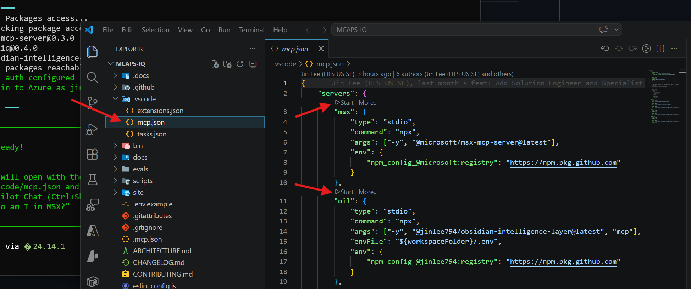

# Verify Installation

<div class="step-indicator" markdown>
<span class="step done">1. Getting Started ✓</span>
<span class="step active">2. Verify Installation</span>
<span class="step">3. First Chat</span>
<span class="step">4. Choose Role</span>
</div>

!!! success "Ran the bootstrap script?"
    If you completed [Getting Started](index.md), the repo is cloned, tools are installed, and you're signed in to Azure. **Skip straight to [Start the MCP Servers](#start-the-mcp-servers).**

---

## Start the MCP Servers

This is the key step — it connects Copilot to your CRM and M365 data.

1. Open the repo in VS Code (the bootstrap script does this automatically):

    ```bash
    code .
    ```

2. In the Explorer sidebar, expand `.vscode/` and click **`mcp.json`** to open it.

3. You'll see **"▷ Start | More..."** links above each server definition. Click **Start** on:
    - **`msx`** (required) — connects to MSX CRM
    - **`oil`** (optional) — connects to your Obsidian vault
    - **`workiq`** (optional) — enables broad M365 searches (email, Teams, calendar)

<figure markdown="span">
  { loading=lazy width="700" }
  <figcaption>Open <code>.vscode/mcp.json</code> and click the <strong>▷ Start</strong> links above each server block to connect them.</figcaption>
</figure>

### Enable Additional Servers

If you scroll down in `mcp.json`, you'll see some server definitions that are **commented out** (e.g. `github`, `ado`). To enable them:

1. **Select** (highlight) the commented-out lines you want to enable
2. Press ++ctrl+k++ then ++ctrl+u++ to **uncomment** the selection
3. The server's **▷ Start** button will appear — click it to connect

!!! tip "M365 servers are pre-configured"
    Scroll further down in `mcp.json` and you'll find the M365 MCP servers already defined and ready to start: **`calendar`**, **`teams`**, **`mail`**, **`sharepoint`**, **`word`**, and **`powerbi-remote`**. These are HTTP-based servers hosted by Microsoft — just click **Start** on the ones you need.

!!! tip "Don't see the Start buttons?"
    - Requires GitHub Copilot Chat **v0.25+** with **Agent mode** enabled
    - Make sure `mcp.json` is the active editor tab
    - Try: ++cmd+shift+p++ → **"Developer: Reload Window"**, then reopen the file

!!! failure "Server fails with 401/403/404?"
    Run `npm run auth:packages` to fix package auth. This uses your GitHub CLI session to configure access to private npm packages.

### GitHub Packages Auth

If the bootstrap script didn't configure package auth (or you need to redo it):

```bash
npm run auth:packages
```

This uses your `gh` session to write a repo-local `.npmrc` for accessing private MCP packages like `@microsoft/msx-mcp-server`.

---

## Sign In to Copilot in VS Code

After opening VS Code, check the **bottom status bar** for your Copilot sign-in status. If you see **"Signed out"**, click **"Sign in to use Copilot"** and authenticate with your **personal GitHub account** (not your `_microsoft` EMU account).

<figure markdown="span">
  { loading=lazy width="400" }
  <figcaption>If the status bar shows <strong>Signed out</strong>, click <strong>Sign in to use Copilot</strong> and use your <strong>personal</strong> GitHub account.</figcaption>
</figure>

!!! warning "Use your personal GitHub account"
    Sign in with your **personal** GitHub account (e.g. `JohnDoe`), **not** your Enterprise Managed User ending in `_microsoft`. Your personal account must be [linked and billing through Microsoft](index.md#before-you-begin) for unlimited Copilot tokens.

---

## Sign In to Azure

!!! success "Bootstrap did this"
    If the bootstrap script signed you in, skip this step. Check with: `az account show`

If you need to sign in manually:

```bash
az login
```

Use your **Microsoft corp account** (`yourname@microsoft.com`). You must be on **VPN**.

??? question "Need a specific tenant?"
    ```bash
    az login --tenant 72f988bf-86f1-41af-91ab-2d7cd011db47
    ```

---

## Verify Your Setup

=== "Automated check"

    ```bash
    node scripts/init.js --check
    ```
    
    Or in VS Code: ++cmd+shift+p++ → **"Tasks: Run Task"** → **"Setup: Check Environment"**

=== "Manual check"

    | What | Command | Expected |
    |------|---------|---------|
    | Node.js | `node --version` | v18+ |
    | Azure CLI | `az --version` | 2.x+ |
    | Azure login | `az account show` | Shows your subscription |
    | MSX access | `az account get-access-token --resource https://microsoftsales.crm.dynamics.com` | Returns a token |

---

## Opening a Terminal in VS Code

Some steps (like running the environment check or `az login`) require a terminal. To open one in VS Code, go to **Terminal → New Terminal** (++ctrl+shift+grave++) or use the menu:

<figure markdown="span">
  { loading=lazy width="600" }
  <figcaption>Click <strong>Terminal → New Terminal</strong> to open an integrated terminal. On Windows this opens PowerShell; on macOS it opens zsh.</figcaption>
</figure>

!!! tip "Copilot CLI users"
    If you plan to use the [Copilot CLI](../integrations/copilot-cli.md) to interact with MCAPS IQ from the terminal, this is where you'll run `mcaps` commands.

---

## The `mcaps` Command

The bootstrap script automatically runs `npm install` and `npm link`, which registers a **global `mcaps` command**. After setup, type `mcaps` from **any directory** to launch a [Copilot CLI](../integrations/copilot-cli.md) session with the full toolkit.

If the bootstrap didn't complete this step (you'll see a warning), run it manually:

```bash
npm install && npm link
```

---

## Common Issues

??? failure "npx cannot fetch MSX or OIL packages"
    ```bash
    npm run auth:packages
    npx -y --registry https://npm.pkg.github.com @microsoft/msx-mcp-server@latest
    ```
    If still failing, check VPN/proxy and confirm your GitHub account has package access.

??? failure "`az login` hangs or fails"  
    1. Make sure you're on VPN
    2. Try: `az login --use-device-code`
    3. If that fails: `az login --tenant 72f988bf-86f1-41af-91ab-2d7cd011db47`

??? failure "PowerShell execution policy (Windows)"
    ```powershell
    Set-ExecutionPolicy -ExecutionPolicy RemoteSigned -Scope CurrentUser
    ```

??? failure "Node.js version too old"
    ```bash
    # macOS
    brew upgrade node
    # Or: nvm install 18 && nvm use 18
    ```

For more issues, see [Troubleshooting Setup](troubleshooting.md).

!!! tip "Still stuck? Ask Copilot to help"
    If you're hitting persistent issues, open the Copilot chat panel (++cmd+shift+i++) and try one of these prompts:

    - *"Help me debug my MCP server setup — msx won't start"*
    - *"I'm getting a 401 error when starting the MSX server. Walk me through fixing GitHub Packages auth."*
    - *"Run the environment check and tell me what's missing"*
    - *"I ran the bootstrap script but az login failed. Help me sign in to Azure on VPN."*

    Copilot has full context of the repo's setup scripts and can walk you through fixes interactively.

---

## Optional: Multi-Agent Squads (Experimental)

!!! warning "Experimental — advanced users only"
    Multi-agent orchestration can deliver real benefits (parallel workstreams, role-specialized reasoning), but without a clear understanding of what you want each agent to do, you can end up with unnecessary complexity and performance issues. **Master single-agent MCAPS IQ first** before reaching for Squads.

Want a team of AI specialists that work in parallel? **Squads** give you persistent, named agents — an orchestrator, data synthesizer, win strategist, artifact builder, and deal coach — all living in your repo.

```bash
npm run squad:setup
```

This installs the [Squad CLI](https://github.com/bradygaster/squad) and initializes a `.squad/` directory with your agent team. Learn more in the [Squads integration guide](../integrations/squads.md).

[:octicons-arrow-right-16: Continue to Your First Chat](first-chat.md){ .md-button .md-button--primary }
