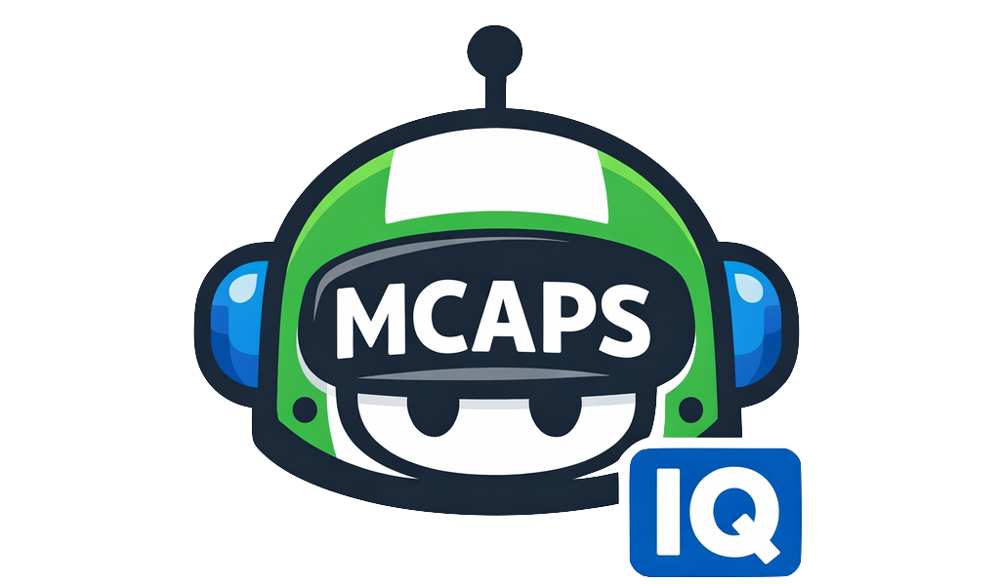

{ width="160" }

# MCAPS IQ

**Talk to Copilot in plain English to manage your MSX pipeline.**{ .tagline }

[:octicons-rocket-16: Get Started in 5 Minutes](getting-started/index.md){ .md-button .md-button--primary }
[:octicons-book-16: Guided Experience](guided/index.md){ .md-button }

⏱️

### Save Time

Eliminate MSX screen-hopping. Pipeline, milestones, tasks, and meeting prep — all in one chat window.

⚡

### Stay Sharp

AI surfaces risks, stale deals, and missed follow-ups before you even ask. Proactive, not reactive.

👥

### Work Together

Cross-role context flows automatically — handoffs, coverage gaps, and relationship health are visible across the team.

🛡️ Read-only by default · Always asks before writing · Every output is a draft for your judgment

43Skills

20+Slash Prompts

7MCAPS Roles

5Data Sources

How It All Fits Together

<iframe src="assets/overview-diagram.html" loading="lazy" title="MCAPS IQ Overview Diagram"></iframe>

Scroll to explore · or open full size ↓

<a href="assets/overview-diagram.html" target="_blank" class="md-button md-button--primary">↗️ View Full Size</a>
<a href="getting-started/" class="md-button">Get Started</a>
<a href="prompts/by-role/" class="md-button">Browse Prompts by Role</a>

How It Works — Architecture

<iframe src="assets/architecture-diagram.html" loading="lazy" title="MCAPS IQ Architecture Diagram"></iframe>

Scroll to explore · or open full size ↓

<a href="assets/architecture-diagram.html" target="_blank" class="md-button">↗️ View Architecture Full Size</a>
<a href="architecture/" class="md-button">Deep Dive: How It Works</a>

---

!!! note "This is a showcase of GitHub Copilot's extensibility"
    The core value here is GitHub Copilot and the agentic era it enables. This project tackles MCAPS internal tooling as the problem domain, but the pattern is universal: connect Copilot to your enterprise systems through MCP servers, layer in domain expertise via instructions and skills, and let your team operate complex workflows in plain language. **Fork the pattern and build your own version.**
