# MCAPS IQ Dashboard

The **MCAPS IQ Dashboard** is a browser-based mission control panel that runs alongside the Copilot CLI extension. It provides real-time visibility into agent sessions, pipeline health, skills inventory, and MCP server status — all in a single-page app served locally.

> Experimental: This dashboard is currently an experimental capability and may change quickly (UI, endpoints, and behavior) between releases.

<div class="admonition info" markdown>
<p class="admonition-title">Copilot CLI Extension</p>
The dashboard is a **Copilot CLI extension** that lives in `.github/extensions/mcaps-iq-dashboard/`. It hooks into the Copilot SDK's `joinSession()` API and relays session events to a shared Express + WebSocket server.
</div>

---

## Quick Start

Because this feature is experimental, use it as an operator aid rather than a guaranteed stable interface for automation.

The dashboard launches automatically when you start a Copilot CLI session with the extension loaded:

```bash
copilot "morning brief"
```

It opens at **`http://127.0.0.1:3850`** in your default browser. Multiple CLI sessions share one dashboard server (singleton enforcement via lockfile).

---

## Architecture

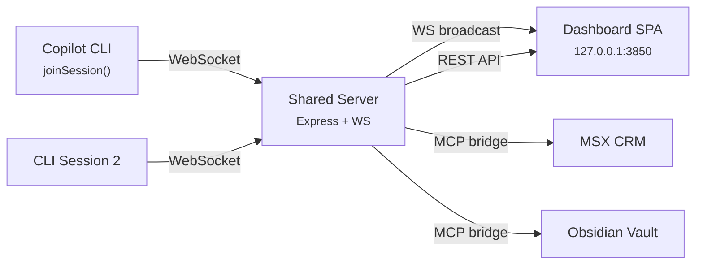

### Key Components

| Component | Path | Purpose |
|---|---|---|
| Extension entry | `extension.mjs` | Copilot SDK integration, 6 hooks, WS relay |
| Shared server | `lib/shared-server.mjs` | Express app, WebSocket hub, API endpoints |
| Session client | `lib/session-client.mjs` | WS client for extension→server communication |
| Server launcher | `lib/server-launcher.mjs` | Singleton server spawn with lockfile |
| CRM client | `lib/crm-client.mjs` | MSX MCP tool bridge for REST endpoints |
| OIL client | `lib/oil-client.mjs` | Obsidian vault MCP tool bridge |
| Skills reader | `lib/skills-reader.mjs` | Reads skills, prompts, agents, role mappings |
| Cron scheduler | `lib/cron-scheduler.mjs` | Device-local scheduled prompt execution |
| Session history | `lib/session-history.mjs` | SQLite-backed session history browser |
| Response filter | `lib/response-filter.mjs` | Code block filtering, verbosity control |

### Frontend (SPA)

All frontend code lives in `public/` — vanilla JS with a hash router, no build step required.

| File | View |
|---|---|
| `app.js` | App shell, WebSocket connection, global state |
| `router.js` | Hash-based routing (`#/home`, `#/opportunities`, etc.) |
| `home-view.js` | Role-contextual landing with quick actions |
| `opportunities-view.js` | Pipeline table with MCEM stage badges, milestone drill-down |
| `accounts-view.js` | Account-centric pipeline aggregation |
| `skills-view.js` | 3-tab skills explorer (Roles, All Skills, Agents) |
| `mcp-servers-view.js` | MCP server toggle and status |
| `mission-control-view.js` | Live session stream + history browser + delegation tracking |
| `schedules-view.js` | Cron job CRUD for scheduled prompts |
| `sessions-view.js` | Split-panel activity stream |
| `settings-view.js` | Role selection, priority accounts, display preferences |
| `session-picker.js` | Modal for prompt-to-session dispatch |
| `content-formatters.js` | Markdown→HTML rendering, table parsing |
| `styles.css` | Full stylesheet (light + dark themes) |

---

## Views

### Home

The landing page adapts to your configured role (AE, Specialist, SE, CSA, CSAM, ATS, IA, Sales Director). Each role gets tailored quick-action buttons that send prompts to the active Copilot session.

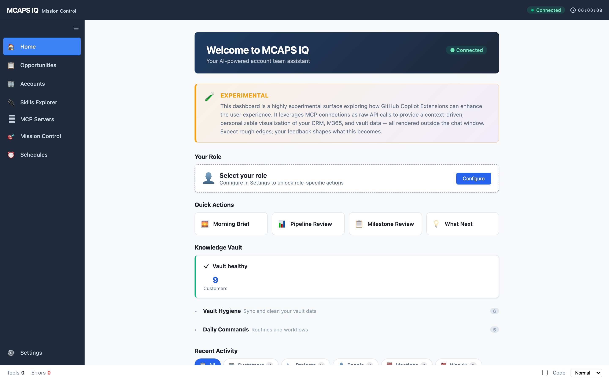

### Opportunities

Live CRM data displayed in a sortable pipeline table. Features MCEM stage badges, health indicators, currency formatting, and inline milestone drill-down with task management.

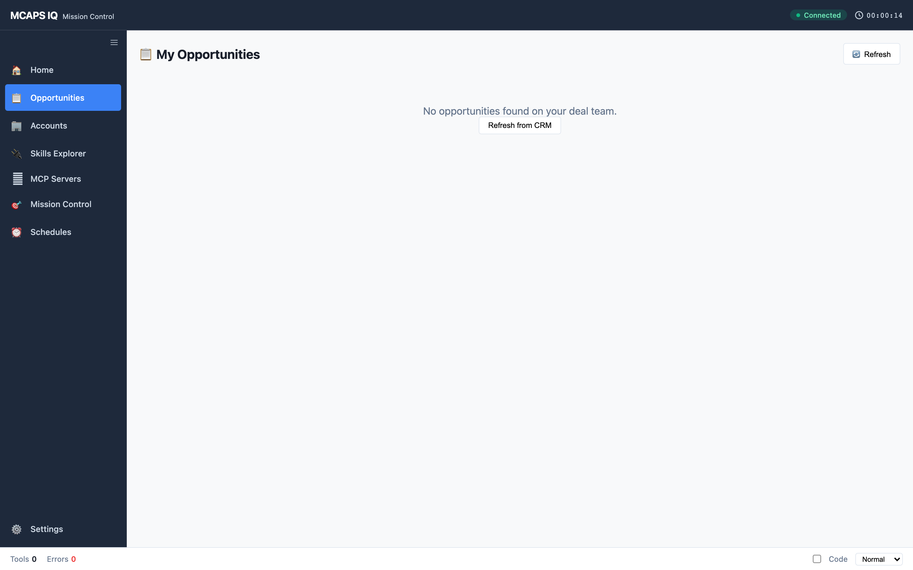

### Accounts

Account-centric aggregation derived from opportunity data. Cards show pipeline totals, stage breakdown mini-bars, and expand to reveal individual opportunities.

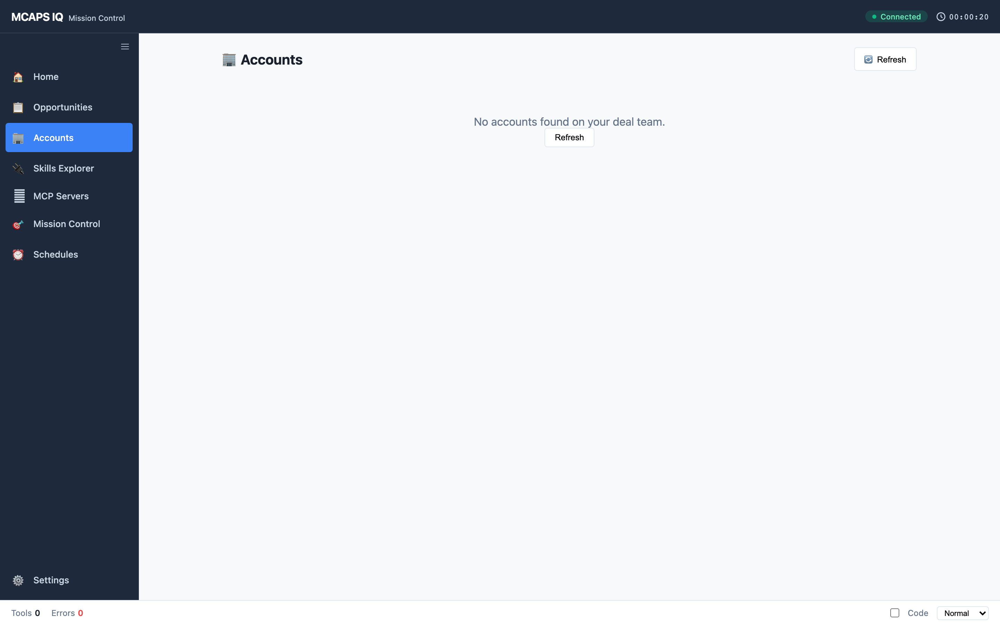

### Skills Explorer

Three-tab layout for exploring all MCAPS IQ capabilities:

**Roles tab** — Maps each MSX role to its relevant skills and MCEM stages.

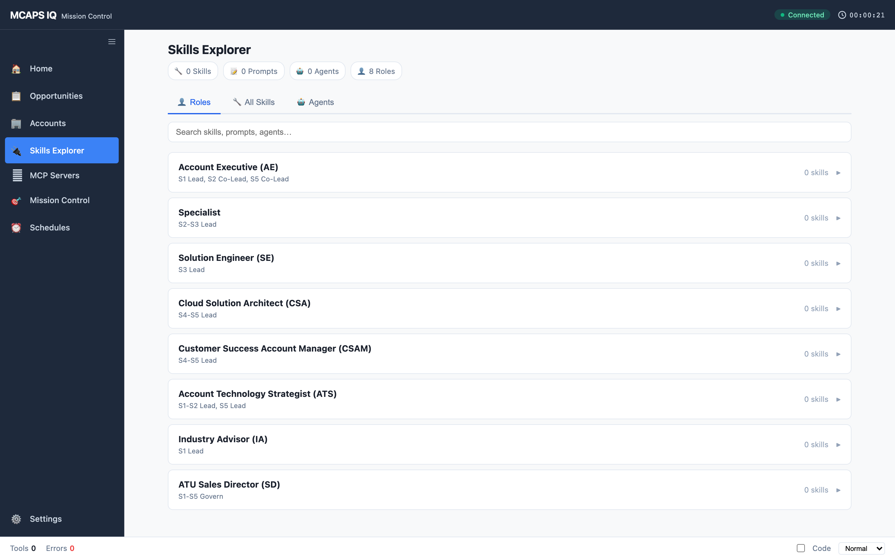

**All Skills tab** — Searchable catalog of all skills with dependency badges (CRM, PBI, M365, Vault) and trigger keywords.

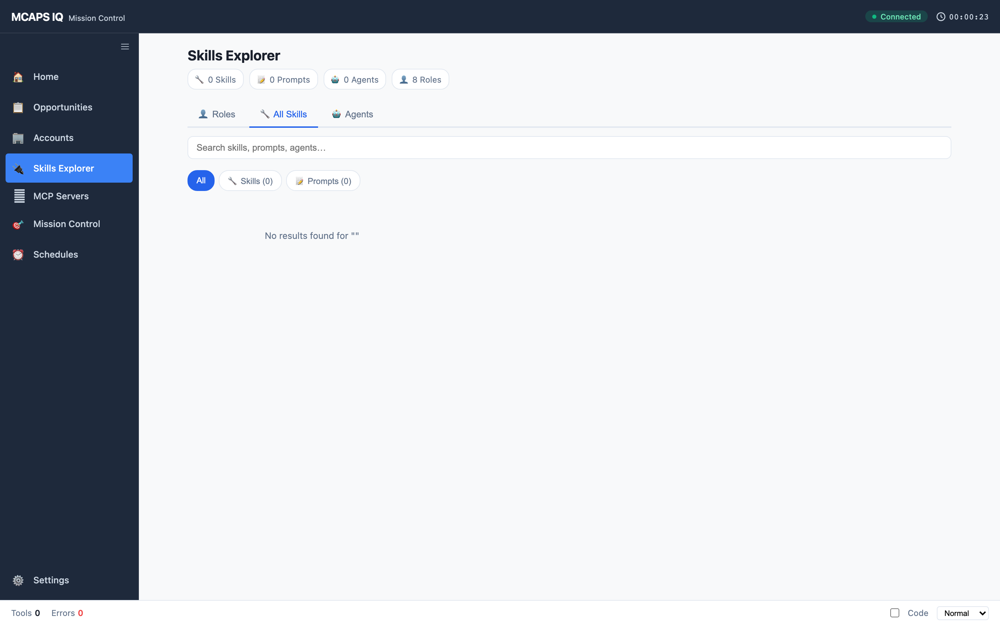

**Agents tab** — Agent definitions and architecture visualization.

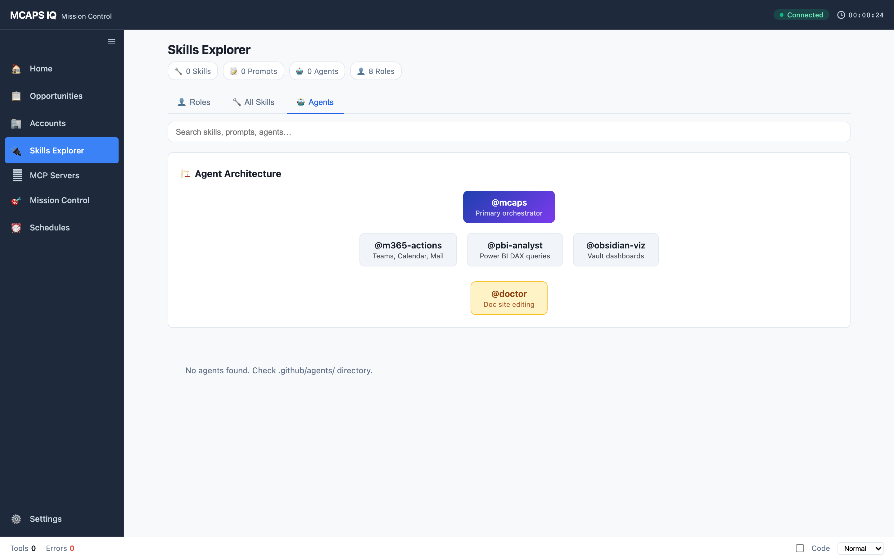

### MCP Servers

Toggle MCP servers on/off with category filtering (M365, CRM, Vault, Analytics, Developer). Shows connection status and server metadata.

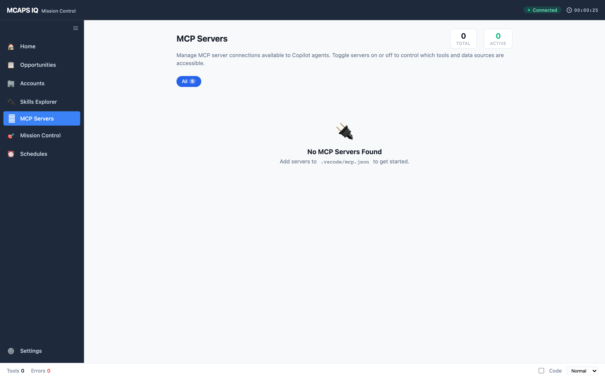

### Mission Control

Unified view combining:

- **Live tab** — Real-time activity stream from all active sessions with tool call tracking, response rendering, and background task monitoring
- **History tab** — SQLite-backed session history browser with search, repo filtering, and detail drill-down
- **Delegation tracking** — Monitors subagent delegation chains

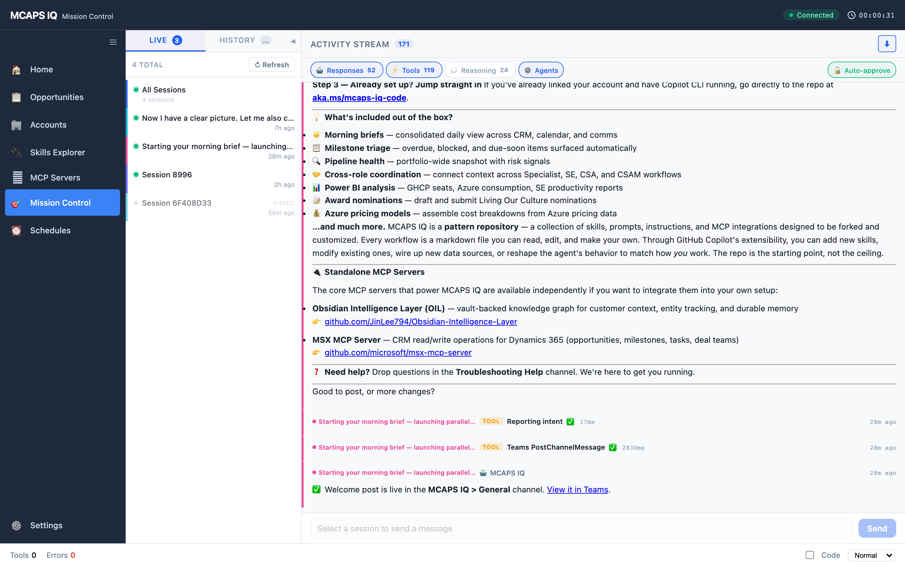

### Schedules

Cron job management for automated prompt execution. Features preset templates, prompt suggestions, cron expression validation with human-readable descriptions, and a run-once quick-trigger panel.

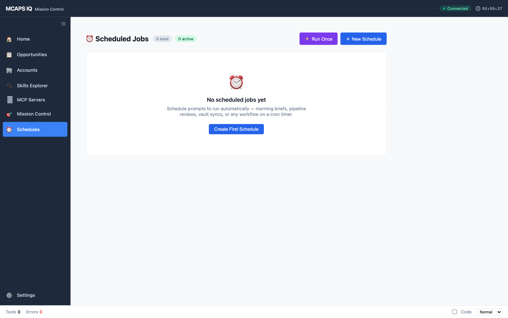

### Settings

Configure your MSX role (auto-detected from CRM `whoami`), priority accounts, and display preferences (code visibility, verbosity level).

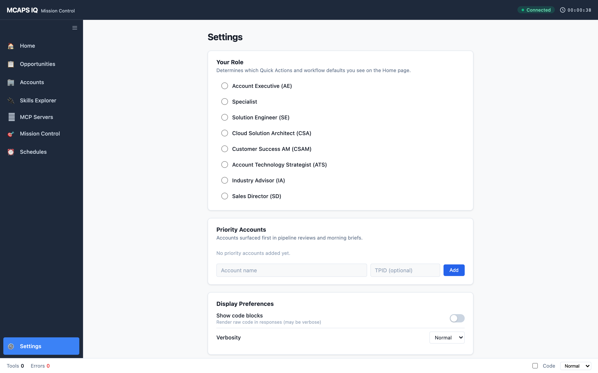

---

## API Endpoints

The dashboard server exposes REST endpoints for frontend consumption and programmatic access:

### Read Endpoints

| Endpoint | Description |
|---|---|
| `GET /api/health` | Server health check |
| `GET /api/state` | Full session state snapshot |
| `GET /api/skills` | All skills from `.github/skills/` |
| `GET /api/skills/roles` | Role→skill mapping |
| `GET /api/prompts` | All prompts from `.github/prompts/` |
| `GET /api/agents` | All agents from `.github/agents/` |
| `GET /api/capabilities/summary` | Skill/prompt/agent/role counts |
| `GET /api/models` | Available Copilot models |
| `GET /api/settings` | User settings |
| `GET /api/schedules` | Cron schedules |
| `GET /api/sessions/history` | Session history (paginated) |

### CRM Bridge Endpoints

| Endpoint | Description |
|---|---|
| `GET /api/crm/status` | CRM auth status |
| `GET /api/crm/whoami` | Current user identity |
| `GET /api/crm/opportunities` | Active opportunities (deal-team scoped) |
| `GET /api/crm/milestones` | Milestones with filters |
| `POST /api/crm/milestones/:id` | Staged milestone update |
| `POST /api/crm/tasks` | Staged task creation |
| `GET /api/crm/operations` | Pending staged operations |
| `POST /api/crm/operations/:id/execute` | Execute staged write |

See [SPEC-crm-api-expansion.md](https://github.com/microsoft/MCAPS-IQ/blob/main/.github/extensions/mcaps-iq-dashboard/SPEC-crm-api-expansion.md) for the full API inventory.

---

## WebSocket Protocol

The dashboard uses WebSocket for real-time communication:

| Event | Direction | Description |
|---|---|---|
| `session:new` | Server→Browser | New CLI session connected |
| `session:end` | Server→Browser | CLI session ended |
| `response:chunk` | Server→Browser | Streaming response text |
| `tool:start` / `tool:end` | Server→Browser | Tool execution lifecycle |
| `tool:approval-request` | Server→Browser | Permission request for tool |
| `task:start` / `task:end` | Server→Browser | Background task lifecycle |
| `thinking:update` | Server→Browser | Agent thinking/reasoning |
| `chat:forward` | Browser→Server | Send prompt to CLI session |
| `filter:change` | Browser→Server | Update display filters |
| `stop:request` | Browser→Server | Abort active session |

---

## Capturing Screenshots

A Playwright script is included for regenerating documentation screenshots:

```bash
# Install dependencies (one-time)
npm install --save-dev playwright
npx playwright install chromium

# Capture all views
node .github/extensions/mcaps-iq-dashboard/scripts/capture-screenshots.mjs

# Capture specific views only
node .github/extensions/mcaps-iq-dashboard/scripts/capture-screenshots.mjs \
  --views home,opportunities,skills

# Capture in dark mode
node .github/extensions/mcaps-iq-dashboard/scripts/capture-screenshots.mjs --dark

# Custom viewport size
node .github/extensions/mcaps-iq-dashboard/scripts/capture-screenshots.mjs \
  --width 1920 --height 1080
```

### Options

| Flag | Default | Description |
|---|---|---|
| `--port <n>` | `3851` | Server port (avoids conflict with live dashboard) |
| `--width <n>` | `1440` | Viewport width |
| `--height <n>` | `900` | Viewport height |
| `--dark` | off | Capture with `prefers-color-scheme: dark` |
| `--out <dir>` | `screenshots/` | Output directory |
| `--views <list>` | all | Comma-separated view IDs |

The script starts a temporary server instance, navigates each view with Playwright (Chromium), waits for content to render, and saves retina-quality (2× DPR) screenshots.

---

## Development

### File Structure

```
.github/extensions/mcaps-iq-dashboard/
├── extension.mjs           # Copilot SDK entry point
├── SPEC-crm-api-expansion.md
├── lib/
│   ├── shared-server.mjs   # Express + WebSocket server
│   ├── session-client.mjs  # Extension→server WS client
│   ├── server-launcher.mjs # Singleton server spawn
│   ├── crm-client.mjs      # MSX MCP tool bridge
│   ├── oil-client.mjs      # Obsidian vault bridge
│   ├── skills-reader.mjs   # .github/ file parser
│   ├── cron-scheduler.mjs  # Scheduled prompt execution
│   ├── session-history.mjs # SQLite session browser
│   ├── multi-session-state.mjs  # Multi-session state manager
│   ├── response-filter.mjs      # Output filtering
│   └── tool-event-detail.mjs    # Tool call metadata extraction
├── public/
│   ├── index.html          # SPA shell
│   ├── app.js              # App state + WebSocket
│   ├── router.js           # Hash router
│   ├── styles.css          # Full stylesheet
│   └── *-view.js           # View modules
├── scripts/
│   └── capture-screenshots.mjs  # Playwright screenshot tool
├── screenshots/            # Generated screenshots
└── tests/
    └── extension-tests.mjs # Smoke tests
```

### Running Tests

```bash
node --test .github/extensions/mcaps-iq-dashboard/tests/extension-tests.mjs
```

### Server Singleton

The server uses a lockfile-based singleton pattern:

1. Extension calls `ensureServer()` on session start
2. Lockfile checked at `~/.local/share/mcaps-iq/locks/<repo-hash>.json`
3. If server is healthy (GET `/api/health`), reuse it
4. Otherwise, spawn `shared-server.mjs` as a detached process
5. Server auto-shuts down after 5 min of no connected sessions

### Adding a New View

1. Create `public/my-view.js` with `mount(container)`, `unmount()`, `onActivate()` exports
2. Register the route in `app.js` → `Router.createRouter({ views: { ... } })`
3. Add a nav item to `index.html`
4. Add the view to `scripts/capture-screenshots.mjs` VIEWS array
