# Prompts & Workflows

Everything you can say to Copilot — organized visually so you can find the right prompt in seconds. Type `/` in chat or describe what you need in plain English.

  
27Slash Commands

  
43Skills

  
7Roles

  
5Data Sources

  

 CRM / MSX

  

 Microsoft 365

  

 Obsidian Vault

  

 Power BI

  

 GitHub

  

 AI Synthesis

---

## Quick Navigation

-   :material-slash-forward:{ .lg .middle } __[Slash Commands](slash-commands.md)__

    ---

    All 27 built-in guided flows. Type `/` in Copilot chat. Organized by category with data source indicators and skill chains.

-   :material-account-group:{ .lg .middle } __[By Role](by-role.md)__

    ---

    Visual role cards for Specialist, SE, CSA, CSAM, AE, ATS, and ATU Sales Director — with example prompts and skill routing.

-   :material-link-variant:{ .lg .middle } __[Multi-Skill Chains](multi-skill-chains.md)__

    ---

    One prompt triggers 3–4 skills in sequence. Flow diagrams show skill chains, data sources, and output format.

-   :material-chart-bar:{ .lg .middle } __[Power BI Analytics](powerbi.md)__

    ---

    7 PBI prompts pulling from MSXI, OctoDash, CMI, and SE Productivity models. Each shows DAX workflows and report structure.

---

## Prompt Landscape at a Glance

Every slash command grouped by when and how you'd use it. Colored badges show which data sources each prompt touches.

<!-- ── Daily & Weekly Rhythm ──────────────────────────── -->

Daily · Weekly

  
☀️

  
<h4>Daily Check</h4>

/daily

Role-aware morning check — surfaces top 3 actions for today based on pipeline state, task health, and milestone urgency.

  CRM
  Vault
  AI Triage

  
📋

  
<h4>Morning Prep</h4>

/morning-prep

Auto-populates today's daily note + meeting prep skeletons from calendar, vault context, and CRM state. Designed for non-interactive CLI use.

  Calendar
  Vault
  CRM

  
📆

  
<h4>Weekly Review</h4>

/weekly

Day-aware mode selector. <strong>Monday:</strong> vault-first governance prep with pipeline hygiene. <strong>Friday:</strong> retrospective digest saved to vault.

  CRM
  M365
  Vault
  AI Synthesis

  
🎯

  
<h4>What Next?</h4>

/what-next

Quick role-specific scan of pipeline + milestones → suggests 3 highest-impact actions with "Want me to do this?" offers.

  CRM
  Vault

  
⚡

  
<h4>Quick Wins</h4>

/quick-wins

5-minute pipeline cleanup — fix the low-hanging CRM hygiene issues that accumulate. Max 5 items, checkbox style.

  CRM

<!-- ── Account Analysis & Deep Workflows ──────────────── -->

Analysis

  
🏥

  
<h4>Account Review</h4>

/account-review

Multi-signal health check with section selector: Health Card, Seat Analysis, Engagement, Pipeline, or Full Review.

  CRM
  M365
  PBI MSXI
  OctoDash

  
📊

  
<h4>Portfolio Prioritization</h4>

/portfolio-prioritization

Rank accounts by GHCP growth potential — 5-tier classification (Greenfield, Stagnant, Whitespace, High Perf, Low Util).

  PBI Seats
  CRM
  Vault

  
📈

  
<h4>Activity Impact</h4>

/ghcp-activity-impact

Correlates activities (VBDs, meetings, POCs) with GHCP seat movement — before/after scoring with 7-level impact scale.

  Vault
  M365
  PBI

  
🤝

  
<h4>Meeting</h4>

/meeting

Unified meeting workflow — auto-detects mode. Give a meeting title → <strong>Prep</strong>. Paste notes → <strong>Process</strong>.

  Calendar
  Vault
  CRM

  
📁

  
<h4>Project Status</h4>

/project-status

Reads vault project note, related meetings, and CRM state to generate a project status summary.

  Vault
  CRM

  
🔗

  
<h4>Connect Review</h4>

/connect-review

Compile Connects performance evidence — correlates MSX + WorkIQ + vault + git signals into an auditable evidence pack.

  CRM
  WorkIQ
  Vault
  GitHub

<!-- ── Power BI ───────────────────────────────────────── -->

Power BI

  
☁️

  
<h4>Azure All-in-One</h4>

/pbi-azure-all-in-one-review

ACR vs budget, pipeline conversion, attainment tracking from MSXI.

MSXI

  
🔬

  
<h4>Service Deep Dive</h4>

/pbi-azure-service-deep-dive-sl5-aio

Cross-report SL5-level consumption correlated with portfolio performance.

MSXIACRSL5

  
🛡️

  
<h4>CXObserve</h4>

/pbi-cxobserve-account-review

Support health, incidents, satisfaction trends, outage impact.

CMI

  
🚨

  
<h4>Customer Incidents</h4>

/pbi-customer-incident-review

Active incidents, CritSits, escalation trends, reactive support health.

CMI

  
🏷️

  
<h4>GHCP New Logo</h4>

/pbi-ghcp-new-logo-incentive

Evaluate accounts against FY26 GHCP New Logo Growth Incentive eligibility.

MSXI

  
💺

  
<h4>GHCP Seats</h4>

/pbi-ghcp-seats-analysis

Seat composition, attach rates, whitespace, MoM trends. Also used by Account Review.

MSXIOctoDash

  
📏

  
<h4>SE Productivity</h4>

/pbi-se-productivity-review

HoK activities, milestones engaged, customer coverage, pipeline velocity.

SE FY26

<!-- ── Vault & Sync ───────────────────────────────────── -->

Vault · Sync

  
🔄

  
<h4>Vault Sync</h4>

/vault-sync

Bulk CRM → vault sync. Pulls live CRM data and writes all entity notes in one pass via vault-sync.js.

  CRM
  Vault

  
✅

  
<h4>Task Sync</h4>

/task-sync

Reconciles CRM task records with vault to maintain a durable SE activity log per milestone.

  CRM
  Vault

  
👤

  
<h4>Create Person</h4>

/create-person

Create a new People note from context in a meeting note or conversation.

  Vault
  WorkIQ

  
🐙

  
<h4>Sync Project from GitHub</h4>

/sync-project-from-github

Pull GitHub repo activity (commits, PRs, issues) into a vault project note.

  GitHub
  Vault

<!-- ── Special & Write ────────────────────────────────── -->

Special

  
🏆

  
<h4>Nomination</h4>

/nomination

Generate an Americas Living Our Culture award nomination with narrative framing and compliance checks.

  CRM
  Vault
  AI Draft

  
📣

  
<h4>Wins Channel Post</h4>

/wins-channel-post

Generate a Teams channel post for "Wins and Customer Impact". Evaluates story fitness before posting.

  Teams
  CRM
  AI Draft

  
🔧

  
<h4>Modernize</h4>

/modernize

Scan VS Code release notes for new agent features and apply them to MCAPS-IQ. Dev-focused prompt.

  GitHub
  AI Analysis

<!-- ── Setup & Onboarding ─────────────────────────────── -->

Setup

  
🚀

  
<h4>Getting Started</h4>

/getting-started

First-time setup — verifies environment, identifies your role, walks you to first success.

CRMAI Guide

  
🪪

  
<h4>My Role</h4>

/my-role

Identify or switch your MCAPS role. Shows role-specific capabilities, daily rhythms, and recommended workflows.

CRM

---

## How Prompts Connect to Skills

```mermaid
graph LR
    A["💬 <b>You say something</b><br/><small>in plain English</small>"] --> B["🧠 <b>Keyword Match</b><br/><small>skills auto-selected</small>"]
    B --> C["⛓️ <b>Skills Chain</b><br/><small>run in sequence</small>"]
    C --> D["🔌 <b>MCP Queries</b><br/><small>CRM · M365 · Vault · PBI</small>"]
    D --> E["✨ <b>Synthesized Output</b><br/><small>tables · actions · risks</small>"]
    
    style A fill:#0078D4,color:#fff,stroke:#005a9e,stroke-width:2px
    style B fill:#00B7C3,color:#fff,stroke:#008b94,stroke-width:2px
    style C fill:#107C10,color:#fff,stroke:#0a5c0a,stroke-width:2px
    style D fill:#5C2D91,color:#fff,stroke:#462170,stroke-width:2px
    style E fill:#FFB900,color:#1B1B1B,stroke:#e0a700,stroke-width:2px

    linkStyle default stroke:#9e9e9e,stroke-width:2.5px
```

!!! tip "You don't need to memorize any of this"
    Just describe what you need. The agent figures out the right skills, tools, and data sources automatically. These pages exist as reference — not required reading.

---

## Deep Dive Pages

| Page | What You'll Find |
|------|-----------------|
| [Slash Commands](slash-commands.md) | Complete catalog with data source badges, skill chains, and role indicators |
| [By Role](by-role.md) | Visual role cards showing which prompts/skills each role uses most |
| [Multi-Skill Chains](multi-skill-chains.md) | Flow diagrams for complex multi-skill workflows |
| [Power BI Analytics](powerbi.md) | All 7 PBI prompts with semantic model details and trigger keywords |
