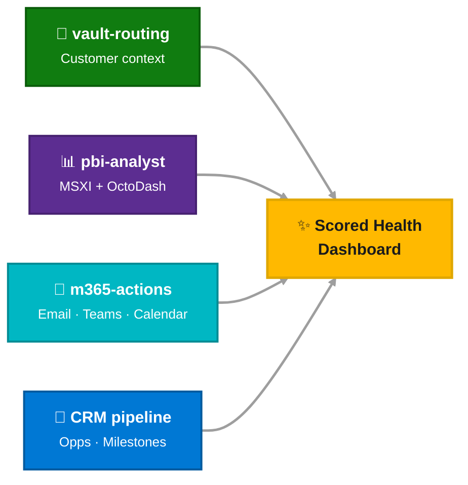
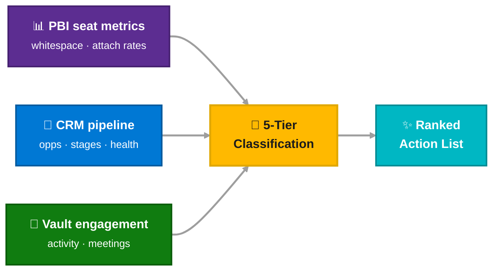
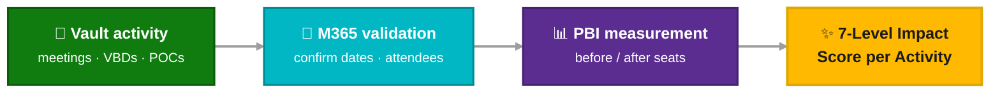
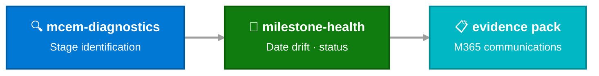
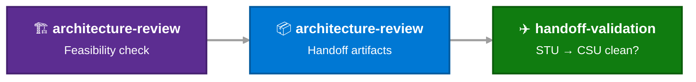
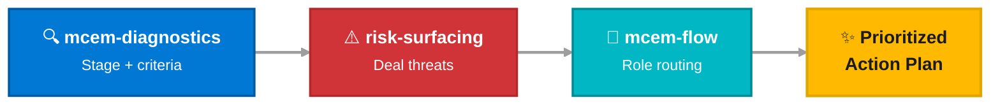

# Multi-Skill Chains

One prompt, 3–4 skills, comprehensive output. These are realistic "day in the life" prompts where the full orchestration shines.

!!! info "How chains work"
    You don't name the skills. Copilot matches your intent via keyword matching against each skill's `description` field, then runs them in the order defined by chain declarations.

<div class="source-legend" markdown>
  <div class="sl-item"><div class="sl-dot" style="background: var(--mcaps-blue);"></div> CRM</div>
  <div class="sl-item"><div class="sl-dot" style="background: var(--mcaps-teal);"></div> M365</div>
  <div class="sl-item"><div class="sl-dot" style="background: var(--mcaps-green);"></div> Vault</div>
  <div class="sl-item"><div class="sl-dot" style="background: var(--mcaps-purple);"></div> PBI</div>
</div>

---

<!-- ══════════════════════════════════════════════════════
     MULTI-SIGNAL CHAINS
     ══════════════════════════════════════════════════════ -->

<div class="catalog-header" markdown>
  <div class="ch-icon" style="background: var(--mcaps-blue);">🔗</div>
  <h2>Multi-Signal Orchestration</h2>
  <div class="ch-count">Cross-source workflows</div>
</div>

<div class="prompt-lane lane-analysis" markdown>
<div class="lane-sidebar">Multi-Signal</div>
<div class="lane-body" markdown>

<div class="ptile" style="min-width: 100%; max-width: 100%;" markdown>
<div class="ptile-head">
  <div class="ptile-icon" style="background: var(--mcaps-blue);">🏥</div>
  <div><h4>Multi-Signal Account Review</h4></div>
</div>
<div class="role-pills"><span class="role-pill rp-ae">AE</span><span class="role-pill rp-spec">Specialist</span><span class="role-pill rp-se">SE</span><span class="role-pill rp-ats">ATS</span></div>
<div class="prompt-example"><div class="pe-avatar">You</div> Run a full account review for Contoso — seats, engagement, and pipeline.</div>



<div class="ptile-sources">
  <span class="ptile-src src-crm">CRM</span>
  <span class="ptile-src src-m365">M365</span>
  <span class="ptile-src src-pbi">MSXI</span>
  <span class="ptile-src src-pbi">OctoDash</span>
  <span class="ptile-src src-vault">Vault</span>
</div>
<p class="ptile-desc">Runs parallel queries against 4 data sources. Pick individual sections (Health Card, Seat Analysis, Engagement, Pipeline) or run the full review.</p>
</div>

</div>
</div>

<div class="prompt-lane lane-pbi" markdown>
<div class="lane-sidebar">PBI + CRM</div>
<div class="lane-body" markdown>

<div class="ptile" style="min-width: 100%; max-width: 100%;" markdown>
<div class="ptile-head">
  <div class="ptile-icon" style="background: var(--mcaps-purple);">📊</div>
  <div><h4>Portfolio Prioritization</h4></div>
</div>
<div class="role-pills"><span class="role-pill rp-spec">Specialist</span><span class="role-pill rp-se">SE</span><span class="role-pill rp-sd">SD</span></div>
<div class="prompt-example"><div class="pe-avatar">You</div> Where should I focus my GHCP sales effort? Rank my accounts by growth potential and tell me the top 5 actions.</div>



<div class="ptile-sources">
  <span class="ptile-src src-pbi">PBI Seats</span>
  <span class="ptile-src src-crm">CRM</span>
  <span class="ptile-src src-vault">Vault</span>
</div>
<p class="ptile-desc">Classifies accounts into 5 tiers (Greenfield, Stagnant, Whitespace, High Performers, Low Utilization) with composite priority scoring.</p>
</div>

<div class="ptile" style="min-width: 100%; max-width: 100%;" markdown>
<div class="ptile-head">
  <div class="ptile-icon" style="background: var(--mcaps-purple);">📈</div>
  <div><h4>Activity Impact Scoring</h4></div>
</div>
<div class="role-pills"><span class="role-pill rp-se">SE</span></div>
<div class="prompt-example"><div class="pe-avatar">You</div> Did my engagement with Contoso actually drive GHCP growth? Show me before/after seat data correlated with my VBDs and meetings.</div>



<div class="ptile-sources">
  <span class="ptile-src src-vault">Vault</span>
  <span class="ptile-src src-m365">M365</span>
  <span class="ptile-src src-pbi">PBI</span>
</div>
</div>

</div>
</div>

---

<!-- ══════════════════════════════════════════════════════
     ROLE-SPECIFIC CHAINS
     ══════════════════════════════════════════════════════ -->

<div class="catalog-header" markdown>
  <div class="ch-icon" style="background: var(--mcaps-teal);">⛓️</div>
  <h2>Role-Specific Chains</h2>
  <div class="ch-count">Sequential skill workflows</div>
</div>

<div class="prompt-lane lane-analysis" markdown>
<div class="lane-sidebar">Specialist</div>
<div class="lane-body" markdown>

<div class="ptile" style="min-width: 100%; max-width: 100%;" markdown>
<div class="ptile-head">
  <div class="ptile-icon" style="background: var(--mcaps-blue);">📋</div>
  <div><h4>Full Weekly Review</h4></div>
</div>
<div class="role-pills"><span class="role-pill rp-spec">Specialist</span></div>
<div class="prompt-example"><div class="pe-avatar">You</div> I'm a Specialist. Run my full weekly review — pipeline hygiene, any deals ready to hand off, and flag risks across my active opps.</div>
<div class="chain-flow" style="font-size: 0.82rem; gap: 8px;">
  <span class="chain-node">pipeline-hygiene-triage</span>
  <span class="chain-arrow">→</span>
  <span class="chain-node">handoff-readiness-validation</span>
  <span class="chain-arrow">→</span>
  <span class="chain-node">risk-surfacing</span>
</div>
<div class="ptile-sources"><span class="ptile-src src-crm">CRM</span><span class="ptile-src src-vault">Vault</span></div>
</div>

</div>
</div>

<div class="prompt-lane lane-vault" markdown>
<div class="lane-sidebar">CSAM</div>
<div class="lane-body" markdown>

<div class="ptile" style="min-width: 100%; max-width: 100%;" markdown>
<div class="ptile-head">
  <div class="ptile-icon" style="background: var(--mcaps-green);">📊</div>
  <div><h4>Pre-Governance Prep</h4></div>
</div>
<div class="role-pills"><span class="role-pill rp-csam">CSAM</span></div>
<div class="prompt-example"><div class="pe-avatar">You</div> Before my Contoso governance meeting Thursday, tell me: what stage are we really in, what's the milestone health, and prepare a customer evidence pack for the last 30 days.</div>



<div class="ptile-sources"><span class="ptile-src src-crm">CRM</span><span class="ptile-src src-m365">M365</span><span class="ptile-src src-vault">Vault</span></div>
</div>

<div class="ptile" style="min-width: 100%; max-width: 100%;" markdown>
<div class="ptile-head">
  <div class="ptile-icon" style="background: var(--mcaps-green);">🚦</div>
  <div><h4>Commit-or-Loopback Decision</h4></div>
</div>
<div class="role-pills"><span class="role-pill rp-csam">CSAM</span><span class="role-pill rp-csa">CSA</span></div>
<div class="prompt-example"><div class="pe-avatar">You</div> The team wants to commit the Fabrikam milestone, but I heard the proof had issues. Check if we should commit or loop back, and tell me who owns what.</div>
<div class="chain-flow" style="font-size: 0.82rem; gap: 8px;">
  <span class="chain-node">commit-gate-enforcement</span>
  <span class="chain-arrow">→</span>
  <span class="chain-node">non-linear-progression</span>
  <span class="chain-arrow">→</span>
  <span class="chain-node">delivery-accountability-mapping</span>
</div>
<div class="ptile-sources"><span class="ptile-src src-crm">CRM</span></div>
</div>

<div class="ptile" style="min-width: 100%; max-width: 100%;" markdown>
<div class="ptile-head">
  <div class="ptile-icon" style="background: var(--mcaps-green);">📈</div>
  <div><h4>Adoption + Expansion Review</h4></div>
</div>
<div class="role-pills"><span class="role-pill rp-csam">CSAM</span></div>
<div class="prompt-example"><div class="pe-avatar">You</div> Review adoption health for Fabrikam, check if value is being realized on committed milestones, and flag any expansion signals that should go to the Specialist.</div>
<div class="chain-flow" style="font-size: 0.82rem; gap: 8px;">
  <span class="chain-node">stage-5-review (adoption)</span>
  <span class="chain-arrow">→</span>
  <span class="chain-node">stage-5-review (value)</span>
  <span class="chain-arrow">→</span>
  <span class="chain-node">stage-5-review (expansion)</span>
</div>
<div class="ptile-sources"><span class="ptile-src src-crm">CRM</span><span class="ptile-src src-pbi">PBI</span><span class="ptile-src src-vault">Vault</span></div>
</div>

</div>
</div>

<div class="prompt-lane lane-pbi" markdown>
<div class="lane-sidebar">CSA</div>
<div class="lane-body" markdown>

<div class="ptile" style="min-width: 100%; max-width: 100%;" markdown>
<div class="ptile-head">
  <div class="ptile-icon" style="background: var(--mcaps-purple);">🏗️</div>
  <div><h4>Post-Proof Handoff</h4></div>
</div>
<div class="role-pills"><span class="role-pill rp-csa">CSA</span></div>
<div class="prompt-example"><div class="pe-avatar">You</div> I'm a CSA. The Contoso proof just completed successfully. Check architecture feasibility, create the handoff note, and validate that the Specialist handoff is clean.</div>



<div class="ptile-sources"><span class="ptile-src src-crm">CRM</span><span class="ptile-src src-vault">Vault</span></div>
</div>

</div>
</div>

---

<!-- ══════════════════════════════════════════════════════
     CROSS-ROLE CHAINS
     ══════════════════════════════════════════════════════ -->

<div class="catalog-header" markdown>
  <div class="ch-icon" style="background: var(--mcaps-gray);">🔀</div>
  <h2>Cross-Role Chains</h2>
  <div class="ch-count">Any role</div>
</div>

<div class="prompt-lane lane-setup" markdown>
<div class="lane-sidebar">Any</div>
<div class="lane-body" markdown>

<div class="ptile" style="min-width: 100%; max-width: 100%;" markdown>
<div class="ptile-head">
  <div class="ptile-icon" style="background: var(--mcaps-gray);">🔍</div>
  <div><h4>End-to-End Deal Triage</h4></div>
</div>
<div class="role-pills"><span class="role-pill rp-any">Any Role</span></div>
<div class="prompt-example"><div class="pe-avatar">You</div> The Northwind deal feels stuck. What stage is it actually in, are exit criteria met, what are the risks, and who should own the next action?</div>



<div class="ptile-sources"><span class="ptile-src src-crm">CRM</span><span class="ptile-src src-vault">Vault</span><span class="ptile-src src-m365">M365</span></div>
</div>

<div class="ptile" style="min-width: 100%; max-width: 100%;" markdown>
<div class="ptile-head">
  <div class="ptile-icon" style="background: var(--mcaps-gray);">☀️</div>
  <div><h4>Morning Standup Prep (SE)</h4></div>
</div>
<div class="role-pills"><span class="role-pill rp-se">SE</span></div>
<div class="prompt-example"><div class="pe-avatar">You</div> I'm an SE. Check my task hygiene, show me any execution blockers on committed milestones, and tell me if there are Unified constraints I should flag today.</div>
<div class="chain-flow" style="font-size: 0.82rem; gap: 8px;">
  <span class="chain-node">se-execution-check</span>
  <span class="chain-arrow">→</span>
  <span class="chain-node">milestone-health-review</span>
</div>
<div class="ptile-sources"><span class="ptile-src src-crm">CRM</span><span class="ptile-src src-vault">Vault</span></div>
</div>

<div class="ptile" style="min-width: 100%; max-width: 100%;" markdown>
<div class="ptile-head">
  <div class="ptile-icon" style="background: var(--mcaps-gray);">☁️</div>
  <div><h4>Power BI Portfolio Review</h4></div>
</div>
<div class="role-pills"><span class="role-pill rp-spec">Specialist</span><span class="role-pill rp-se">SE</span><span class="role-pill rp-sd">SD</span></div>
<div class="prompt-example"><div class="pe-avatar">You</div> Run my Azure portfolio review — what's my gap to target and which opportunities should I focus on?</div>
<p class="ptile-desc">Delegates to <code>pbi-analyst</code> subagent for DAX execution, then correlates with CRM pipeline.</p>
<div class="ptile-sources"><span class="ptile-src src-pbi">MSXI</span><span class="ptile-src src-crm">CRM</span></div>
</div>

</div>
</div>

---

## Tips for Writing Your Own Chains

!!! tip "Three rules for effective chain prompts"

    1. **Describe the outcome**, not the skills. Let Copilot figure out the workflow.
    2. **Include context**: customer name, milestone name, your role — more context = better results.
    3. **Don't fear long prompts**. A 3-sentence prompt chaining 4 skills is more productive than 4 separate prompts.

# Multi-Skill Chains

These are realistic "day in the life" prompts that chain **multiple skills** in sequence. This is where the full orchestration shines — one prompt, 3–4 skills, one comprehensive answer.

!!! info "How chains work"
    You don't need to name the skills. Copilot matches your intent to the right skills using keyword matching against each skill's `description` field. It then runs them in the order defined by each skill's chain declarations.

---

## Multi-Signal Account Review (Any Role)

```
Run a full account review for Contoso — seats, engagement, and pipeline.
```

**Uses:** `/account-review` prompt — orchestrates vault + PBI `pbi-analyst` + M365 `m365-actions` + CRM in parallel lanes. Pick individual sections (Health Card, Seat Analysis, Engagement, Pipeline) or run the full review.

---

## Portfolio Prioritization (Specialist/SE)

```
Where should I focus my GHCP sales effort? Rank my accounts by growth 
potential and tell me the top 5 actions.
```

**Uses:** `/portfolio-prioritization` prompt — PBI seat metrics + CRM pipeline + vault engagement → 5-tier classification (Greenfield, Stagnant, Whitespace, High Performers, Low Utilization) with composite priority scoring.

---

## Activity Impact Scoring (SE)

```
Did my engagement with Contoso actually drive GHCP growth? Show me 
before/after seat data correlated with my VBDs and meetings.
```

**Uses:** `/ghcp-activity-impact` prompt — vault activity discovery → M365 validation → PBI before/after measurement → 7-level impact scoring per activity.

---

## Full Weekly Review (Specialist)

```
I'm a Specialist. Run my full weekly review — pipeline hygiene, any deals 
ready to hand off, and flag risks across my active opps.
```

**Skills chained:** `pipeline-hygiene-triage` → `handoff-readiness-validation` → `risk-surfacing`

---

## Pre-Governance Prep (CSAM)

```
Before my Contoso governance meeting Thursday, tell me: what stage are we 
really in, what's the milestone health, and prepare a customer evidence 
pack for the last 30 days.
```

**Skills chained:** `mcem-stage-identification` → `milestone-health-review` → `customer-evidence-pack`

---

## Commit-or-Loopback Decision (CSAM/CSA)

```
The team wants to commit the Fabrikam milestone, but I heard the proof 
had issues. Check if we should commit or loop back, and tell me who owns what.
```

**Skills chained:** `commit-gate-enforcement` → `non-linear-progression` → `delivery-accountability-mapping`

---

## End-to-End Deal Triage (Any Role)

```
The Northwind deal feels stuck. What stage is it actually in, are exit 
criteria met, what are the risks, and who should own the next action?
```

**Skills chained:** `mcem-stage-identification` → `exit-criteria-validation` → `risk-surfacing` → `role-orchestration`

---

## Post-Proof Handoff (CSA → CSAM)

```
I'm a CSA. The Contoso proof just completed successfully. Check architecture 
feasibility, create the handoff note, and validate that the Specialist 
handoff is clean.
```

**Skills chained:** `architecture-feasibility-check` → `architecture-execution-handoff` → `handoff-readiness-validation`

---

## Adoption + Expansion Review (CSAM)

```
Review adoption health for Fabrikam, check if value is being realized on 
committed milestones, and flag any expansion signals that should go to 
the Specialist.
```

**Skills chained:** `adoption-excellence-review` → `value-realization-pack` → `expansion-signal-routing`

---

## Power BI Portfolio Review

```
Run my Azure portfolio review — what's my gap to target and which 
opportunities should I focus on?
```

**Uses:** `pbi-azure-portfolio-review` prompt (Power BI + CRM cross-medium)

---

## Morning Standup Prep (SE)

```
I'm an SE. Check my task hygiene, show me any execution blockers on 
committed milestones, and tell me if there are Unified constraints 
I should flag today.
```

**Skills chained:** `task-hygiene-flow` → `execution-monitoring` → `unified-constraint-check`

---

## Tips for Writing Your Own Chains

1. **Describe the outcome**, not the skills. Let Copilot figure out the workflow.
2. **Include context**: customer name, milestone name, your role — the more context, the better the result.
3. **Don't be afraid of long prompts**. A 3-sentence prompt that chains 4 skills is more productive than 4 separate 1-sentence prompts.
