# Power BI Prompts

The **Power BI Remote MCP** connects Copilot to your Power BI semantic models. Pull ACR telemetry, incentive baselines, consumption scorecards, and pipeline analytics — all from the chat window. No DAX knowledge required.

!!! info "Prerequisites"
    Power BI integration requires the `powerbi-remote` server running in `.vscode/mcp.json`. See [Power BI Setup](../integrations/powerbi.md) for details.

<div class="source-legend" markdown>
  <div class="sl-item"><div class="sl-dot" style="background: var(--mcaps-purple);"></div> Power BI</div>
  <div class="sl-item"><div class="sl-dot" style="background: var(--mcaps-blue);"></div> CRM (for correlation)</div>
</div>

---

<div class="catalog-header" markdown>
  <div class="ch-icon" style="background: var(--mcaps-purple);">📊</div>
  <h2>All PBI Prompts</h2>
  <div class="ch-count">7 prompts · 5 semantic models</div>
</div>

All prompts delegate to the `pbi-analyst` subagent for DAX execution. You can invoke them via slash command or let the agent auto-route from keywords.

<!-- ── Azure ──────────────────────────────────────────── -->

<div class="prompt-lane lane-pbi" markdown>
<div class="lane-sidebar">Azure</div>
<div class="lane-body" markdown>

<div class="ptile" markdown>
<div class="ptile-head">
  <div class="ptile-icon" style="background: var(--mcaps-purple);">☁️</div>
  <div><h4>Azure All-in-One Review</h4></div>
</div>
<div class="ptile-slash">/pbi-azure-all-in-one-review</div>
<div class="role-pills"><span class="role-pill rp-spec">Specialist</span><span class="role-pill rp-se">SE</span><span class="role-pill rp-sd">SD</span></div>
<p class="ptile-desc">ACR vs budget, pipeline conversion ranking, recommended actions. Pulls ACR actuals, budget attainment, pipeline, and account attributes.</p>

<div class="filter-bar" style="padding: 6px 12px; margin: 4px 0;" markdown>
  <span class="fb-label">Triggers:</span>
  <span class="fb-tag">azure portfolio</span>
  <span class="fb-tag">ACR attainment</span>
  <span class="fb-tag">budget attainment</span>
  <span class="fb-tag">gap to target</span>
</div>

<div class="ptile-sources"><span class="ptile-src src-pbi">MSA_AzureConsumption_Enterprise (MSXI)</span></div>
<div class="prompt-example"><div class="pe-avatar">You</div> Run my Azure portfolio review — what's my gap to target and which opportunities should I focus on?</div>
</div>

<div class="ptile" markdown>
<div class="ptile-head">
  <div class="ptile-icon" style="background: var(--mcaps-purple);">🔬</div>
  <div><h4>Azure Service Deep Dive (SL5)</h4></div>
</div>
<div class="ptile-slash">/pbi-azure-service-deep-dive-sl5-aio</div>
<div class="role-pills"><span class="role-pill rp-spec">Specialist</span><span class="role-pill rp-se">SE</span></div>
<p class="ptile-desc">Cross-report analysis: portfolio performance × SL5-level consumption. Shows which Azure services are growing or declining.</p>

<div class="filter-bar" style="padding: 6px 12px; margin: 4px 0;" markdown>
  <span class="fb-label">Triggers:</span>
  <span class="fb-tag">service deep dive</span>
  <span class="fb-tag">SL5</span>
  <span class="fb-tag">service-level consumption</span>
</div>

<div class="ptile-sources"><span class="ptile-src src-pbi">MSXI</span><span class="ptile-src src-pbi">WWBI_ACRSL5</span></div>
<div class="prompt-example"><div class="pe-avatar">You</div> Show me service-level consumption breakdown for my Azure accounts.</div>
</div>

</div>
</div>

<!-- ── Support ────────────────────────────────────────── -->

<div class="prompt-lane lane-pbi" markdown>
<div class="lane-sidebar">Support</div>
<div class="lane-body" markdown>

<div class="ptile" markdown>
<div class="ptile-head">
  <div class="ptile-icon" style="background: var(--mcaps-purple);">🛡️</div>
  <div><h4>CXObserve Account Review</h4></div>
</div>
<div class="ptile-slash">/pbi-cxobserve-account-review</div>
<div class="role-pills"><span class="role-pill rp-csam">CSAM</span><span class="role-pill rp-ae">AE</span></div>
<p class="ptile-desc">Support experience review — active incidents, escalations, satisfaction trends, and outage impact. Replaces the CXObserve portal lookup.</p>

<div class="filter-bar" style="padding: 6px 12px; margin: 4px 0;" markdown>
  <span class="fb-label">Triggers:</span>
  <span class="fb-tag">CXObserve</span>
  <span class="fb-tag">CXP</span>
  <span class="fb-tag">support health</span>
  <span class="fb-tag">customer health</span>
</div>

<div class="ptile-sources"><span class="ptile-src src-pbi">AA&MSXI (CMI)</span></div>
<div class="prompt-example"><div class="pe-avatar">You</div> What's the support health for my account?</div>
</div>

<div class="ptile" markdown>
<div class="ptile-head">
  <div class="ptile-icon" style="background: var(--mcaps-purple);">🚨</div>
  <div><h4>Customer Incident Review</h4></div>
</div>
<div class="ptile-slash">/pbi-customer-incident-review</div>
<div class="role-pills"><span class="role-pill rp-csam">CSAM</span><span class="role-pill rp-csa">CSA</span></div>
<p class="ptile-desc">Current incidents, CritSits, outage trends, and reactive support health.</p>

<div class="filter-bar" style="padding: 6px 12px; margin: 4px 0;" markdown>
  <span class="fb-label">Triggers:</span>
  <span class="fb-tag">outage review</span>
  <span class="fb-tag">CritSit</span>
  <span class="fb-tag">customer incident</span>
  <span class="fb-tag">escalation</span>
</div>

<div class="ptile-sources"><span class="ptile-src src-pbi">AA&MSXI (CMI)</span></div>
<div class="prompt-example"><div class="pe-avatar">You</div> Show me current incidents and outages for my account.</div>
</div>

</div>
</div>

<!-- ── GHCP ───────────────────────────────────────────── -->

<div class="prompt-lane lane-pbi" markdown>
<div class="lane-sidebar">GHCP</div>
<div class="lane-body" markdown>

<div class="ptile" markdown>
<div class="ptile-head">
  <div class="ptile-icon" style="background: var(--mcaps-purple);">🏷️</div>
  <div><h4>GHCP New Logo Incentive</h4></div>
</div>
<div class="ptile-slash">/pbi-ghcp-new-logo-incentive</div>
<div class="role-pills"><span class="role-pill rp-spec">Specialist</span><span class="role-pill rp-se">SE</span></div>
<p class="ptile-desc">Evaluates accounts against FY26 GHCP New Logo Growth Incentive — eligible, qualifying, and won accounts based on realized ACR.</p>

<div class="filter-bar" style="padding: 6px 12px; margin: 4px 0;" markdown>
  <span class="fb-label">Triggers:</span>
  <span class="fb-tag">new logo</span>
  <span class="fb-tag">GHCP incentive</span>
  <span class="fb-tag">new logo growth</span>
</div>

<div class="ptile-sources"><span class="ptile-src src-pbi">DIM_GHCP_Initiative (MSXI)</span></div>
<div class="prompt-example"><div class="pe-avatar">You</div> Which of my accounts qualify for the GHCP New Logo incentive?</div>
</div>

<div class="ptile" markdown>
<div class="ptile-head">
  <div class="ptile-icon" style="background: var(--mcaps-purple);">💺</div>
  <div><h4>GHCP Seats Analysis</h4></div>
</div>
<div class="ptile-slash">/pbi-ghcp-seats-analysis</div>
<div class="role-pills"><span class="role-pill rp-spec">Specialist</span><span class="role-pill rp-se">SE</span><span class="role-pill rp-ae">AE</span></div>
<p class="ptile-desc">Per-account seat composition, attach rates, remaining whitespace, MoM trends. Also used internally by <code>/account-review</code> Section 2.</p>

<div class="filter-bar" style="padding: 6px 12px; margin: 4px 0;" markdown>
  <span class="fb-label">Triggers:</span>
  <span class="fb-tag">GHCP seats</span>
  <span class="fb-tag">seat analysis</span>
  <span class="fb-tag">attach rate</span>
  <span class="fb-tag">whitespace</span>
</div>

<div class="ptile-sources"><span class="ptile-src src-pbi">Dim_Metrics (MSXI)</span><span class="ptile-src src-pbi">OctoDash</span></div>
<div class="prompt-example"><div class="pe-avatar">You</div> Show me GHCP seat data and whitespace for my tracked accounts.</div>
</div>

</div>
</div>

<!-- ── Seller ──────────────────────────────────────────── -->

<div class="prompt-lane lane-pbi" markdown>
<div class="lane-sidebar">Seller</div>
<div class="lane-body" markdown>

<div class="ptile" markdown>
<div class="ptile-head">
  <div class="ptile-icon" style="background: var(--mcaps-purple);">📏</div>
  <div><h4>SE Productivity Review</h4></div>
</div>
<div class="ptile-slash">/pbi-se-productivity-review</div>
<div class="role-pills"><span class="role-pill rp-se">SE</span><span class="role-pill rp-sd">SD</span></div>
<p class="ptile-desc">Individual SE productivity — HoK activities, milestones engaged, committed milestones, customer deal-team coverage, pipeline created, and engagement velocity.</p>

<div class="filter-bar" style="padding: 6px 12px; margin: 4px 0;" markdown>
  <span class="fb-label">Triggers:</span>
  <span class="fb-tag">SE productivity</span>
  <span class="fb-tag">SE scorecard</span>
  <span class="fb-tag">how am I doing</span>
  <span class="fb-tag">seller productivity</span>
  <span class="fb-tag">HoK activity count</span>
</div>

<div class="ptile-sources"><span class="ptile-src src-pbi">Azure Individual Seller Productivity FY26</span></div>
<div class="prompt-example"><div class="pe-avatar">You</div> How am I doing? Run my SE productivity review.</div>
</div>

</div>
</div>

---

## How PBI Prompts Work

```mermaid
graph LR
    A["💬 <b>You ask a question</b><br/><small>natural language</small>"] --> B["🧠 <b>Trigger Match</b><br/><small>PBI keyword detected</small>"]
    B --> C["🤖 <b>pbi-analyst</b><br/><small>subagent launched</small>"]
    C --> D["📊 <b>DAX Execution</b><br/><small>semantic model query</small>"]
    D --> E["🔗 <b>CRM Correlation</b><br/><small>pipeline + vault enrich</small>"]
    E --> F["✨ <b>Formatted Report</b><br/><small>tables · charts · actions</small>"]
    
    style A fill:#0078D4,color:#fff,stroke:#005a9e,stroke-width:2px
    style B fill:#00B7C3,color:#fff,stroke:#008b94,stroke-width:2px
    style C fill:#5C2D91,color:#fff,stroke:#462170,stroke-width:2px
    style D fill:#5C2D91,color:#fff,stroke:#462170,stroke-width:2px
    style E fill:#107C10,color:#fff,stroke:#0a5c0a,stroke-width:2px
    style F fill:#FFB900,color:#1B1B1B,stroke:#e0a700,stroke-width:2px

    linkStyle default stroke:#9e9e9e,stroke-width:2.5px
```



---

## Building Your Own PBI Prompt

The **pbi-prompt-builder** skill walks you through creating custom Power BI prompts interactively:

```
I want to build a Power BI prompt to track my gap to target across 
my Azure accounts.
```

The builder will:

1. **Discover** available semantic models
2. **Map** your questions to tables and measures
3. **Generate** and validate DAX queries against live data
4. **Output** a ready-to-use `.prompt.md` file

See [Power BI Integration](../integrations/powerbi.md) for the full setup guide.
