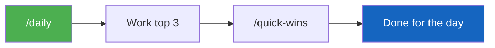

# Slash Commands

Type `/` in the VS Code Copilot chat panel to see available commands. Each one detects your role and tailors the experience.

---

## Start Here

| Command | What It Does |
|---------|-------------|
| `/getting-started` | First-time setup — verifies environment, identifies your role, walks you to first success |
| `/my-role` | Shows your role, capabilities, daily rhythms, and recommended workflows |

---

## Daily Workflow

| Command | What It Does |
|---------|-------------|
| `/daily` | Role-specific morning check — surfaces top 3 actions |
| `/morning-prep` | Auto-populates today's daily note + meeting prep skeletons from calendar |
| `/weekly` | Weekly review — Monday: governance prep, Friday: digest. Auto-detects by day |
| `/what-next` | Stuck? Scans pipeline + milestones → suggests 3 highest-impact actions |
| `/quick-wins` | 5-minute CRM hygiene fixes — max 5 items, checkbox style |

---

## Account Analysis

| Command | What It Does |
|---------|-------------|
| `/account-review` | Multi-signal health check: GHCP seats, M365 engagement, CRM pipeline. Pick sections or run full review |
| `/portfolio-prioritization` | Rank all tracked accounts by GHCP growth potential — 5-tier classification with composite scoring |
| `/ghcp-activity-impact` | Did your VBDs and meetings drive seat growth? Before/after scoring with 7-level impact scale |

---

## Meetings

| Command | What It Does |
|---------|-------------|
| `/meeting` | Unified meeting workflow — prep before (provide title) or process after (paste notes). Auto-detects mode |

---

## Deep Workflows

| Command | What It Does |
|---------|-------------|
| `/connect-review` | Compile Connects performance evidence from MSX + M365 + vault + git |
| `/nomination` | Generate an Americas Living Our Culture award nomination |
| `/project-status` | Project status report from vault + CRM |

---

## Vault Management

| Command | What It Does |
|---------|-------------|
| `/create-person` | Create a People note in the vault from meeting or conversation context |
| `/sync-project-from-github` | Pull GitHub repo activity into a vault project note |

---

## Power BI Reports

These run via the `pbi-analyst` subagent. You can invoke them directly or let the agent route based on keywords.

| Command | Triggers On |
|---------|-------------|
| `/pbi-azure-all-in-one-review` | "azure portfolio", "ACR attainment", "budget attainment" |
| `/pbi-azure-service-deep-dive-sl5-aio` | "service deep dive", "SL5", "service-level consumption" |
| `/pbi-cxobserve-account-review` | "support health", "CXP", "CXObserve" |
| `/pbi-customer-incident-review` | "outage review", "CritSit", "customer incident" |
| `/pbi-ghcp-new-logo-incentive` | "new logo", "GHCP incentive" |
| `/pbi-ghcp-seats-analysis` | Used internally by `/account-review` Section 2 |

---

## Recommended Flow



```
First time:  /getting-started  →  pick an action from the menu
Daily:       /daily            →  work through top 3  →  /quick-wins if time
Weekly:      /weekly           →  drill into flagged items
Account:     /account-review   →  deep-dive any account (pick sections)
Meeting:     /meeting          →  prep before, process after
Focus:       /portfolio-prioritization  →  where to spend GHCP sales effort
```

---

## Creating Your Own Slash Commands

Files in `.github/prompts/` automatically appear as slash commands in VS Code. Create one for any workflow you repeat often.

**Example:** `.github/prompts/quarterly-review-prep.prompt.md`

```markdown
---
description: "Prepare a quarterly business review deck."
---

# Quarterly Review Prep

1. Use `list_opportunities` for {customer} — get all active opportunities.
2. Use `get_milestones` for each — summarize status and blockers.
3. Use `ask_work_iq` — find recent executive emails or meeting decisions.
4. Format as a QBR summary: pipeline, delivery, risks, asks.
```

After saving, type `/` in chat to see it in the menu.

!!! info "Copilot CLI note"
    Slash commands are a VS Code feature. In Copilot CLI, open the prompt file and paste the content, or just describe what you need in natural language.
