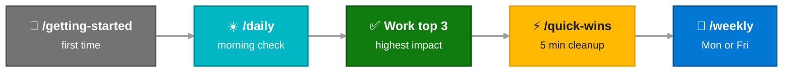

# All Prompts

Type `/` in the VS Code Copilot chat panel or just describe what you need in plain English. Each prompt auto-loads the right [skills](index.md#prompts-vs-skills) behind the scenes and tailors the experience to your role.

<div class="source-legend" markdown>
  <div class="sl-item"><div class="sl-dot" style="background: var(--mcaps-blue);"></div> CRM</div>
  <div class="sl-item"><div class="sl-dot" style="background: var(--mcaps-teal);"></div> M365</div>
  <div class="sl-item"><div class="sl-dot" style="background: var(--mcaps-green);"></div> Vault</div>
  <div class="sl-item"><div class="sl-dot" style="background: var(--mcaps-purple);"></div> PBI</div>
  <div class="sl-item"><div class="sl-dot" style="background: #333;"></div> GitHub</div>
  <div class="sl-item"><div class="sl-dot" style="background: var(--mcaps-amber);"></div> AI</div>
</div>

---

<!-- ── START HERE ─────────────────────────────────────── -->

<div class="catalog-header" markdown>
  <div class="ch-icon" style="background: var(--mcaps-gray);">🚀</div>
  <h2>Start Here</h2>
  <div class="ch-count">2 commands</div>
</div>

<div class="prompt-lane lane-setup" markdown>
<div class="lane-sidebar">Setup</div>
<div class="lane-body" markdown>

<div class="ptile" markdown>
<div class="ptile-head">
  <div class="ptile-icon" style="background: var(--mcaps-gray);">🚀</div>
  <div><h4>Getting Started</h4></div>
</div>
<div class="ptile-slash">/getting-started</div>
<p class="ptile-desc">First-time setup — verifies environment, identifies your role, walks you to your first success.</p>
<div class="role-pills"><span class="role-pill rp-any">All Roles</span></div>
<div class="ptile-sources"><span class="ptile-src src-crm">CRM</span><span class="ptile-src src-ai">AI Guide</span></div>
<div class="prompt-example"><div class="pe-avatar">You</div> I just cloned the repo. Walk me through setup.</div>
</div>

<div class="ptile" markdown>
<div class="ptile-head">
  <div class="ptile-icon" style="background: var(--mcaps-gray);">🪪</div>
  <div><h4>My Role</h4></div>
</div>
<div class="ptile-slash">/my-role</div>
<p class="ptile-desc">Identify or switch your MCAPS role. Shows role-specific capabilities, daily rhythms, and recommended workflows.</p>
<div class="role-pills"><span class="role-pill rp-any">All Roles</span></div>
<div class="ptile-sources"><span class="ptile-src src-crm">CRM</span></div>
<div class="prompt-example"><div class="pe-avatar">You</div> What's my role and what can I do?</div>
</div>

</div>
</div>

---

<!-- ── DAILY WORKFLOW ──────────────────────────────────── -->

<div class="catalog-header" markdown>
  <div class="ch-icon" style="background: var(--mcaps-teal);">⏱</div>
  <h2>Daily Workflow</h2>
  <div class="ch-count">5 commands</div>
</div>

<div class="prompt-lane lane-rhythm" markdown>
<div class="lane-sidebar">Daily · Weekly</div>
<div class="lane-body" markdown>

<div class="ptile" markdown>
<div class="ptile-head">
  <div class="ptile-icon" style="background: var(--mcaps-teal);">☀️</div>
  <div><h4>Daily Check</h4></div>
</div>
<div class="ptile-slash">/daily</div>
<p class="ptile-desc">Role-specific morning check — surfaces top 3 actions for today.</p>
<div class="role-pills"><span class="role-pill rp-any">All Roles</span></div>
<div class="chain-flow">
  <span class="chain-node">morning-brief</span>
  <span class="chain-arrow">→</span>
  <span class="chain-node">role-skill</span>
  <span class="chain-arrow">→</span>
  <span class="chain-node">risk-surfacing</span>
</div>
<div class="ptile-sources">
  <span class="ptile-src src-crm">CRM</span>
  <span class="ptile-src src-vault">Vault</span>
  <span class="ptile-src src-ai">AI Triage</span>
</div>
<div class="prompt-example"><div class="pe-avatar">You</div> Start my day.</div>
</div>

<div class="ptile" markdown>
<div class="ptile-head">
  <div class="ptile-icon" style="background: var(--mcaps-teal);">📋</div>
  <div><h4>Morning Prep</h4></div>
</div>
<div class="ptile-slash">/morning-prep</div>
<p class="ptile-desc">Auto-populates today's daily note + meeting prep skeletons. Designed for non-interactive CLI execution.</p>
<div class="role-pills"><span class="role-pill rp-any">All Roles</span></div>
<div class="chain-flow">
  <span class="chain-node">Calendar</span>
  <span class="chain-arrow">→</span>
  <span class="chain-node">Vault lookup</span>
  <span class="chain-arrow">→</span>
  <span class="chain-node">CRM enrich</span>
  <span class="chain-arrow">→</span>
  <span class="chain-node">Write daily note</span>
</div>
<div class="ptile-sources">
  <span class="ptile-src src-m365">Calendar</span>
  <span class="ptile-src src-vault">Vault</span>
  <span class="ptile-src src-crm">CRM</span>
</div>
</div>

<div class="ptile" markdown>
<div class="ptile-head">
  <div class="ptile-icon" style="background: var(--mcaps-teal);">📆</div>
  <div><h4>Weekly Review</h4></div>
</div>
<div class="ptile-slash">/weekly</div>
<p class="ptile-desc"><strong>Monday:</strong> governance prep with vault write-back. <strong>Friday:</strong> retrospective digest saved to vault.</p>
<div class="role-pills"><span class="role-pill rp-any">All Roles</span></div>
<div class="chain-flow">
  <span class="chain-node">vault sweep</span>
  <span class="chain-arrow">→</span>
  <span class="chain-node">role-skill chains</span>
  <span class="chain-arrow">→</span>
  <span class="chain-node">status + actions</span>
  <span class="chain-arrow">→</span>
  <span class="chain-node">vault write-back</span>
</div>
<div class="ptile-sources">
  <span class="ptile-src src-crm">CRM</span>
  <span class="ptile-src src-m365">M365</span>
  <span class="ptile-src src-vault">Vault</span>
  <span class="ptile-src src-ai">AI</span>
</div>
<div class="prompt-example"><div class="pe-avatar">You</div> It's Monday — run my weekly pipeline review.</div>
</div>

<div class="ptile" markdown>
<div class="ptile-head">
  <div class="ptile-icon" style="background: var(--mcaps-teal);">🎯</div>
  <div><h4>What Next?</h4></div>
</div>
<div class="ptile-slash">/what-next</div>
<p class="ptile-desc">Suggests 3 highest-impact actions. Each offers "Want me to do this?"</p>
<div class="role-pills"><span class="role-pill rp-any">All Roles</span></div>
<div class="ptile-sources">
  <span class="ptile-src src-crm">CRM</span>
  <span class="ptile-src src-vault">Vault</span>
</div>
<div class="prompt-example"><div class="pe-avatar">You</div> I have a few minutes — what should I focus on?</div>
</div>

<div class="ptile" markdown>
<div class="ptile-head">
  <div class="ptile-icon" style="background: var(--mcaps-teal);">⚡</div>
  <div><h4>Quick Wins</h4></div>
</div>
<div class="ptile-slash">/quick-wins</div>
<p class="ptile-desc">5-minute pipeline cleanup — max 5 checkbox items.</p>
<div class="role-pills"><span class="role-pill rp-any">All Roles</span></div>
<div class="ptile-sources"><span class="ptile-src src-crm">CRM</span></div>
</div>

</div>
</div>

---

<!-- ── ACCOUNT ANALYSIS ───────────────────────────────── -->

<div class="catalog-header" markdown>
  <div class="ch-icon" style="background: var(--mcaps-blue);">📊</div>
  <h2>Account Analysis</h2>
  <div class="ch-count">3 commands</div>
</div>

<div class="prompt-lane lane-analysis" markdown>
<div class="lane-sidebar">Analysis</div>
<div class="lane-body" markdown>

<div class="ptile" markdown>
<div class="ptile-head">
  <div class="ptile-icon" style="background: var(--mcaps-blue);">🏥</div>
  <div><h4>Account Review</h4></div>
</div>
<div class="ptile-slash">/account-review</div>
<p class="ptile-desc">Multi-signal health check. Sections: Health Card · Seat Analysis · Engagement · Pipeline · Full Review.</p>
<div class="role-pills">
  <span class="role-pill rp-ae">AE</span>
  <span class="role-pill rp-spec">Specialist</span>
  <span class="role-pill rp-se">SE</span>
  <span class="role-pill rp-ats">ATS</span>
</div>
<div class="chain-flow">
  <span class="chain-node">vault-routing</span>
  <span class="chain-arrow">→</span>
  <span class="chain-node">pbi-analyst (MSXI + OctoDash)</span>
  <span class="chain-arrow">→</span>
  <span class="chain-node">m365-actions</span>
  <span class="chain-arrow">→</span>
  <span class="chain-node">CRM pipeline</span>
</div>
<div class="ptile-sources">
  <span class="ptile-src src-crm">CRM</span>
  <span class="ptile-src src-m365">M365</span>
  <span class="ptile-src src-pbi">MSXI</span>
  <span class="ptile-src src-pbi">OctoDash</span>
</div>
<div class="prompt-example"><div class="pe-avatar">You</div> Run a full account review for Contoso — seats, engagement, and pipeline.</div>
</div>

<div class="ptile" markdown>
<div class="ptile-head">
  <div class="ptile-icon" style="background: var(--mcaps-blue);">📊</div>
  <div><h4>Portfolio Prioritization</h4></div>
</div>
<div class="ptile-slash">/portfolio-prioritization</div>
<p class="ptile-desc">5-tier classification: Greenfield · Stagnant · Whitespace · High Perf · Low Util.</p>
<div class="role-pills">
  <span class="role-pill rp-spec">Specialist</span>
  <span class="role-pill rp-se">SE</span>
  <span class="role-pill rp-sd">SD</span>
</div>
<div class="ptile-sources">
  <span class="ptile-src src-pbi">PBI Seats</span>
  <span class="ptile-src src-crm">CRM</span>
  <span class="ptile-src src-vault">Vault</span>
</div>
<div class="prompt-example"><div class="pe-avatar">You</div> Rank my accounts by GHCP growth potential — where should I focus?</div>
</div>

<div class="ptile" markdown>
<div class="ptile-head">
  <div class="ptile-icon" style="background: var(--mcaps-blue);">📈</div>
  <div><h4>Activity Impact</h4></div>
</div>
<div class="ptile-slash">/ghcp-activity-impact</div>
<p class="ptile-desc">Before/after scoring with 7-level impact scale. "Did my VBDs drive growth?"</p>
<div class="role-pills"><span class="role-pill rp-se">SE</span><span class="role-pill rp-spec">Specialist</span></div>
<div class="chain-flow">
  <span class="chain-node">Vault activity</span>
  <span class="chain-arrow">→</span>
  <span class="chain-node">M365 validation</span>
  <span class="chain-arrow">→</span>
  <span class="chain-node">PBI before/after</span>
  <span class="chain-arrow">→</span>
  <span class="chain-node">Impact scoring</span>
</div>
<div class="ptile-sources">
  <span class="ptile-src src-vault">Vault</span>
  <span class="ptile-src src-m365">M365</span>
  <span class="ptile-src src-pbi">PBI</span>
</div>
</div>

</div>
</div>

---

<!-- ── MEETINGS ───────────────────────────────────────── -->

<div class="catalog-header" markdown>
  <div class="ch-icon" style="background: var(--mcaps-blue);">🤝</div>
  <h2>Meetings</h2>
  <div class="ch-count">1 command · 2 modes</div>
</div>

<div class="prompt-lane lane-analysis" markdown>
<div class="lane-sidebar">Meeting</div>
<div class="lane-body" markdown>

<div class="ptile" markdown>
<div class="ptile-head">
  <div class="ptile-icon" style="background: var(--mcaps-blue);">🤝</div>
  <div><h4>Meeting</h4></div>
</div>
<div class="ptile-slash">/meeting</div>
<p class="ptile-desc">Unified meeting workflow — auto-detects mode from input.</p>
<div class="role-pills"><span class="role-pill rp-any">All Roles</span></div>

<div style="display: flex; gap: 10px; margin-top: 6px;" markdown>
<div style="flex: 1; padding: 10px 12px; border-radius: 8px; border-left: 3px solid var(--mcaps-blue); background: var(--md-code-bg-color);" markdown>
**Prep Mode** — Provide meeting title
<div class="chain-flow" style="margin: 4px 0;">
  <span class="chain-node">Calendar</span>
  <span class="chain-arrow">→</span>
  <span class="chain-node">Vault</span>
  <span class="chain-arrow">→</span>
  <span class="chain-node">CRM</span>
  <span class="chain-arrow">→</span>
  <span class="chain-node">Pre-filled note</span>
</div>
</div>
<div style="flex: 1; padding: 10px 12px; border-radius: 8px; border-left: 3px solid var(--mcaps-green); background: var(--md-code-bg-color);" markdown>
**Process Mode** — Paste raw notes
<div class="chain-flow" style="margin: 4px 0;">
  <span class="chain-node">Structure</span>
  <span class="chain-arrow">→</span>
  <span class="chain-node">Actions</span>
  <span class="chain-arrow">→</span>
  <span class="chain-node">Update vault</span>
</div>
</div>
</div>

<div class="ptile-sources">
  <span class="ptile-src src-m365">Calendar</span>
  <span class="ptile-src src-vault">Vault</span>
  <span class="ptile-src src-crm">CRM</span>
</div>
</div>

</div>
</div>

---

<!-- ── DEEP WORKFLOWS ─────────────────────────────────── -->

<div class="catalog-header" markdown>
  <div class="ch-icon" style="background: var(--mcaps-blue);">🔗</div>
  <h2>Deep Workflows</h2>
  <div class="ch-count">3 commands</div>
</div>

<div class="prompt-lane lane-analysis" markdown>
<div class="lane-sidebar">Deep</div>
<div class="lane-body" markdown>

<div class="ptile" markdown>
<div class="ptile-head">
  <div class="ptile-icon" style="background: var(--mcaps-blue);">🔗</div>
  <div><h4>Connect Review</h4></div>
</div>
<div class="ptile-slash">/connect-review</div>
<p class="ptile-desc">Compile Connects performance evidence from MSX + WorkIQ + vault + git.</p>
<div class="role-pills"><span class="role-pill rp-any">All Roles</span></div>
<div class="ptile-sources">
  <span class="ptile-src src-crm">CRM</span>
  <span class="ptile-src src-m365">WorkIQ</span>
  <span class="ptile-src src-vault">Vault</span>
  <span class="ptile-src src-gh">GitHub</span>
</div>
</div>

<div class="ptile" markdown>
<div class="ptile-head">
  <div class="ptile-icon" style="background: var(--mcaps-blue);">🏆</div>
  <div><h4>Nomination</h4></div>
</div>
<div class="ptile-slash">/nomination</div>
<p class="ptile-desc">Generate an Americas Living Our Culture award nomination.</p>
<div class="role-pills"><span class="role-pill rp-any">All Roles</span></div>
<div class="ptile-sources">
  <span class="ptile-src src-crm">CRM</span>
  <span class="ptile-src src-vault">Vault</span>
  <span class="ptile-src src-ai">AI Draft</span>
</div>
</div>

<div class="ptile" markdown>
<div class="ptile-head">
  <div class="ptile-icon" style="background: var(--mcaps-blue);">📁</div>
  <div><h4>Project Status</h4></div>
</div>
<div class="ptile-slash">/project-status</div>
<p class="ptile-desc">Project status summary from vault project note + CRM validation.</p>
<div class="role-pills"><span class="role-pill rp-any">All Roles</span></div>
<div class="ptile-sources">
  <span class="ptile-src src-vault">Vault</span>
  <span class="ptile-src src-crm">CRM</span>
</div>
</div>

</div>
</div>

---

<!-- ── VAULT MANAGEMENT ───────────────────────────────── -->

<div class="catalog-header" markdown>
  <div class="ch-icon" style="background: var(--mcaps-green);">📓</div>
  <h2>Vault Management</h2>
  <div class="ch-count">4 commands</div>
</div>

<div class="prompt-lane lane-vault" markdown>
<div class="lane-sidebar">Vault</div>
<div class="lane-body" markdown>

<div class="ptile" markdown>
<div class="ptile-head">
  <div class="ptile-icon" style="background: var(--mcaps-green);">🔄</div>
  <div><h4>Vault Sync</h4></div>
</div>
<div class="ptile-slash">/vault-sync</div>
<p class="ptile-desc">Bulk CRM → vault sync in one pass via vault-sync.js.</p>
<div class="role-pills"><span class="role-pill rp-any">All Roles</span></div>
<div class="ptile-sources"><span class="ptile-src src-crm">CRM</span><span class="ptile-src src-vault">Vault</span></div>
</div>

<div class="ptile" markdown>
<div class="ptile-head">
  <div class="ptile-icon" style="background: var(--mcaps-green);">✅</div>
  <div><h4>Task Sync</h4></div>
</div>
<div class="ptile-slash">/task-sync</div>
<p class="ptile-desc">Reconcile CRM tasks with vault milestone notes → durable SE activity log.</p>
<div class="role-pills"><span class="role-pill rp-se">SE</span></div>
<div class="ptile-sources"><span class="ptile-src src-crm">CRM</span><span class="ptile-src src-vault">Vault</span></div>
</div>

<div class="ptile" markdown>
<div class="ptile-head">
  <div class="ptile-icon" style="background: var(--mcaps-green);">👤</div>
  <div><h4>Create Person</h4></div>
</div>
<div class="ptile-slash">/create-person</div>
<p class="ptile-desc">Create a People note from meeting or conversation context.</p>
<div class="role-pills"><span class="role-pill rp-any">All Roles</span></div>
<div class="ptile-sources"><span class="ptile-src src-vault">Vault</span><span class="ptile-src src-m365">WorkIQ</span></div>
</div>

<div class="ptile" markdown>
<div class="ptile-head">
  <div class="ptile-icon" style="background: var(--mcaps-green);">🐙</div>
  <div><h4>Sync from GitHub</h4></div>
</div>
<div class="ptile-slash">/sync-project-from-github</div>
<p class="ptile-desc">Pull GitHub repo activity into a vault project note.</p>
<div class="role-pills"><span class="role-pill rp-any">All Roles</span></div>
<div class="ptile-sources"><span class="ptile-src src-gh">GitHub</span><span class="ptile-src src-vault">Vault</span></div>
</div>

</div>
</div>

---

<!-- ── POWER BI REPORTS ────────────────────────────────── -->

<div class="catalog-header" markdown>
  <div class="ch-icon" style="background: var(--mcaps-purple);">📊</div>
  <h2>Power BI Reports</h2>
  <div class="ch-count">7 commands</div>
</div>

These run via the `pbi-analyst` subagent. You can invoke them directly or let the agent route based on keywords.

<div class="prompt-lane lane-pbi" markdown>
<div class="lane-sidebar">PBI</div>
<div class="lane-body" markdown>

<div class="ptile" markdown>
<div class="ptile-head">
  <div class="ptile-icon" style="background: var(--mcaps-purple);">☁️</div>
  <div><h4>Azure All-in-One</h4></div>
</div>
<div class="ptile-slash">/pbi-azure-all-in-one-review</div>
<p class="ptile-desc">ACR vs budget, pipeline conversion, attainment.</p>
<div class="role-pills"><span class="role-pill rp-spec">Specialist</span><span class="role-pill rp-se">SE</span><span class="role-pill rp-sd">SD</span></div>
<div class="ptile-sources"><span class="ptile-src src-pbi">MSXI</span></div>
<div class="prompt-example"><div class="pe-avatar">You</div> Run my Azure portfolio review — what's my gap to target?</div>
</div>

<div class="ptile" markdown>
<div class="ptile-head">
  <div class="ptile-icon" style="background: var(--mcaps-purple);">🔬</div>
  <div><h4>Service Deep Dive (SL5)</h4></div>
</div>
<div class="ptile-slash">/pbi-azure-service-deep-dive-sl5-aio</div>
<p class="ptile-desc">SL5-level consumption × portfolio performance.</p>
<div class="role-pills"><span class="role-pill rp-spec">Specialist</span><span class="role-pill rp-se">SE</span></div>
<div class="ptile-sources"><span class="ptile-src src-pbi">MSXI</span><span class="ptile-src src-pbi">ACRSL5</span></div>
</div>

<div class="ptile" markdown>
<div class="ptile-head">
  <div class="ptile-icon" style="background: var(--mcaps-purple);">🛡️</div>
  <div><h4>CXObserve</h4></div>
</div>
<div class="ptile-slash">/pbi-cxobserve-account-review</div>
<p class="ptile-desc">Support health, incidents, satisfaction, outage impact.</p>
<div class="role-pills"><span class="role-pill rp-csam">CSAM</span><span class="role-pill rp-ae">AE</span></div>
<div class="ptile-sources"><span class="ptile-src src-pbi">CMI</span></div>
<div class="prompt-example"><div class="pe-avatar">You</div> What's the support health for my account?</div>
</div>

<div class="ptile" markdown>
<div class="ptile-head">
  <div class="ptile-icon" style="background: var(--mcaps-purple);">🚨</div>
  <div><h4>Customer Incidents</h4></div>
</div>
<div class="ptile-slash">/pbi-customer-incident-review</div>
<p class="ptile-desc">Active incidents, CritSits, escalation trends.</p>
<div class="role-pills"><span class="role-pill rp-csam">CSAM</span><span class="role-pill rp-csa">CSA</span></div>
<div class="ptile-sources"><span class="ptile-src src-pbi">CMI</span></div>
</div>

<div class="ptile" markdown>
<div class="ptile-head">
  <div class="ptile-icon" style="background: var(--mcaps-purple);">🏷️</div>
  <div><h4>GHCP New Logo</h4></div>
</div>
<div class="ptile-slash">/pbi-ghcp-new-logo-incentive</div>
<p class="ptile-desc">FY26 New Logo Growth Incentive eligibility.</p>
<div class="role-pills"><span class="role-pill rp-spec">Specialist</span><span class="role-pill rp-se">SE</span></div>
<div class="ptile-sources"><span class="ptile-src src-pbi">MSXI</span></div>
<div class="prompt-example"><div class="pe-avatar">You</div> Which accounts qualify for the GHCP New Logo incentive?</div>
</div>

<div class="ptile" markdown>
<div class="ptile-head">
  <div class="ptile-icon" style="background: var(--mcaps-purple);">💺</div>
  <div><h4>GHCP Seats</h4></div>
</div>
<div class="ptile-slash">/pbi-ghcp-seats-analysis</div>
<p class="ptile-desc">Seat composition, attach rates, whitespace, MoM. Also powers Account Review § 2.</p>
<div class="role-pills"><span class="role-pill rp-spec">Specialist</span><span class="role-pill rp-se">SE</span><span class="role-pill rp-ae">AE</span></div>
<div class="ptile-sources"><span class="ptile-src src-pbi">MSXI</span><span class="ptile-src src-pbi">OctoDash</span></div>
</div>

<div class="ptile" markdown>
<div class="ptile-head">
  <div class="ptile-icon" style="background: var(--mcaps-purple);">📏</div>
  <div><h4>SE Productivity</h4></div>
</div>
<div class="ptile-slash">/pbi-se-productivity-review</div>
<p class="ptile-desc">HoK activities, milestones engaged, customer coverage, velocity.</p>
<div class="role-pills"><span class="role-pill rp-se">SE</span><span class="role-pill rp-sd">SD</span></div>
<div class="ptile-sources"><span class="ptile-src src-pbi">SE FY26</span></div>
<div class="prompt-example"><div class="pe-avatar">You</div> How am I doing? Run my SE productivity review.</div>
</div>

</div>
</div>

---

<!-- ── SPECIAL ─────────────────────────────────────────── -->

<div class="catalog-header" markdown>
  <div class="ch-icon" style="background: var(--mcaps-amber);">✨</div>
  <h2>Special</h2>
  <div class="ch-count">3 commands</div>
</div>

<div class="prompt-lane lane-write" markdown>
<div class="lane-sidebar">Special</div>
<div class="lane-body" markdown>

<div class="ptile" markdown>
<div class="ptile-head">
  <div class="ptile-icon" style="background: var(--mcaps-amber);">📣</div>
  <div><h4>Wins Channel Post</h4></div>
</div>
<div class="ptile-slash">/wins-channel-post</div>
<p class="ptile-desc">Generate a Teams channel post for wins. Evaluates fitness before posting.</p>
<div class="role-pills"><span class="role-pill rp-any">All Roles</span></div>
<div class="ptile-sources"><span class="ptile-src src-m365">Teams</span><span class="ptile-src src-crm">CRM</span><span class="ptile-src src-ai">AI Draft</span></div>
</div>

<div class="ptile" markdown>
<div class="ptile-head">
  <div class="ptile-icon" style="background: var(--mcaps-amber);">🔧</div>
  <div><h4>Modernize</h4></div>
</div>
<div class="ptile-slash">/modernize</div>
<p class="ptile-desc">Scan VS Code release notes for new agent features → apply to MCAPS-IQ. Dev-focused.</p>
<div class="role-pills"><span class="role-pill rp-any">Developer</span></div>
<div class="ptile-sources"><span class="ptile-src src-gh">GitHub</span><span class="ptile-src src-ai">AI</span></div>
</div>

</div>
</div>

---

## Recommended Flow



```
First time:  /getting-started  →  pick an action from the menu
Daily:       /daily            →  work through top 3  →  /quick-wins if time
Weekly:      /weekly           →  drill into flagged items
Account:     /account-review   →  deep-dive any account (pick sections)
Meeting:     /meeting          →  prep before, process after
Focus:       /portfolio-prioritization  →  where to spend GHCP sales effort
```

---

## Creating Your Own Commands

Files in `.github/prompts/` automatically appear as `/` commands in VS Code. Create one for any workflow you repeat often.

**Example:** `.github/prompts/quarterly-review-prep.prompt.md`

```markdown
---
description: "Prepare a quarterly business review deck."
---

# Quarterly Review Prep

1. Use `list_opportunities` for {customer} — get all active opportunities.
2. Use `get_milestones` for each — summarize status and blockers.
3. Use `ask_work_iq` — find recent executive emails or meeting decisions.
4. Format as a QBR summary: pipeline, delivery, risks, asks.
```

After saving, type `/` in chat to see it in the menu.

!!! info "Copilot CLI note"
    Slash commands are a VS Code feature. In Copilot CLI, open the prompt file and paste the content, or just describe what you need in natural language.
